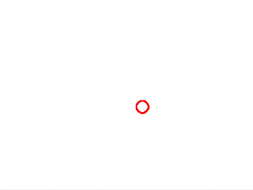
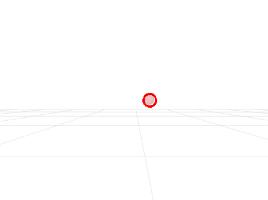

# Assignment 1

This is the second assignment for Yale's CPSC-659 Building Interactive Machines course.

## Table of Contents

* [Introduction](#introduction)
    * [System Requirements](#system-requirements)
    * [Background Knowledge](#background-knowledge)
    * [Deliverables](#deliverables)
    * [Evaluation](#evaluation)
    * [Further Reading and Tutorials](#further-reading-and-tutorials)
* [Preliminaries](#preliminaries)
 * [Notation](#notation)
 * [Conventions](#conventions)
 * [Kinematic Chains](#kinematic-chains)
 * [3D Transformations](#3d-transformations)
 * [Changing the Frame of a Point](#changing-the-frame-of-a-point)
 * [Transforms in ROS](#transforms-in-ros)
* [Part I. Introduction to tf](#part-i-introduction-to-tf)
 * [Questions / Tasks](#questions--tasks)
* [Part II. Publishing tf messages](#part-ii-publishing-tf-messages)
 * [Questions / Tasks](#questions--tasks-1)
* [Part III. Making a virtual camera](#part-iii-making-a-virtual-camera)
 * [Questions / Tasks](#questions--tasks-2)
* [Part IV. Orienting Shutter's camera towards a moving target](#part-iv-orienting-shutters-camera-towards-a-moving-target)
 * [Questions / Tasks](#questions--tasks-3)


## Introduction 
This assignment will provide you practical experience with the [tf](ros.org/wiki/tf) ROS package, 
the pinhole camera model, and inverse kinematics. You will also practice
a bit of geometry, e.g., to transform points across coordinate frames.

#### System Requirements
As for the first assignment, you should have access to a computer with `Ubuntu 16.04` and `ROS Kinetic` to complete the homework. 

> NOTE: If you have Ubuntu 18.04, you can also complete this homework 
using ROS Melodic. 

You should also have `git` installed in the machine that you are using to work on your assignment.
You will use git to save your work to your [GitLab](http://www.gitlab.com) repository.

#### Background Knowledge

This assignment assumes that you have already completed the first assignment ([assignment-0](../../assignment-0/README.md)) and,
thus, have set up your catkin workspace. You are also expected to have experience with Linux shells 
(e.g., [bash](https://www.gnu.org/software/bash/)), [git](https://git-scm.com/), and
the [Robot Operating System (ROS)](http://www.ros.org/). This includes being familiar with
the `roscore`, `rosrun`, `roslaunch`, `rostopic`, `rosmsg`, `rosnode`, `rqt_graph`, and `rviz` tools. You
should also know how to bring up a simulation of the Shutter robot in ROS, and
control the position of its joints one at a time. If
you are unfamiliar with any of these tools, programs, or procedures, please revisit the 
[assignment-0](../../assignment-0/README.md).

#### Deliverables

- **Report:** You are expected to submit a pdf to Canvas with answers to the questions/tasks at 
the end of each part of the assignment. This report should also have any information needed 
to understand and/or run your code, as well as the specific commit SHA of the version of the code
that you would like to be evaluated on. Though not mandatory, it is recommended that you generate this pdf 
with [Overleaf](https://www.overleaf.com/edu/yale#!overview) and this 
[simple assignment template](https://www.overleaf.com/latex/templates/simple-assignment-template/mzkqqqjypzvd) 
in [LaTeX](https://www.latex-project.org/).

- **ROS Bags:** You are also expected to submit two [ROS bags](http://wiki.ros.org/Bags) to Canvas (see 
Parts III and IV of this assignment).

- **Code:** Finally, you are expected to push code for this assignment to your 
[GitLab](http://www.gitlab.com) repository as indicated in the [general instructions](../README.md) 
document for CPSC-659 assignments. 

#### Evaluation

You assignment will be evaluated based on the content of your report and your code:

- Report (30 pts)
    * Part I (20 pts) <!-- 5 + 2 + 5 + 8 -->
    * Part II (5 pts) <!-- 5 pts from II-2 -->
    * Part III (5 pts) <!-- 5 pts from II-3 -->
- Code (70 pts)
    * Part II (15 pts) <!-- 15 -->
    * Part III (20 pts) <!-- 12 + 8 -->
    * Part IV (35 pts + 5 pts of extra credit) <!-- 20 + 5 + 10 ( 3 + 2 + 5 ) -->

#### Further Reading and Tutorials

- [tf: The Transform Library](http://wiki.ros.org/Papers/TePRA2013_Foote?action=AttachFile&do=get&target=TePRA2013_Foote.pdf)
- [Introduction to Robotics: Mechanics and Control](https://www.pearson.com/us/higher-education/program/Craig-Introduction-to-Robotics-Mechanics-and-Control-4th-Edition/PGM91709.html) by J. Craig (see Chapters 3 and 4 for more information on
manipulator kinematics)

## Preliminaries

### Notation
We refer to `vectors` or column matrices with bold lower-case letters (e.g., $`\bold{x}`$).
Other `matrices`, such as linear transformations, and `scalars` are written with regular
font weight. 

### Conventions

In this course, all reasoning in space is done in a 
[right hand system](http://mathworld.wolfram.com/Right-HandRule.html). The orientation
of the cross product between $`\bold{i} = [1, 0, 0]^T`$ (in the direction of the $`x`$ axis) and 
$`\bold{j} = [0, 1, 0]^T`$ ($`y`$ axis) is determined by
placing $`\bold{i}`$ and $`\bold{j}`$ tail-to-tail, flattening the right hand, extending it in the direction
of $`\bold{i}`$, and then curling the fingers towards $`\bold{j}`$. The thumb then points in the direction
of $`\bold{k} = \bold{i} \times \bold{j} = [0,0,1]^T`$ (corresponding to the $`z`$ axis). 

<p align="center">
<br>
Right Hand System (image from Wikipedia.org)
</p>

We also use a [right hand rule](https://en.wikipedia.org/wiki/Right-hand_rule#Rotations) 
for rotations: right fingers are curled in the direction of rotation and the right thumb 
points in the positive direction of the axis.

<p align="center">
<br>
Right Hand Rule (image from Wikipedia.org)
</p>

### Kinematic Chains

A kinematic chain is an assembly of rigid bodies or `links` connected by `joints`.
The joints allow the links to move relative to one another
and are typically instrumented with sensors, e.g., to measure the relative position of neihboring links.

There are different types of joints but, in this assignment, we will focus on
working with `revolute joints` because Shutter has 4 of them. Revolute joints
have a single axis of rotation and, thus, exibit just one Degree of Freedom. The 
`joint angle` of these revolute joints controls the displacement between the pair
of links that are connected to it.

In general, we like to think about Degrees of Freedom (DoF) as the number of independent position 
variables that would have to be specified in order to locate all parts of a robot.
Shutter, in particular, has 4 motors in its arm, each of which implements a revolute joint.
Thus, Shutter has 4 DoF. 


### 3D Transformations

3D spatial transformations map 3D points from one `coordinate system` (or `frame`) to another.
They are particularly relevant for robotics and 3D vision applications, where the 
elements of interest are in different locations in the world. For example, transformations
are useful to know the position of the camera in the Robot shutter relative to one of its 
links or its base. Similarly, 3D transformations can help infer the location of an object 
with respect to a camera that observes it.

Following [ROS conventions](http://wiki.ros.org/tf/Overview/Transformations), 
we refer to a point $`\mathbf{p}`$ within a frame $`B`$ as $`^{B}\mathbf{p}`$. 
We also refer to the relationship between any two frames $`A`$ and $`B`$ as 
a 6 Degrees of Freedom (DoF) transformation: 
a rotation followed by a translation. Specifically,
the pose of $`A`$ in $`B`$ is given by the rotation of $`A`$'s coordinate axes in $`B`$
 and the translation from $`B`$'s origin to $`A`$'s origin. 

>- **Translations:** A 3D translation can be represented by a vector $`\bold{t} = [t_1, t_2, t_3]`$
    or by a $`4 \times 4`$ matrix:<br>
    $`t =
    \begin{bmatrix}
    1 & 0 & 0 & t_1\\
    0 & 1 & 0 & t_2\\
    0 & 0 & 1 & t_3\\
    0 & 0 & 0 & 1
    \end{bmatrix}
    `$<br>
    The scalars $`t_1`$, $`t_2`$, and $`t_3`$ correspond to the displacements in $`x`$,
    $`y`$, and $`z`$, respectively. Thus, a translation has 3 DoF. Note that
    representing translations with $`4 \times 4`$ matrices as above is helpful 
    for transforming points in homogeneous coordinates.<br> <br>
    
>- **Rotations:** A 3D rotation has 3 DoF as well. Each DoF corresponds to a rotation around one of the axes of the 
    coordinate frame. We can represent rotations also as $`4 \times 4`$ transformation matrices:<br>
    $`R = 
    \begin{bmatrix}
    r_{11} & r_{12} & r_{13} & 0\\
    r_{12} & r_{22} & r_{23} & 0\\
    r_{13} & r_{32} & r_{33} & 0\\
    0 & 0 & 0 & 1
    \end{bmatrix}
    `$<br>
    Note that the $`3 \times 3`$ submatrix of $`R`$ with the elements $`r_11`$ ... $`r_33`$
    is an [orthogonal matrix](https://en.wikipedia.org/wiki/Orthogonal_matrix).<br>    
    It is important to know that [ROS uses quaternions](http://wiki.ros.org/tf2/Tutorials/Quaternions) 
    to represent rotations, but there are many other useful representations (e.g., 
    [Euler angles](https://en.wikipedia.org/wiki/Euler_angles)).

### Changing the Frame of a Point
Let $`^{A}\mathbf{p}`$ be a 3D point in the $`A`$ frame. Its position in 
$`B`$ can be expressed as $`^{B}\mathbf{p} = ^{B}_{A}T\ ^{A}\mathbf{p}`$, where 
$`^{B}_{A}T = ^{B}_{A}(t \times R)`$ is the $`4 \times 4`$ transformation matrix that
results from right-multiplying the translation matrix $`^{B}_{A}t`$ by the rotation
matrix $`^{B}_{A}R`$. In particular,
 
- $`^{B}_{A}t`$ is the $`4 \times 4`$ transformation matrix that encodes the
 translation between the frames $`A`$ and $`B`$. The values $`t_1, t_2, t_3`$ of
the translation $`^{B}_{A}t`$ are the origin of the frame $`A`$ in $`B`$.
- $`^{B}_{A}R`$ is the  $`4 \times 4`$ rotation matrix corresponding to the orientation of $`A`$'s coordinate axes in 
$`B`$. 

Note that the 3D vector with elements $`r_{11}, r_{21}, r_{31}`$ 
from the first column of the rotation matrix $`^{B}_{A}R`$ has the same direction as the $`x`$ axis of $`A`$ 
in the $`B`$ frame. Similarly, the elements $`r_{12}, r_{22}, r_{32}`$
and $`r_{13}, r_{23}, r_{33}`$ have the same direction of the $y$ and $z$ axes of 
$`A`$ in $`B`$, respectively.

### Transforms in ROS

The [tf](http://wiki.ros.org/tf) library in ROS represents transforms and coordinate frames 
in a `tree structure` buffered in time. The tree is a directed graph, where any two 
vertices are connected by one path. The nodes of this graph corresponds to coordinate frames,
each associated with a link, and the edges correspond to transforms between pairs of frames. 

Any directed edge in the tf tree has a `parent` frame (source node), and a `child` frame 
(target node). Let the parent frame be $`P`$ and the child be $`C`$. Then, the transform
stored in the edge parent -> child corresponds to $`^{P}_{C}T`$.

<!-- todo: add image of nodes and edge with transform -->

The tf library quickly computes the net transform between two nodes (frames) 
by multiplying the edges connecting them. To traverse up a directed edge from a child to a parent node, 
tf uses the inverse of the transformation that is stored in the edge.

<!-- todo: say something about querying transforms over time here? -->

## Part I. Introduction to tf
This part of the assignment will help you understand how [tf](http://wiki.ros.org/tf) lets 
users keep track of multiple coordinate frames over time in ROS. 

1. Complete the [Introduction to tf2](http://wiki.ros.org/tf2/Tutorials/Introduction%20to%20tf2)
tutorial from ROS. You should familiarize yourself with the `view_frames` and `tf_echo` tools. 
You should also learn to visualize the transforms in /tf and /tf_static with [rviz](http://wiki.ros.org/rviz).

### Questions / Tasks
Now that you know how to use basic tf tools, bring up a simulation of the robot Shutter. 
You will inspect its tf tree with tf tools. 

> NOTE: In [assignment-0](../../assignment-0/README.md), you ran `roscore` before bringing up the robot to enable ROS nodes to communicate. 
But you can also launch `shutter.launch` directly, as you did in the tutorial. 
If roscore isn't already running, roslaunch  will automatically start it. Try it!

- **I-1.** Generate an image of the tf tree of Shutter with [view_frames](http://wiki.ros.org/tf/Debugging%20tools#Viewing_TF_trees). 
Include this image in your report.

    *Tip:* You can also generate the image with the 
    [rqt_tf_tree](http://wiki.ros.org/rqt_tf_tree) interface if you prefer.

- **I-2.** Based on the tf tree from I-1, which frames are between the robot's *base_footprint* 
frame and the *zed_camera_link* frame?

- **I-3.** Based on the tf tree, what is the $`4 \times 4`$ transformation $`^{W}_{Z}T`$
between the *wrist_1_link* frame ($`W`$) and the *zed_camera_link* frame ($`Z`$)? Please
provide the transformation with both the rotation and translation components.

    *Tip:* You can use the [tf_echo](http://wiki.ros.org/tf#tf_echo) tool to query
    transformations. You will then need to assemble the $`4 \times 4`$ homogenous transformation matrix 
    from these values. We recommend [this primer](wiki.ogre3d.org/Quaternion+and+Rotation+Primer) from Ogre
    if you are confused about different rotation representations.

- **I-4.** How are the transformations in the /tf and /tf_static topics generated after you 
bring up the robot? Please explain which node(s) contribute to generating the tf tree.

    *Tip:* You should inspect what nodes and topics are being published in your ROS system,
    e.g., with the [rqt_graph](http://wiki.ros.org/rqt_graph) tool. You can also read the shutter.launch script
    in the shutter_bringup package (and any subsequent script that it launches) 
    to understand how the robot's tf tree is being generated.


## Part II. Publishing tf messages
As mentioned earlier, the [tf](http://wiki.ros.org/tf) library
uses a tree structure to represent frames and transformations in ROS. These frames and transformations
are created based on the messages streamed through the /tf and /tf_static topics. 

By convention, the /tf and /tf_static topics 
transmit [tf2_msgs/TFMessage](http://docs.ros.org/jade/api/tf2_msgs/html/msg/TFMessage.html) messages,
which contain a list of transformations encoded as 
[geometry_msgs/TransformStamped](http://docs.ros.org/jade/api/geometry_msgs/html/msg/TransformStamped.html) messages.
Each [geometry_msgs/TransformStamped](http://docs.ros.org/jade/api/geometry_msgs/html/msg/TransformStamped.html) 
message has:

- a `header`, with a `stamp` of when the transform was published 
and the `frame_id` of the reference frame for the transformation;
- a `child_frame_id`, corresponding to the name of the child frame; and
- a `transform`, of type [geometry_msgs/Transform](http://docs.ros.org/jade/api/geometry_msgs/html/msg/Transform.html),
with the translation and rotation of the transform $`{parent}_{child}T`$.

You will use code that is already provided in this assignment to learn how to publish tf
data as described above. To get started, follow the steps below:

1. Inspect the `generate_target.py` Python script in the scripts directory of the `shutter_lookat` 
package that is provided as part of this assignment. You should understand how the script creates a 
simulated moving object and publishes its position relative to the "base_footprint" frame of 
Shutter through the `/target` topic.

2. Visualize the moving target in [rviz](http://wiki.ros.org/rviz). Before running the launch
script below, make sure that you are not running any other node in ROS.

    ```bash
    $ roslaunch shutter_lookat generate_target.launch
    ```

    The launch script should then open rviz and display the robot and the moving target in front
    of it. The target should be displayed as a red ball.
   

### Questions / Tasks
Let's now publish the position of the moving object as a ROS tf frame.

- **II-1.** Follow the steps below to make a new ROS node that publishes 
the position of a simulated moving object as a ROS tf frame ("target") relative
to the robot's "camera_link" frame. 

    - Create a new ROS node in Python within the script directory of the `shutter_lookat` package.
The node should be named `publish_target_relative_to_zed_camera.py`.

    - Within your new node:
    
        - Subscribe to the `/target` topic to receive the position of the
simulated object relative to the "base_footprint" frame.

            > We suggest that you organize the code of your node
in a Python class, as in [this tutorial on a pytalker node](http://wiki.ros.org/ROSNodeTutorialPython#The_pytalker_node),
given the increased complexity of this node in comparison previous examples.

        - Transform the 3D pose of the moving object to the "camera_link" frame in Shutter.
        For this, you will have to query the transformation between the "base_footprint" frame
        and the "camera_link" using the `lookup_transform` function from the tf2 API, e.g., 
        as in the ROS tutorial on [writing a tf2 listener](http://wiki.ros.org/tf2/Tutorials/Writing%20a%20tf2%20listener%20%28Python%29).
             
            > You can use the [tf2_geometry_msgs](http://wiki.ros.org/tf2_geometry_msgs) API to transform the pose of the object
            as in [this post](https://answers.ros.org/question/222306/transform-a-pose-to-another-frame-with-tf2-in-python/).
            
        - Broadcast a tf transform from the "camera_link" frame to a (new) "target" frame in tf. 
        The target frame should have the same pose as the simulated object (as provided through
        the /target topic).
        
            > An example on broadcasting tf transformations can be found in 
            [this tutorial](http://wiki.ros.org/tf/Tutorials/Writing%20a%20tf%20broadcaster%20%28Python%29).
        
    - Edit the `generate_target.launch` script in the shutter_lookat package so that
    it runs your new node (publish_target_relative_to_zed_camera.py) 
    in addition to all of the nodes that it already launches.
     
        > [Roslaunch](http://wiki.ros.org/roslaunch) is a tool for easily launching multiple
        ROS nodes. Roslaunch scripts are written in XML format, according to [this specification](http://wiki.ros.org/roslaunch/XML).

    - Close all your nodes in ROS and launch the `generate_target.launch` script (which
    now includes your node). 
    
    - Add a TF display to rviz, and verify that the new `target` frame that you are publishing
    visually matches the position of the moving target (red ball). If the frame and the moving
    object are not displayed in the same place, check your code and edit as necessary.
    
    - Save your work by adding and committing your publish_target_relative_to_zed_camera.py
    node and the generage_target.launch script to your local repository. Push your code to GitLab.
     
        > Remember that continously committing your work and pushing to Gitlab will ensure that your
        code is backed up and readily accessible at any time in the future.
    
- **II-2.** Stop any ROS processes that you are running, relaunch your new
    generate_target.launch script, and create a new image of the tf tree in ROS, 
    e.g., using [view_frames](http://wiki.ros.org/tf/Debugging%20tools#Viewing_TF_trees). 
    Add the image of the tf tree to your report.
    
    
## Part III. Making a virtual camera
You will now project the simulated moving object from Part II of this assignment 
on a virtual image captured from a camera in Shutter. Close all ROS nodes
and launch the generate_target.launch script again before starting this part of the assignment.

1. Create a new ROS node called `virtual_camera.py` in the scripts directory of
the shutter_lookat package.

2. Implement your node such that it repeats the steps below while the program is running:

    **a.** Query the latest transformation that maps points from the "target" frame
to the "camera_link" frame.

    **b.** Extract the position of the moving object relative to the "camera_link" frame from
    the transformation queried from step (a).

    **c.** Project the position of the moving object to the image of a virtual camera positioned 
    in the "camera_link" frame. The projection operation should use the following
    intrinsic camera calibration parameters:

    ```python
    cx=320       # x-coordinate of principal point in terms of pixel dimensions
    cy=240       # y-coordinate of principal point in terms of pixel dimensions
    fx=349       # focal length in terms of pixel dimensions in the x direction
    fy=349       # focal length in terms of pixel dimensions in the y direction
    # note: there's no skew.
    ```
    
    > If you are unsure of what the above parameters mean, read more about projective cameras 
    in Hartly & Zisserman's [Multiple View Geometry](http://www.robots.ox.ac.uk/~vgg/hzbook/) book.

    **d.** Create an image with white background using the [OpenCV library](https://opencv.org/) 
    in your node. This image will become the output of the simulated camera that you are building
    for Shutter. The image should be in VGA format, i.e., have a
    dimension of 640 x 480 pixels.
    
    ```python
    # Example code
    import cv2          # import opencv
    import numpy as np  # import numpy
    
    # create image
    image = np.zeros((height,width,3), np.uint8)
    # color image
    image[:,:] = (255,255,255) # (B, G, R)
    ```
        
    **e.** Draw the outline of a red circle on the image. The position of the center of the circle
    should match the position of the projected moving object in the image, such that as
    the object moves, the projected circle also moves. Make
    the radius of the circle 12 pixels, and its outline 3 pixels wide.
    
    ```python
    # Example code
    cv2.circle(image,(x,y), radius, (0,0,255), outline_width) # (x,y) is the projected location of the object
    ```
    
    > See the official [OpenCV documentation](https://docs.opencv.org/3.1.0/dc/da5/tutorial_py_drawing_functions.html) 
    for more examples on drawing basic figures.

    **f.** Publish the image that you created with OpenCV as a sensor_msgs/Image message in ROS. You
    can use the [cv_bridge](http://wiki.ros.org/cv_bridge) library to convert the OpenCV image to
    an Image message. Note that the Image message should have a `header` with the current time as
    stamp and the "camera_link" frame as frame_id. The Image message should be published by your node
    through the `/virtual_camera/image_raw` topic.
    
    > Examples on converting OpenCV images to ROS messages can be found
    in [this tutorial](http://wiki.ros.org/cv_bridge/Tutorials/ConvertingBetweenROSImagesAndOpenCVImagesPython).

3. Visualize the images that your node is publishing using the 
[rqt_image_view](http://wiki.ros.org/rqt_image_view) tool. You should see the red circle
moving in a circular path in the image (as in the Figure below). If this is not the case, please check your implementation of the
virtual_camera.py script.

<kbd>

</kbd>

### Questions / Tasks

You will now share the calibration parameters for Shutter's virtual camera in ROS.
 Sharing the parameters will help other programs 
 reason geometrically about the images that your virtual camera generates.

- **III-1.** Edit your virtual_camera.py script to enable your node to also publish 
 calibration parameters. The parameters should be published as a [CameraInfo](http://docs.ros.org/api/sensor_msgs/html/msg/CameraInfo.html) message
through the `/virtual_camera/camera_info` topic, as indicated in the steps below.

    **a.** Import the [CameraInfo](http://docs.ros.org/api/sensor_msgs/html/msg/CameraInfo.html) message
    into your virtual_camera.py script.
    
    ```python
    # Example
    from sensor_msgs.msg import CameraInfo
    ```
    
    **b.** Create a function that builds CameraInfo messages from the calibration parameters
    provided in Part III of this assignment. You can use the code snippet below to this end.
    
    ```python
    def make_camera_info_message(stamp, frame_id, image_width, image_height, cx, cy, fx, fy):
        """
        Build CameraInfo message
        :param stamp: timestamp for the message
        :param frame_id: frame id of the camera
        :param image_width: image width
        :param image_height: image height
        :param cx: x-coordinate of principal point in terms of pixel dimensions
        :param cy: y-coordinate of principal point in terms of pixel dimensions
        :param fx: focal length in terms of pixel dimensions in the x direction
        :param fy: focal length in terms of pixel dimensions in the y direction
        :return: CameraInfo message with the camera calibration parameters.
        """
        camera_info_msg = CameraInfo()
        camera_info_msg.header.stamp = stamp
        camera_info_msg.header.frame_id = frame_id
        camera_info_msg.width = image_width
        camera_info_msg.height = image_height
        camera_info_msg.K = [fx, 0, cx, 0, fy, cy, 0, 0, 1]
        camera_info_msg.D = [0, 0, 0, 0, 0]
        camera_info_msg.R = [1, 0, 0, 0, 1, 0, 0, 0, 1]
        camera_info_msg.P = [fx, 0, cx, 0, 0, fy, cy, 0, 0, 0, 1, 0]
        camera_info_msg.distortion_model = "plumb_bob"
        return camera_info_msg
    ```
    
    > Specific details about the fields of CameraInfo messages can be found 
     in its [message definition](http://docs.ros.org/api/sensor_msgs/html/msg/CameraInfo.html).
    
    **c.** Create a publisher for the CameraInfo messages in your node.
    
    ```python
    # Example
    camerainfo_pub = rospy.Publisher("/virtual_camera/camera_info", CameraInfo, queue_size=10)
    ```
    
    **d.** Publish a CameraInfo message whenever your node publishes an Image message. The
    CameraInfo message should have the same header as the Image message.
    
    ```python
    # Example (assumes that image_msg is the Image message that your node publishes for the virtual camera)
    camerainfo_msg = make_camera_info_message(image_msg.header.stamp,
                                              image_msg.header.frame_id,
                                              image_width,
                                              image_height,
                                              cx, cy,
                                              fx, fy)
    self.camerainfo_pub.publish(camerainfo_msg)
    ```
    
    **e.** Finally, check that your node is publishing CameraInfo messages through the 
    /virtual_camera/camera_info topic with the [rostopic echo](http://wiki.ros.org/rostopic#rostopic_echo) tool.
    
    Remember to commit your code whenever you want to save a snapshot of your work.

- **III-2.** You will now verify that the image and the camera parameters that your node publishes 
are consistent with one another with the help of the rviz [Camera Plugin](http://wiki.ros.org/rviz/DisplayTypes/Camera). 

    > The [Camera Plugin](http://wiki.ros.org/rviz/DisplayTypes/Camera) creates a new rendering
window in rivz from the perspective of a camera. The plugin also overlays other displays that
you have enabled in rviz on the rendered image. Your goal is to use these overlays to verify that
the virtual camera that you already implemented is working correctly. 

    Close all running ROS nodes and re-launch the generate_target.launch script. Then run 
    your virtual_camera.py node and, once RViz opens, add a Camera display to the rviz window.
    Configure the camera plugin as follows:
    
    * Image Topic: /virtual_camera/image_raw
    * Transport Hint: raw
    * Image Rendering: background
    * Overlay Alpha: 0.6
    * Zoom Factor: 1

    The red circle from your /virtual_camera/image_raw image should then align in the rviz 
    Camera plugin with the red ball of the simulated moving object (as in the Figure below). 
    If this is not the case, check and correct your implementation of the virtual_camera.py node.
       
    <kbd>
    
    </kbd>
    
    Once the image that is published by the virtual_camera.py script is consistent 
    with what the Camera plugin shows in RViz, record a ROS [bag](http://wiki.ros.org/Bags) 
    as in [this tutorial](http://wiki.ros.org/rosbag/Tutorials/Recording%20and%20playing%20back%20data). 
    The bag should have all of the messages that are streamed in your system for a duration of 15 seconds.
    
    ```bash
    $ rosbag record -O assignment1_part3.bag -a --duration 15 
    ```
    
    > You can see a description of the arguments that `rosbag record` accepts [here](http://wiki.ros.org/rosbag/Commandline#record).
    
    Inspect your ROS bag with the [rosbag info]() tool to verify that it contains messages
    for all of the following topics:
    
    * /arm_controller/follow_joint_trajectory/status
    * /diagnostics
    * /joint_states 
    * /rosout   
    * /target  
    * /target_marker 
    * /tf         
    * /tf_static  
    * /virtual_camera/camera_info    
    * /virtual_camera/image_raw 
    
    Make sure to **submit your ROS bag to Canvas** as part of this assignment. You don't need to and 
    you shouldn't commit the bag to your repository! Otherwise, you will make your repository
    unnecessarily heavy.
    
- **III-3.** Explain in your report what is the difference between calling the `lookup_transform`
function from the tf2 API with rospy.Time(0) or rospy.Time.now() as third argument? 

> Note that how you call the lookup_transform function can have an effect on the
rate of operation of your virtual_camera.py node. Try changing how you call the function
in your node and check how often are you able to publish images through the
/virtual_camera/image_raw topic. Use the [rostopic hz](http://wiki.ros.org/rostopic) tool 
to this end.

    
## Part IV. Orienting Shutter's camera towards a moving target
You will now make your simulation of Shutter follow the red ball in front of it. For this,
you will solve the [inverse kinematics](https://en.wikipedia.org/wiki/Inverse_kinematics) 
problem assuming that Shutter has only two controllable joints.

1. Close all your ROS nodes, and launch generate_target.launch. You should then see
the robot in `rviz` with its virtual camera pointing forward. The moving target should be 1.5
meters away from the robot's virtual camera, as in the previous part of this assignment.

    ```bash
    $ roslaunch shutter_lookat generate_target.launch
    ```

2. Run your `virtual_camera.py` node so that you can see what the robot's virtual camera
sees in rviz. Add an image display to rviz to visualize the camera's image.


3. Modify the node `look_at_target.py` within the scripts folder of the shutter_lookat package. 
In particular, you should modify the functions:
 
    ```python
    def solve_for_yaw(self, current_joint_states):
        """
        Solve for the yaw angle (joint 1) that we want the robot to have and send command to robot driver
        :param current_joint_states: dictionary with current join values
        :return: True if everything went well; False otherwise.
        """

        # complete this function as part of the assignment

        return True
    ```
    
    ```python
    def solve_for_pitch(self, current_joint_states):
        """
        Solve for the pitch angle (joint 3) that we want the robot to have and send command to robot driver
        :param current_joint_states:
        :return: True if everything went well; False otherwise.
        """

        # complete this function as part of the assignment

        return True
    ```
  
 in your local copy of the script within your private repository. The first function (`solve_for_yaw()`) 
 should send a command to Shutter's first joint (joint_1) to align its camera towards the moving target. That is,
 this function should control the yaw angle of the robot's arm. The second function (`solve_for_pitch()`) 
 should send
 a command to Shutter's third joint (joint_3) to orient its forearm link towards the target and,
 as a result, control the pitch angle of the camera. An illustrative result is shown in the image below:
 
 

 
> You should not change the position of the second and third joints of the robot. These joints should
remain at 0.0 and -1.571 radians after the generate_target.launch script finishes launching. Please
don't change the main loop of the node either so that it is easy to understand how your
code works.

### Questions / Tasks


- **IV-1.** Make the robot follow the target such that the projected position 
of the red ball appears static in the image from your virtual camera. Commit your code to your repository 
and explain in a few words your approach to enable the robot to follow the target. 

- **IV-2.** Modify your `virtual_camera.py` script from Part III of this assignment to print to the
  screen the horizontal and vertical distance between the projected target and the center of the image. 
  
    ```python
    # Example code. Assumes that the projected target is at (x,y).
    import math    
    image_width = 640
    image_height = 480
    print "Distance to center: {}, {}".format((x - image_width*0.5), (y - image_height*0.5))
    ```
    
    Indicate in your report the maximum horizontal and vertical distances that you get 
    after the robot tries to follow the target for 10 seconds. 
    
    > Distances higher than 20 pixels or evident motion in the projected target might indicate 
    a problem in your implementation of the look_at_target.py node. 
    
- **IV-3.** Close all your nodes again, relaunch the generate_target.launch script with the additional
parameter `close_target:=true`:

    ```bash
    $ roslaunch shutter_lookat generate_target.launch close_target:=true
    ```
    
    Then run your virtual_camera.py and look_at_target.py nodes. You should now see the target moving
    in front of the robot at a shorter distance of 0.3 meters.
    
    **a.** As the robot tries to follow the close target, record a ROS bag called 
    `assignment1_part4.bag` (as in Part III) with all of the information from your ROS system:
    
        ```bash
        $ rosbag record -O assignment1_part4.bag -a --duration 15 
        ```
        
        The bag should last 15 seconds. Submit the bag to Canvas as part of your assignment.
    
    **b.** What maximum horizontal and vertical distances do you get now between the projected
    target and the middle of the image? When computing
    the maximum horizontal and vertical distances, let the robot follow the target for at least 10 seconds.
    
    **c.** Did the projected location of the target appear to be moving in the image or the distance from
    the projected location to the image center increased
    from IV-2 to IV-3.a? If the answer is yes, please explain why is this the case? Why isn't the target
    centered in the image?

 
- **IV-4. (extra credit 5pt)** Make the robot's virtual camera center the close target in its image (i.e., 
center the target when you launch `generate_target.launch close_target:=true` as in IV-3).
The distance between the projected target and the middle of the image should be less than:
    - 80 pixels in the horizontal dimension, and 
    - 60 pixels in the vertical dimension. 
    
    > If your answer to the question IV-3.c was negative, great work! You've already earned 
    5 extra credits for making Shutter accurately follow the target.
    
    **a.** Commit your code to your repository and briefly explain your approach to following the target 
    in your report.
    
    **b.** Indicate the average error (and std. dev.) that you obtain after having the robot 
    follow the close target (at 0.3 meters away from the robot) with your new look_at_target.py implementation.
    


