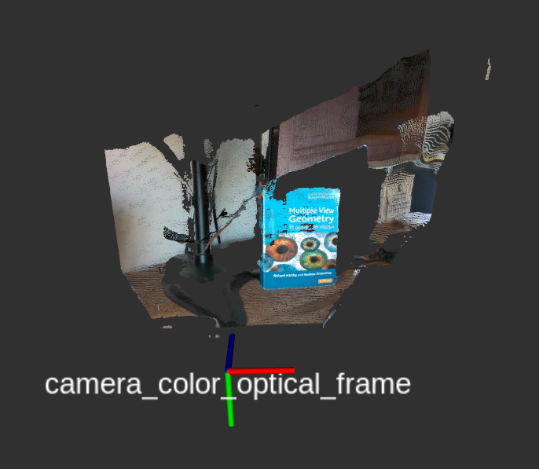
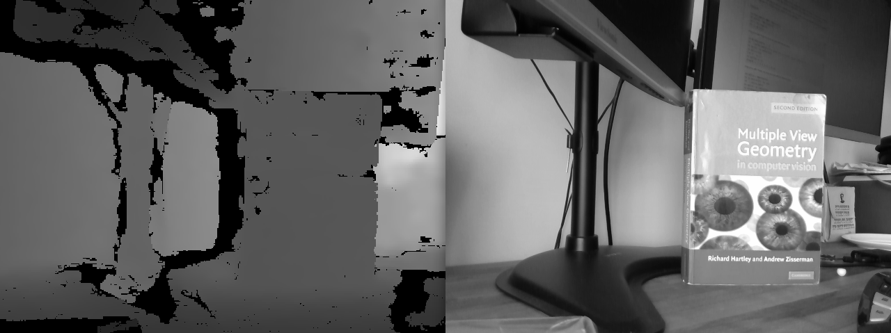
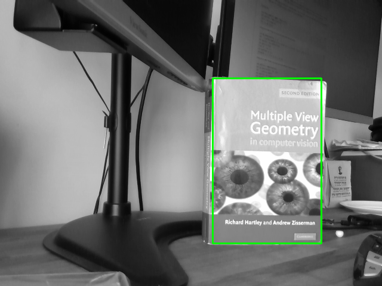

# Assignment 2 (Extra questions for CPSC-559)

The sections below for Assignment 2 are only meant to be completed/answered by students taking CPSC-559. 
Students in CPSC-459 are welcome to try to solve the problems/tasks below and even come to office hours to discuss them. 
However, their answers to the questions in Part V and Part VI of the Assignment 2 will not be considered during grading.

## Part V. Solving for the intrinsics

[Full camera calibration](https://www.mathworks.com/help/vision/ug/camera-calibration.html) consists of findings the 
intrinsic and extrinsic camera parameters
that define the projective operation 
, <!--$`\mathbf{x} = P\mathbf{X}`$--> 
where  <!--$`\mathbf{X}=[X\ Y\ Z\ 1]^T`$--> 
is a point in homogeneous coordinates in the world coordinate frame and 
<!--$`\mathbf{x}`$--> 
is the point's projection on the image. However, it sometimes happens that one only cares about observing the world from 
a camera and an external coordinate frame is irrelevant for the application. In these situations, we only care about 
the intrinsic camera parameters <!--$`K`$-->, such 
that <!--$`\mathbf{x} = K[I|\bold{0}][X\ Y\ Z\ 1]^T`$-->, where <!--$`I`$--> is the <!--$`3 \times 3`$--> identity matrix 
and <!--$`\bold{0}`$--> is the 3-dimensional zero vector.

### Questions / Tasks


- **V-1.** Assume that a camera has no skew and no lens distortion, as the virtual camera that you implemented for 
Shutter in Part III of this assignment. Then, your goal is to compute the camera's intrinsic parameters <!--$`K`$--> by minimizing:
    
    <!--$`error = \sum_i \|\mathbf{x}_i - K[I|\bold{0}]\mathbf{X}_i\|^2`$-->
    
    using Least Squares, where i indexes a set of sample correspondences 
     <!--$`< \mathbf{x}_i,\mathbf{X}_i >`$-->
    and  implements the projection of the world
    point in the camera frame onto the image. Note that this projection operation corresponds to 
    
    with  the 3D point 
     in homogeneous coordinates.
    
    The set of 3D - 2D correspondences that you should use for this problem is provided in the 
    `calibration/correspondences.txt` file of this assignment. The first three columns of the file provide the 
    <!--$` X, Y, Z `$--> 3D coordinates of the points, 
    meanwhile the last two columns are the corresponding pixel locations . <!--$`x, y`$-->
    You can convert pixel and 3D world locations to homogeneous coordinates by simply adding a 1 at the end.
    For example: <!--$`[x, y, 1]`$-->.

    You should implement your solution to this calibration problem in the `calibration/calibrate_K.py` script that is 
    provided as part of this assignment. In particular, you should complete the `compute_K()` function within the script, 
    such that when you run the script as:
    
    ```bash
    $ ./calibrate_K.py correspondences.txt
    ```
    
    it prints your solution for <!--$`K`$--> and the resulting 
    <!--$`error`$-->.
    
    Run public tests for this part of this assignment to ensure that your code is operating as expected:

     ```bash
     $ cd calibration
     $ python3 -m unittest test_calibrate_K
     ```

    Explain in your report how you formulated a system of equations to solve for <!--$`K`$-->, and 
    how you implemented your solution in the `calibrate_K.py` script. The pdf template allows you to upload an image
    with your explanation, which can either be an image of a hand-drawn solution (e.g., if you solved the problem in a notebook)
    or an image of a solution that you typed in a word processing program like a Google Doc. 

    > Note: It is allowed to use numeric solvers from numpy in your implementation, but you should not use 
    other numeric manipulation libraries as automated tests will not have additional dependencies.
    Note that even if you do use solvers from numpy for your solution, you should explain how you solved 
    the problem in your report.

## Part VI. Estimating depth from images

In general, it is impossible to estimate the absolute scale of a scene based only on an image of it. However, if we know the true size of an object in the world,
we can take advantage of this piece of information to estimate how far the object is from the camera (i.e., its depth). This is your goal for this part of the assignment.

To work on the problem of estimating the depth of an object in an image, the instructor followed the steps below to 
gather data from a RealSense camera -- like the one in a real Shutter robot.

1. First, the [RealSense driver](https://github.com/IntelRealSense/librealsense/blob/master/doc/distribution_linux.md) and the [realsense2_camera ROS package](https://github.com/IntelRealSense/realsense-ros.git) were installed to use the camera in Ubuntu. 

2. Second, the driver for the RealSense D435 camera was started to stream images through the ROS network:

    ```bash
    $ roslaunch realsense2_camera rs_camera.launch align_depth:=true
    ```

    The aligned depth option told the driver to generate depth images that are aligned with the RGB images captured by the camera. This means
    that the depth of a pixel (x,y) in the RGB image can be obtained from the same location in the depth image. 

3. Third, a Hartly and Zisserman's book was placed on the table captured by the camera, as shown in the pointcloud below. You will estimate the depth of this book in the tasks of this section of the assignment.

    
    
4. Fourth, the `depth/save_images.py` script was run to save to disk what the camera was currently observing. The resulting depth (left) and gray (right) images are shown below:

    
    
The above process resulted in the [image.npz](https://drive.google.com/file/d/1BFibFGBLJeYvgxtBnxHRJxfHfbAcOjO_/view?usp=sharing) data file, which you should download to complete this part of the assignment. The data includes:

- The image captured by the camera and converted to grayscale format (i.e., the data is a 2D matrix of 8-bit integer pixel values).
- The depth image (aligned with the grayscale image). The data is a 2D matrix of floats (in meters).
- The width of the images.
- The height of the images.
- The intrinsics matrix K for the camera that captured the grayscale image.

To load the data from the image.npz file, you can use the sample script `depth/process_images.py`. This script shows you how extract the different components of the image.npz file in Python, visualize the images, and select a region of interest in the grayscale image.


### Questions / Tasks

- **VI-1.** The book has a true height of h=0.245 meters and is placed in front of the camera, oriented roughly such that its cover is parallel to the <!--$`XY`$--> plane of the camera's coordinate frame. How can you compute how far the book is from the camera's center in the grayscale image of the [image.npz](https://drive.google.com/file/d/1BFibFGBLJeYvgxtBnxHRJxfHfbAcOjO_/view?usp=sharing) file? That is, how can you get an estimate of the <!--$`Z`$--> coordinate of the book's cover in the camera's coordinate frame? Explain your answer to this question in your report, given the book's true height, the intrinsic 
parameters (<!--$`K`$-->) of the camera used to get the grayscale image, and the position of the top-left <!--$`\left(\bold{x_1} = (x_1,y_1)\right)`$--> and bottom-right <!--$`\left(\bold{x_2} = (x_2,y_2)\right)`$--> corners of a box surrounding the book's front cover in the image, as illustrated in the image below.

    

    > Tip: We recommend that you draw the geometric relations of the known and unknown variables for this problem. Include this drawing in your report to help explain your answer to this question. 

- **VI-2.** Modify the `docs/process_images.py` script to implement your solution to the task VI-1. To this end, first 
add an additional input argument to the script for gathering the height of the object of interest (in this case, the book):

    ```python
    object_height = float(sys.argv[2]) # new argument in the script
    ```

    Second, complete the `compute_depth_from_gray_image()` function in the `process_images.py` script with your solution 
    to calculate the depth based on the `image_coordinates` provided for the object when the script runs. When
    you are done implementing your solution, you should be able to: (1) run the script, providing the book's height; 
    (2) select the book in the grayscale image; and (3) see the estimated depth printed in the terminal:

    ```bash
    $ ./process_images.py images.npz <book_height>
    Loading images.npz
    (...)
    Estimated depth: ... <- your result
    ```

    Write in your report the resulting depth value that you computed for the book. And don't forget to commit your 
    modified script to your repository!

    > Tip: The book is not perfectly parallel to the horizontal and vertical axes of the camera's frame, thus the book does not appear in the image as a perfect rectangle. This is OK for this part of the assignment, though. The important detail when selecting the book in the image is that the top and bottom part of the green rectangle align as best as possible with the top and bottom edge of the book's cover.

- **VI-3.** Add code to the `process_images.py` script to compare your estimated value from V-2 with the average depth of 
the book in the depth image. To this end, complete the `compute_depth_from_depth_image()` function in the script such that:

    a. it gathers the depth values corresponding to the book from the depth image,
    b. filters out zero values (these cells of the depth image correspond to pixels in the grayscale image for which depth could not be estimated), and
    c. computes the average depth of the resulting filtered values. This average depth should be returned by the function.
    
    Run public tests for this part of this assignment to ensure that your code is operating as expected:

     ```bash
     $ cd depth
     $ python3 -m unittest test_depth
     ```
     
    Once you are done implementing the function, you should be able to run the script again, and measure the absolute 
    difference between the latter result (Part VI-3) and your estimated depth from the grayscale image alone (VI-2).

    ```bash
    # Example output
    $ ./process_images.py images.npz <book_height>
    Loading images.npz
    (...)
    Estimated depth: ... <- your result from VI-2
    Estimated depth from depth image: ... <- result from VI-3
    Absolute difference between estimates: ... <- result from VI-3
    ```
  
    Save in your report your estimated depth from the depth image (from Part VI-3) and the absolute difference between
    the estimates from the gray and depth images. Also, don't forget to commit and push your latest version of the 
    code to your GitHub repository!
