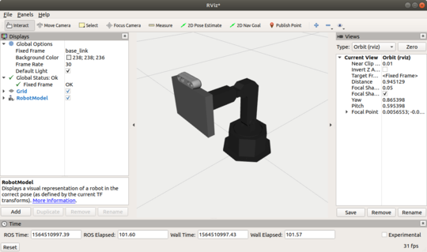

# Assignment 2

This is the second assignment for Yale's CPSC-459/559 Building Interactive Machines course.

## Table of Contents

* [Introduction](#introduction)
    * [System Requirements](#system-requirements)
    * [Background Knowledge](#background-knowledge)
    * [Deliverables](#deliverables)
    * [Evaluation](#evaluation)
    * [Further Reading and Tutorials](#further-reading-and-tutorials)
* [Part I - Set up your workspace to work with Shutter](#part-i---setting-up-your-workspace-to-work-with-shutter)
    * [Questions / Tasks](#questions--tasks) 
* [Part II - Bringing up Shutter](#part-ii---bringing-up-shutter)
    * [Questions / Tasks](#questions--tasks-1) 
* [Part III. Visualize the robot state in RViz](#part-iii-visualize-the-robot-state-in-rviz)
    * [Questions / Tasks](#questions--tasks-2)
* [Part IV. Control one robot joint at a time](#part-iv-control-one-robot-joint-at-a-time)
    * [Questions / Tasks](#questions--tasks-3) 
* [Part V. Create a ROS node to change joint positions programmatically](#part-v-create-a-ros-node-to-change-joint-positions-programmatically)
    * [Questions / Tasks](#questions--tasks-4) 


## Introduction

This assignment will provide you practical experience using the [Robot Operating 
System (ROS)](http://www.ros.org/) and [git](https://git-scm.com/).

#### System Requirements
You should have access to a computer with `Ubuntu 18.04` and `ROS Melodic` to complete the homework. 
The instructions below assume that you are using a [bash shell](https://www.gnu.org/software/bash/) 
to do the assignment, and that have installed the *desktop-full* Melodic version of ROS 
using `apt-get` as in this guide: 
[http://wiki.ros.org/melodic/Installation/Ubuntu](http://wiki.ros.org/melodic/Installation/Ubuntu).

You should also have `git` installed in the machine that you are using to work on your assignment.
You will use git to save your work to your [GitLab](http://www.gitlab.com) repository, as explained in 
[Assignment 1](../assignment-1).

#### Background Knowledge

If you do not have much experience working with a Linux shell, please read this 
[introduction to bash](http://cs.lmu.edu/~ray/notes/bash/) by R. Toal and 
[What Is The Bashrc File Used For? ](https://www.lifewire.com/bashrc-file-4101947) by G. Newell. 
At the bare minimum, you should be familiar with the commands `cd`, `ls`, `rm`, `mkdir`, `echo`, 
`nano` before starting Part I of the assignment.

#### Deliverables

- **Report:** You are expected to submit a pdf to Canvas with answers to the questions/tasks at 
the end of each part of the assignment. This report should also have any information needed 
to understand and/or run your code, as well as the specific commit SHA of the version of the code
that you would like to be evaluated on. Though not mandatory, it is recommended that you generate the report pdf 
with [Overleaf](https://www.overleaf.com/edu/yale#!overview) and this 
[assignment template](https://www.overleaf.com/latex/templates/assignment-template-for-yale-cpsc-459-559/nbysxxygbysk) 
in [LaTeX](https://www.latex-project.org/).

- **Code:** You are also expected to push code for this assignment to your 
[GitLab](http://www.gitlab.com) repository as in [Assignment 1](../assignment-1). 

#### Evaluation

You assignment will be evaluated over 100pts, based on the content of your report and your code:

- Report (70 pts)
    * Part I (10 pts): I-Q1 (5 pts) + I-Q2 (5 pts)
    * Part II (22 pts): II-Q1 (6 pts) + II-Q2 (3 pts) + II-Q3 (3 pts) + II-Q4 (3 pts) + II-Q5 (3 pts) + II-Q6 (1 pts) + II-Q7 (3 pts)     
    * Part III (8 pts): III-Q1 (4 pts) + III-Q2 (4 pts)
    * Part IV (22 pts): IV-Q1 (4 pts) + IV-Q2 (3 pts) + IV-Q3 (5 pts) + IV-Q4 (5 pts) + IV-Q5 (5 pts)
    * Part V (8 pts): V-Q1 (4 pts) + V-Q3(4 pts)
- Code (30 pts)
    * Part v (30 pts)


#### Further Reading and Tutorials 

Feel free to read more about ROS in its [wiki](http://wiki.ros.org/) as you work on 
this assignment or, later, if you want to gain a deeper understanding of any of the concepts 
mentioned below. Additional tutorials can be found in [this page of the wiki](http://wiki.ros.org/ROS/Tutorials).
Questions (and answers) to common problems or issues with ROS can also be 
found in [https://answers.ros.org/questions/](https://answers.ros.org/questions/).

## Part I - Set up your workspace to work with Shutter

*Catkin* is the build system for ROS. To understand what it is for and why it exists, 
read sections 1, 2 and 4 of Catkin's conceptual overview document: 
[http://wiki.ros.org/catkin/conceptual_overview](http://wiki.ros.org/catkin/conceptual_overview).

Set up your Catkin workspace to work with the Shutter robot:

1. Create a [workspace](http://wiki.ros.org/catkin/workspaces) called *catkin_ws* 
in your home directory. Follow the steps in this tutorial: 
[http://wiki.ros.org/catkin/Tutorials/create_a_workspace](http://wiki.ros.org/catkin/Tutorials/create_a_workspace)

    > The [tutorial](http://wiki.ros.org/catkin/Tutorials/create_a_workspace)
    page has tabs for switching between ROS distributions. Follow the tutorial for the distribution of
    ROS that you have installed in your system, i.e., Melodic.

2. Download Shutter's codebase into your workspace's `src` directory.

    ```bash
    # Go to the src folder in your workspace
    $ cd ~/catkin_ws/src

    # Clone the Shutter packages from GitLab
    $ git clone https://gitlab.com/interactive-machines/shutter/shutter-ros.git
 
    # Load git submodules with ROS dependencies
    $ cd shutter-ros
    $ git submodule init
    $ git submodule update
    ```
    
    > [Git submodules](https://git-scm.com/book/en/v2/Git-Tools-Submodules) are other,
    external projects (Git repositories) that have been included in 
    the shutter-ros repository. These projects are needed to run the robot's base code.
    
    You should now have a number of directories in ~/catkin_ws/src/shutter-ros, including:
    
    ```bash
    $ cd ~/catkin_ws/src
    $ ls -C1 shutter-ros
    arbotix_ros
    documentation
    shutter_bringup
    shutter_description
    (...)
    ```
    
    Some of these directories are standard folders, other are ROS catkin packages. 
    A ROS catkin package contains:
    
    1. A [catkin compliant package.xml](http://wiki.ros.org/catkin/package.xml) file
    that contains basic information about the package, e.g., package name, description,
    license, author, dependencies, etc.
    
    2. A [CMakeLists.txt](http://wiki.ros.org/catkin/CMakeLists.txt) file that is 
    used by catkin to build the software package.
    
    For example, the shutter_bringup package has the following files:
    
    ```bash
    # Example
    $ ls -C1 ~/catkin_ws/src/shutter-ros/shutter_bringup
    CMakeLists.txt
    config
    launch
    package.xml
    README.md
    ```
    
    > Each ROS package must have its own folder. This means that there cannot be
    nested packages. Multiple packages cannot share the same directory.
    
    Read the README.md file in the root level of the 
    [shutter-ros](https://gitlab.com/interactive-machines/shutter/shutter-ros.git) repository
    to understand its content and general organization. You can also access the documentation for shutter-ros at [https://shutter-ros.readthedocs.io](https://shutter-ros.readthedocs.io). 
        
3. Install other third-party dependencies with [rosdep](http://docs.ros.org/independent/api/rosdep/html/).
If rosdep is not found in your system, first install it and initialize it as 
indicated [here](http://docs.ros.org/independent/api/rosdep/html/overview.html). 
You will need sudo access to complete this step. 

    > If you are working on one of the machines in AKW 410, feel free to skip this
    step. All dependencies should already be installed in the computer. Or
    contact your T.F. to help you with this step if you think this is not the case.
 
    ```bash
    # update rosdep 
    $ rosdep update

    # install dependencies for Shutter
    $ cd ~/catkin_ws
    $ rosdep install -y -r --ignore-src --rosdistro=melodic --from-paths src

    # install python dependencies for Shutter's face renderer
    $ cd src/shutter-ros/shutter_face/
    $ pip install -r requirements.txt --user
    ```

    > If you don't have pip installed, follow [these instructions](https://linuxconfig.org/how-to-install-pip-on-ubuntu-18-04-bionic-beaver) to install it before installing the Python dependencies for shutter_face.

           
4. Build the packages in the src directory of your workspace with `catkin_make`. 

    ```bash
    # Build your workspace
    $ cd ~/catkin_ws
    $ catkin_make -DCMAKE_BUILD_TYPE=Release
    ```

    > You might want to select a different CMake build type other than Release (e.g. RelWithDebInfo or Debug).
    More options can be found in [cmake.org](http://cmake.org/cmake/help/v2.8.12/cmake.html#variable:CMAKE_BUILD_TYPE). 

    Now you should have a devel space in `~/catkin_ws/devel`, which contains its own setup.bash file.
    Sourcing this file will `overlay` the install space onto your environment. 
    
    > Overlaying refers to building and using a ROS package from source on top of an existing version
    of that same package (e.g., installed to the system in /opt/ros/melodic). For more information
    on overlaying, read [this tutorial](http://wiki.ros.org/catkin/Tutorials/workspace_overlaying).
    
    > Add ```source ~/catkin_ws/devel/setup.bash``` at the end of your `.bashrc` file
     to automatically set up your environment with your workspace every time you open a new shell.
     Otherwise, make sure to source ~/catkin_ws/devel/setup.bash on every new shell that you want
     to use to work with ROS. Sourcing setup.bash from your devel space will ensure that ROS 
     can work properly with the code that you've added to and built in ~/catkin_ws.
                  

### Questions / Tasks

Read more about catkin workspaces [here](http://wiki.ros.org/catkin/workspaces), 
and answer the following questions in your assignment report:

- **I-1.** What other directory was automatically created in ~/catkin_ws when you executed 
`catkin_make` and what is this directory for?

- **I-2.** The command `catkin_make` should have generated 3 types of setup files (setup.bash,
setup.sh, setup.zsh). What is the difference between these setup files?


## Part II - Bringing up Shutter

Now that you have setup Shutter's code in your catkin workspace, you will simulate
the Shutter robot and learn to use basic ROS tools to gather information about 
[ROS nodes](http://wiki.ros.org/Nodes)
-- processes that perform computation in your ROS system -- and 
[ROS messages](http://wiki.ros.org/Messages) -- data being sent from one node to another.
     
1. Open a new bash shell and start [roscore](http://wiki.ros.org/roscore). Roscore is a collection 
of nodes and programs that are pre-requisites of a ROS-based system.

    ```bash
    $ roscore
    ```
       
    > You must have roscore running in order for ROS nodes to communicate.
         
2. Open another terminal, and *bring up* a simulated version of the Shutter robot 
with [roslaunch](http://wiki.ros.org/roslaunch).

    ```bash
    $ roslaunch shutter_bringup shutter.launch simulation:=true 
    ```

    > The term *bring up* is often used in ROS to denote the process of starting 
    the base functionality of a robot.
    
    > Roslaunch is a tool for easily launching multiple ROS nodes locally (or remotely
    via [SSH](https://en.wikipedia.org/wiki/Secure_Shell)) and setting up parameters 
    in ROS' [Parameter Server](http://wiki.ros.org/Parameter%20Server). You will make your
    own launch file later in this assignment.
    
    The shutter.launch file will then publish a 3D model of the robot (in [URDF format](http://wiki.ros.org/urdf))
    to the [ROS Parameter Server](http://wiki.ros.org/roscpp/Overview/Parameter%20Server).
    The model has information about the the joints of the robot 
    and its sensors, including specific properties and relative placement. 
    The shutter face renderer will also run and open.
    
    > The ROS Parameter Server is a shared, multi-variate dictionary that is accessible via network APIs. 
    Nodes use this server to store and retrieve parameters at runtime. As it is not designed for 
    high-performance, it is best used for static, non-binary data such as configuration parameters. 
    It is meant to be globally viewable so that tools can easily inspect the configuration state of 
    the system and modify if necessary. 
    
    The shutter.launch script runs three [ROS nodes](http://wiki.ros.org/Nodes) as three 
    independent processes:
    
    1. */arbotix*: robot driver from the [arbotix_python ROS package](https://github.com/marynelv/arbotix_ros).
    The driver provides a basic ROS interface to the robot's 
    [Arbotix RoboController](https://www.trossenrobotics.com/p/arbotix-robot-controller.aspx) 
    in its base, or equivalent simulation functionality.
    
    2. */robot_state_publisher:* [state_publisher](http://wiki.ros.org/robot_state_publisher) node which 
    publishes the position of the joints of the robot to [tf](ros.org/wiki/tf).
    
    3. */motor_stopper:* node to safely send joint commands to the robot. By safe, we mean that the commands can be interrupted if desired. 
  
    
3. Use [rqt_graph](http://wiki.ros.org/rqt_graph) to visualize the 
[nodes](http://wiki.ros.org/Nodes) that are currently running
in your ROS system and the [topics](http://wiki.ros.org/Topics) that are being used to 
exchange information between nodes.

    ```bash
    $ rosrun rqt_graph rqt_graph
    ```
    
    Uncheck the "Debug" option under "Hide" in rqt_graph,
    and select "Nodes/Topics(all)" to visualize all of the nodes that are sharing information
    in the graph. You should see a total of 5 `ROS nodes` (displayed as ellipses) in the graph: /arbotix, 
    /robot_state_publisher, /motor_stopper, /rqt_gui_py_node_XXXX, and /rosout. 
    
    > The full name of the rqt_graph node includes numbers XXXX, which indicate that the
    program was run as an anonymous node. The numbers were generated 
    automatically when the node was initialized to provide the program a unique name, e.g.,
    in case you want to run multiple versions of rqt_graph. More information about initializing nodes
    in C++ or Python can be found 
    [here](http://wiki.ros.org/roscpp/Overview/Initialization%20and%20Shutdown) or 
    [here](http://wiki.ros.org/rospy/Overview/Initialization%20and%20Shutdown), respectively.
    
    The nodes are connected in the graph through `ROS topics` (displayed as squares). 
    ROS topics are named buses over which data [messages](http://wiki.ros.org/Messages) are exchanged. 
    There can be multiple publishers and subscribers to a topic. 
    
    > In general, nodes are not aware of who they are communicating with. 
    Instead, nodes that are interested in data *subscribe* to the relevant topic; 
    nodes that generate data *publish* to the relevant topic. 
    
    For example, the nodes /arbotix, /robot_state_publisher, and /rqt_gui_py_node_XXXX publish
    messages to the /rosout topic. Thus, you should see a directed edge in the graph from
    each of these nodes to the /rosout topic. Meanwhile, the 
    node [/rosout](http://wiki.ros.org/rosout#rosapi) subscribes to the /rosout topic. This is 
    illustrated in the graph with an edge that goes in the opposite direction: 
    from the /rosout topic to the /rosout node.
    
    > The node [rosout](http://wiki.ros.org/rosout) implements a system-wide logging mechanism for messages
    sent to the /rosout topic. The /rosout node subscribes to the /rosout topic to record
    the messages into a log file.
    
    

### Questions / Tasks
    
Answer the questions and complete the tasks below based on the status of your ROS system after 
bringing up the robot.
  
- **II-Q1.** Based on the graph from rqt_graph, how many topics have at least one 
subscriber and at least one publisher in your ROS system? 

- **II-Q2.** Through which topic in specific are the /arbotix and 
/robot_state_publisher node communicating in ROS?

- **II-Q3.** Using the [rostopic command-line  tool](http://wiki.ros.org/rostopic), investigate what type 
of [ROS message]() is being sent/received through the ROS topic that /arbotix and /robot_state_publisher 
are using to communicate with one another?

    *Tip:* Query information about a topic with:
    ```bash
    $ rostopic info <topic_name>
    ```

- **II-Q4.** What are the fields of the message type that is used to transmit information from 
/arbotix to /robot_state_publisher?

    *Tip:* Query information about a message type with the [rosmsg command-line  tool](http://wiki.ros.org/rosmsg):
    ```bash
    $ rosmsg show <message_type>
    ```

- **II-Q5.** Using the [rostopic echo](http://wiki.ros.org/rostopic#rostopic_echo) command-line tool 
get one of the messages that is being sent from /arbotix to /robot_state_publisher. Include an example
in your report.


- **II-Q6.** Use the [rostopic hz](http://wiki.ros.org/rostopic#rostopic_hz) command-line tool 
to find out at what rate are messages being published to the topic of question PII-Q2.

- **II-Q7.** Besides the topic of question PII-Q2, through which other topics can the 
/arbotix node publish messages? Provide a list of the topics and their respective 
message types in your report.

    *Tip:* The full list of topics through which /arbotix may publish messages 
    will not necessarily show in rqt_graph, because not all of the topics have subscribers. 
    To query full information about a node, use instead the 
    [rosnode command-line tool](wiki.ros.org/rosnode):
    ```bash
    $ rosnode info <node_name>
    ```


## Part III. Visualize the robot state in RViz 

First bring up Shutter as in Part II of this assignment (though there is no need to launch rqt_graph this time). 
Then, follow the steps below to visualize a simplified version of the robot and its joints in [rivz](http://wiki.ros.org/rviz).

> rviz is a 3D visualization environment for ROS. It helps visualize sensor data and robot 
state information. 

1. Read sections 4-7 of the [rviz User Guide](http://wiki.ros.org/rviz/UserGuide). The guide will 
provide you an overview of the Panels, Displays, and configuration options available in rviz.
 
2. Run `rviz` in a new terminal. 

    ```bash
    $ rosrun rviz rviz
    ```
 
    A graphical interface should then open up in your computer.
    
3. Change the `Fixed Frame` to "base_link" in rviz's Global Options panel. This will ensure
that the robot's model is shown straight up in the middle of the 3D visualization area of rviz.
    
4. Change your background color to a light color (e.g., light gray) in the Global Options as well.
    
5. Add a `RobotModel display` to rviz. Click on the "Add" button in the Displays panel, and
a window will pop up. Then, look for the "rviz" plugins folder, and select RobotModel. You should
then see a simplified model of the robot in rviz, as in the figure below.

    

    The [RobotModel Display type](http://wiki.ros.org/rviz/DisplayTypes/RobotModel) shows
    the [links](http://wiki.ros.org/urdf/XML/link) of the robot according to 
    the URDF model published by the shutter.launch script (Part II - step 2 of this assignment).
    Each link describes a rigid body in the robot with physical, geometrical, 
    and visual features. 
    
    The RobotModel display also uses the [/tf](wiki.ros.org/tf) transform 
    tree to position the links of the robot in their respective current location.
    The information in the /tf topic is updated by the /robot_state_publisher node based
    on the messages that /arbotix publishes to the /joint_states topic.
    
    > As indicated in the user guide, you can zoom in, pan, and rotate the view of the 
    robot in rviz with your mouse.
    
    
### Questions / Tasks

Inspect the robot model using the properties of the RobotModel Display in rviz. Then,
answer the questions and complete the tasks below:

- **III-Q1.** How many links does the robot model have? List them all in your report.
    
- **III-Q2.** Use the properties of the RobotModel Display panel to change the "alpha" 
value of all of the links of the robot to 0.5, and show the coordinate axes for 5 key links in 
the robot: "base_link", "shoulder_link", "biceps_link", "forearm_link", and "wrist_link". 
The coordinate axes can be turned on and off with the "Show Axes" property of each of the links 
in the RobotModel Display panel.
 
    Take a picture of the robot in rviz with the 5 set of axes visible and include it
in your report.

    > Each of the axes that you are visualizing is a coordinate frame (attached to a rigid body, i.e., a link)
    in the robot. Their relative position and orientation is provided to rviz through the /tf topic. 
    Additional information about tf can be found [here](http://wiki.ros.org/tf).


## Part IV. Control one robot joint at a time
    
Shutter's body has 5 key links ("base_link", "shoulder_link", "biceps_link", 
"forearm_link", and "wrist_link") and 4 revolute [joints](http://wiki.ros.org/urdf/XML/joint). The joints are implemented in the real
robot with [dynamixel MX-64M and MX-28M motors](http://www.robotis.us/dynamixel/). These motors count with
magnetic encoders that provide the arbotix driver an estimate of their current position. 
 
Each joint in the robot connects two links:
- **joint 1:** Connects the "base_link" to the "shoulder_link"
- **joint 2:** Connects the "shoulder_link" to the "bicepts_link"
- **joint 3:** Connects the "bicepts_link" to the "forearm_link"
- **joint 4:** Connects the "forearm_link" to the "wrist_link"
 
You will now learn to control the positions of these 4 joints with a graphical
interface in order to change the pose of the robot.

1. If the simulated robot or rviz are not running, bring up the robot and 
rviz as in Parts II and III of this assignment.

2. Control the position of the robot's joints with the `arbotix_gui` interface.

    ```bash
    $ rosrun arbotix_python arbotix_gui
    ```
    
    By enabling and moving the sliders in the GUI, you will be sending requests to move the joints
    through the /joint_X/command topics. The /arbotix driver, which listens to these topics,
    will then send the new positions to the robot. 
    
    How does rviz update the visualization of the robot model? As the robot
    starts moving, the /arbotix driver will publish the new joint positions, which then
    get re-published in /tf as transformations by the /robot_state_publisher node. The /tf 
    transformations and the robot URDF model are used by rviz to render the robot in motion.
    
### Questions / Tasks

- **IV-Q1.** Now that you know that the robot has 4 joints, how can you get the current position
of the joints through the command line? 

    *Tip:* The current positions must be measured with magnetic encoders in the real 
    robot (or simulated by the arbotix driver).

- **IV-2.** How can you inspect through the command line the exact position that the 
arbotix_gui is requesting for a joint as you move one of the sliders in the interface? For example, 
if you enable joint_1 in the arbotix_gui and move the slider to rotate the robot around, 
how can you get the exact angle that you are requesting that joint to have?

- **IV-3.** What is the maximum and minimum angle in radians that you can set for joint_4 through
the arbotix_gui?

- **IV-4.** Take a screenshot of the robot in rviz when its joints are set to:
    - joint_1: 0 rad
    - joint_2: 0 rad
    - joint_3: -1.57 rad
    - joint_4: 0 rad
    
    Include the screenshot in your report.
    
- **IV-5.** What shell command can you use to request a new pose for a 
joint of the robot? Before testing this command, close the arbotix_gui 
so that it doesn't interfere with your pose request.

    *Tip:* Use the [rostopic pub](http://wiki.ros.org/rostopic#rostopic_pub) command line tool.

## Part V. Create a ROS node to change joint positions programmatically

You will now create a custom package and write a ROS node in Python to 
change the pose of the robot programmatically. The robot should iterate between the 3 poses below:

- Pose 1 (*default_pose*):
    * joint_1: 0 rad 
    * joint_2: 0 rad
    * joint_3: 0 rad
    * joint_4: 0 rad
    
- Pose 2 (*pulled_back_pose*):
    * joint_1: 0 rad 
    * joint_2: -0.95 rad
    * joint_3: 0.41 rad
    * joint_4: -1 rad
    
- Pose 3 (*low_pose*):
    * joint_1: 0 rad 
    * joint_2: -1.45 rad
    * joint_3: 1.45 rad
    * joint_4: -1.53 rad

More specifically, the robot should change pose from Pose 1 -> Pose 2 -> Pose 3 -> Pose 1 -> ... 
and so on. The robot should wait about 5 seconds between changing poses.

Follow the steps below to get started:

1. Place your local git repository in the src directory of your workspace. For example,
if you named your workspace ~/catkin_ws and cloned your repository in your home folder as 
~/\<username\>-cpsc459-assignments, then move the repository to the ~/catkin_ws/src directory as follows:

    ```bash 
    # Example 
    $ cd ~
    $ mv <username>-cpsc459-assignments catkin_ws/src/
    ```
    
    > Because you will create a ROS package for your code within your repository, placing
    your repository in the src directory of your workspace will allow you to run your code
    with `rosrun` from any location in your computer.
    
2. Create a new catkin package with the `catkin_create_pkg` tool from the [catkin_pkg](https://github.com/ros-infrastructure/catkin_pkg) ROS library.
This package should be named "shutter_poses" and should be created within the assignment-2 
directory of your git repository.

    ```bash
    # Example
    $ cd ~/catkin_ws/src/<username>-cpsc459-assignments/assignment-2
    $ catkin_create_pkg shutter_poses rospy std_msgs 
    ```

    > The rospy and std_msgs packages are added at the end of the catkin_create_pkg command
    so that they are automatically defined as dependencies of your package. You can always
    add/edit/remove dependencies by editing the package.xml and CMakeLists.txt files 
    that are created within your package. See this 
    [tutorial](http://wiki.ros.org/ROS/Tutorials/CreatingPackage) (Sec. 5 & 6) for examples.

3. Customize your package by editing the package.xml file that was created by catkin_create_pkg 
in your package. Add a better description of the package and author information.

4. Create a python node in your new package. Name the node "test_poses.py" and save it
in the scripts folder of your package.

    ```bash
    # Example
    $ roscd shutter_poses
    $ mkdir scripts
    $ touch switch_poses.py
    ```
    
    You should now have a new empty file named "switch_poses.py" in the 
    <username>-cpsc459-assignments/assignment-2/shutter_poses/scripts directory.

5. Make the file into an executable python script. Add ```#!/usr/bin/env python``` as first
line to your file and change permissions with 
[chmod](https://www.howtoforge.com/tutorial/linux-chmod-command/) to allow it to run as an executable:

    ```bash
    # Example
    $ chmod +x switch_poses.py
    ```

6. Structure the code in your node as in the publisher example of 
[this tutorial](http://wiki.ros.org/ROS/Tutorials/WritingPublisherSubscriber%28python%29#rospy_tutorials.2BAC8-Tutorials.2BAC8-WritingPublisherSubscriber.Writing_the_Publisher_Node)
and write any necessary code to make the joints of the robot move according to the poses
specified above. Don't worry about adjusting the speed of the servos as the robot is moving from one pose to the next as that is taken care by the robot's arbotix driver. 

    In your node, you should first import rospy and any necessary message types at the top of the program. 
    Then, define a function that will initialize the node and do most of the work. Finally,
    call this function from your main function. Your program should then look like the example below:

    ```python
    #!/usr/bin/env python
    
    import rospy
    from std_msgs.msg import Float64
    # add any other python modules that you need here ...

    # define joint positions per pose
    poses_list = [
       {'joint_1': 0, 'joint_2': 0, 'joint_3': 0, 'joint_4': 0},
       ... # complete list of poses
    ]

    def pose_switcher():
       # Define publishers and init your node here.
       # Add a loop to request the robot to move its joints according to the 
       # desired poses.
       ...

    if __name__ == '__main__':
       try: 
           pose_switcher()
       except rospy.ROSInterruptException:
           pass
    ```
    
7. Once you've finished writing your node, start roscore (as in Part II of this assignment), 
bring up the robot (Part II), run rviz (Part III), and run your node with `rosrun`:

    ```bash
    # Example
    rosrun shutter_poses switch_poses.py
    ```
    
8. Check that the robot is behaving as expected in RViz. If not, close your node, edit your code,
and run it again.

    > You can leave roscore and all other nodes running while you edit your code.
    
9. Save your work by adding and committing your node to your local repository and 
pushing your code to GitLab.

    ```bash
    # add files to your repository to track their changes over time
    $ roscd shutter_poses
    $ git add package.xml CMakeLists.txt scripts/switch_poses.py

    # commit changes
    $ git commit -m "<some useful log message>"

    # push changes to your master branch in GitLab
    $ git push origin master
    ```
    
    > Continously committing your work and pushing to Gitlab will ensure that your
    code is backed up and readily accessible at any time in the future.
    
### Questions / Tasks

- **V-Q1.** Add a README.md file in 
[GitLab flavored markdown](https://docs.gitlab.com/ee/user/markdown.html) format to your 
shutter_poses package. This file should explain how the switch_poses.py node works. What does it do? What topics does it subscribe to? What does it publish?

    > Documenting ROS packages and nodes is good practice!

- **V-Q2.** Add the `commit SHA` that corresponds to the final version of your code to your report.
This version of the code is what will be used to evaluate this assignment.

- **V-Q3.** Record your screen (e.g., with [kazam](https://launchpad.net/kazam)) as the 
robot is changing its pose in RViz and reaching the desired poses. Turn this video into an animated
gif, e.g., with ffmpeg and imagemagick as indicated in 
[this code snippet](https://gitlab.com/snippets/1743818), and include it to your README.md file
to demonstrate the execution of the switch_poses.py node in your documentation. 

    NOTE: We suggest that you add the animated gif to your repository so that all of your documentation
    is contained in a single place and the animated gif is displayed in 
    GitLab when your README.md file is rendered on the web. 

     > More information on including images 
     in GitLab's markdown can be found [here](https://docs.gitlab.com/ee/user/markdown.html#images).


