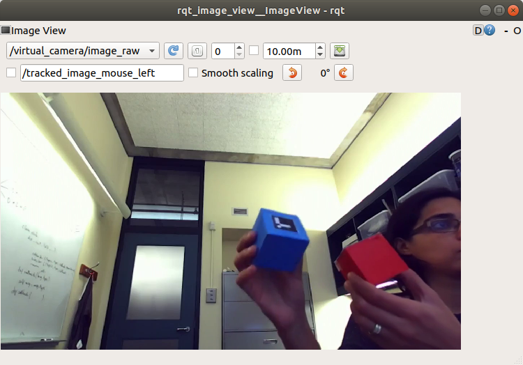
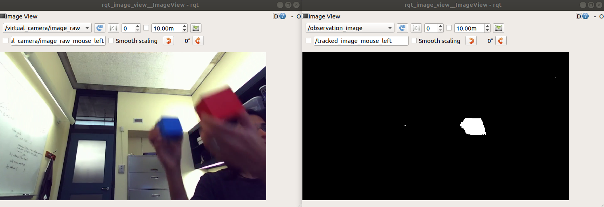
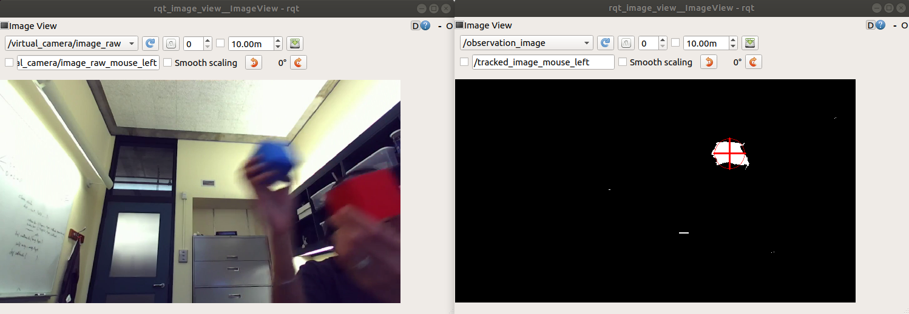

# Assignment 2

This is the third assignment for Yale's CPSC-659 Building Interactive Machines course.

## Table of Contents


## Introduction 
This assignment will provide you practical experience with custom messages in ROS, low-level image processing,
 and Kalman filters.


#### System Requirements
As for the prior assignments, you should have access to a computer with `Ubuntu 16.04` and `ROS Kinetic` to complete the homework. 

> NOTE: If you have Ubuntu 18.04, you can also complete this homework 
using ROS Melodic. 

You should also have `git` installed in the machine that you are using to work on your assignment.
You will use git to save your work to your [GitLab](http://www.gitlab.com) repository.


#### Background Knowledge

This assignment assumes that you have already completed the prior assignments and, thus, you
have set up your catkin workspace. You are also expected to have experience with Linux shells 
(e.g., [bash](https://www.gnu.org/software/bash/)), [git](https://git-scm.com/), and
the [Robot Operating System (ROS)](http://www.ros.org/). This includes being familiar with
the `roscore`, `rosrun`, `roslaunch`, `rosbag`, `rostopic`, `rosmsg`, `rosnode`, `rqt_image_view`, 
and `rviz` tools. 


#### Notation
We refer to `vectors` or column matrices with bold lower-case letters (e.g., $`\bold{x}`$).
Other `matrices`, such as linear transformations, and `scalars` are written with regular
font weight. 


#### Deliverables

- **Report:** You are expected to submit a pdf to Canvas with answers to the questions/tasks at 
the end of each part of the assignment. This report should also have any information needed 
to understand and/or run your code, as well as the specific commit SHA of the version of the code
that you would like to be evaluated on. Though not mandatory, it is recommended that you generate this pdf 
with [Overleaf](https://www.overleaf.com/edu/yale#!overview) and this 
[simple assignment template](https://www.overleaf.com/latex/templates/simple-assignment-template/mzkqqqjypzvd) 
in [LaTeX](https://www.latex-project.org/).

- **Code:** Finally, you are expected to push code for this assignment to your 
[GitLab](http://www.gitlab.com) repository as indicated in the [general instructions](../README.md) 
document for CPSC-659 assignments. 


#### Evaluation

You assignment will be evaluated based on the content of your report and your code:


#### Further Reading

- [Playing Catch and Juggling with a Humanoid Robot](https://www.disneyresearch.com/publication/playing-catch-and-juggling-with-a-humanoid-robot/)
- [Discriminative Training of Kalman Filters](http://www.roboticsproceedings.org/rss01/p38.pdf)


## Part I. Creating a Custom ROS Message Type
ROS uses [messages](http://wiki.ros.org/msg) of various types to transmit information between nodes. For example, in the 
past you have worked [TransformStamped](http://docs.ros.org/kinetic/api/geometry_msgs/html/msg/TransformStamped.html) 
messages and [PoseStamped](http://docs.ros.org/kinetic/api/geometry_msgs/html/msg/PoseStamped.html). Now, you 
will create your own custom message type.

To get started, read [this tutorial on Creating Messages and Services](http://wiki.ros.org/ROS/Tutorials/CreatingMsgAndSrv) 
in ROS.
Then, follow the steps below to make your own message type as in the tutorial. This message type will serve in the next parts
 of the assignment to send information about a detected visual target.

1. Create a `msg` directory within the `shutter_track_target` ROS repository of this assignment. This directory
will hold your new message definition.

    ```bash
    $ cd shutter_track_target
    $ mkdir msg
    ```
    
2. Create a file in the shutter_track_target/msg directory named `Observation.msg`. The content of the file
should define the following fields for the message type:

    - **header** (of type [std_msgs/Header](http://docs.ros.org/api/std_msgs/html/msg/Header.html))
    - **x** (of type float64 -- built-in [primitive message type](http://wiki.ros.org/msg) --)
    - **y** (of type float64 -- built-in [primitive message type](http://wiki.ros.org/msg) --)
    
3. Edit the package.xml and CMakeLists.txt files in the shutter_track_target package to define your
new message type as in the [tutorial on Creating Messages and Services](http://wiki.ros.org/ROS/Tutorials/CreatingMsgAndSrv).

    *Tip:* You need to add package dependencies to package.xml, as well as define your new message
    type and dependencies in CMakeLists.txt. Don't forget to uncomment the generate_messages() function
    in CMakeLists.txt as in the tutorial.

4. Build your catkin workspace to generate the new message type

    ```bash
    $ cd <catkin_workspace>
    $ catkin_make
    ```
    
    *Tip:* If for some reason catkin_make fails to generate your message, check the CMakeLists.txt and
    package.xml filtes that you edited in step 3.
    
5. Verify that your message type is built and has the 3 fields as mentioned in the step 2 above. You
can use with the `rosmsg` tool to this end:

    ```bash
    $ rosmsg show shutter_track_target/Observation
    std_msgs/Header header
      uint32 seq
      time stamp
      string frame_id
    float64 x
    float64 y
    ```
    (the output of rosmsg should be as in the code snipped above)
    

### Questions / Tasks

- **I-1.** Add the Observation.msg, package.xml and CMakeLists.txt files to your repository.
Commit the changes that you made to generate your new message type in the shutter_track_target package.

## Part II. Get Data 
Download the ROS bag [left-seq1.bag](https://drive.google.com/open?id=1k694YrMM54QAK85AZ_a-F7jWmtWQ1TEn) from Google 
Drive. Then, place it inside a `data` directory within the shutter_track_target package:

```bash
$ cd shutter_track_target
$ mkdir data
$ cd data
$ mv <path-to-bag> . # move the bag to the data directory
```

Inspect the bag to make sure that it was downloaded properly:

```bash
$ rosbag info left-seq1.bag
path:        left-seq1.bag
version:     2.0
duration:    11.5s
start:       Sep 26 2018 21:49:02.76 (1538012942.76)
end:         Sep 26 2018 21:49:14.23 (1538012954.23)
size:        630.3 MB
messages:    239
compression: none [239/239 chunks]
types:       sensor_msgs/Image [060021388200f6f0f447d0fcd9c64743]
topics:      /virtual_camera/image_raw   239 msgs    : sensor_msgs/Image
```

And play the bag to see its content: 

```bash
$ rosparam set use_sim_time true # necessary if the use_sim_time parameter is not set in ROS yes or is set to false
$ rosbag play --clock left-seq1.bag
$ rosrun rqt_image_view rqt_image_view # visualize the /virtual_camera/image_raw image
```

(You should see images of Marynel moving two colored cubes as in the figure below. These images
were captured with the ZED camera on Shutter)

<kbd>

</kbd>

*Tip:* ROS nodes use the /clock topic to gather information about time (see [here](http://wiki.ros.org/Clock) for more information). 
When the `use_sim_time` parameter is set to true, ROS will stop publishing your computer's system clock
through /clock and, instead, `rosbag play` will publish a simulated time. 
If you are playing ROS bags and don't set use_sim_time parameter to true, then messages may be handled incorrectly by
ROS nodes. You can check the value of the use_sim_time parameter in the [ROS parameter server](http://wiki.ros.org/Parameter%20Server) 
with the command:

```bash
$ rosparam get use_sim_time
```

### Questions / Tasks
- **II-1.** Make a video of rqt_image_view that shows the content of the /virtual_camera/image_raw
topic as the left-seq1.bag rosbag plays. Turn this video into an animated
gif, e.g., with ffmpeg and imagemagick as indicated in 
[this code snipped](https://gitlab.com/snippets/1743818), and include it in a `docs` directory within the
 shutter_track_target package. Commit the gif to your repository.
 

## Part III. Detecting a Visual Target
You will now use simple image processing techniques to detect the blue cube in the images within the left-seq1.bag.
These detections will be observations for the location of the target, which you will then filter in the next part
of the assignment.

To get you started, this assignment provides the skeleton structure for a node that detects
blobs of a given color: see the shutter_track_target/scripts/detect_visual_target.py script. Read the script
to understand how it works in general. 

For the next parts of this assignment, do NOT edit the init() and image_callback() functions of the DetectTarget class
in the detect_visual_target.py node. Only edit the filter_image(), compute_keypoints_for_blobs(), and publish_observation()
functions as indicated in the three tasks below. 

### Questions / Tasks
You will now complete the detect_visual_target.py node by implementing the filter_image(), compute_keypoints_for_blobs(), and publish_observation()
functions.

- **III-1.** Read this [tutorial on Color Spaces in OpenCV](https://www.learnopencv.com/color-spaces-in-opencv-cpp-python/).
Afterwards, implement the `filter_image()` function in the detect_visual_target.py node so that the function:

    1. Converts the input `cv_image` to the HSV color space.
    2. Filters the image in the HSV color space using the [cv2.inRange]() function from OpenCV. 
    3. Finally, returns the image (mask) output by the inRange() function.
    
    *Tip:* This [tutorial](https://pythonprogramming.net/color-filter-python-opencv-tutorial/) provides
    an example on color filtering in OpenCV. 
    
To check that your filter_image() function is working properly, run your node with the default hue range of 100-140:

```bash
# play the left-seq1.bag as in Part II of the assignment, and then run the node:
$ rosrun shutter_track_target detect_visual_target.py
```

You should then be able to visualize the output topic `/observation_image` for debugging purposes with 
`rqt_image_view`. The output image (or mask) should have high values for the pixels corresponding to the blue 
cube in the input image, as shown below.

<kbd>

</kbd>

- **III-2.** Read this other [tutorial on Blob Detection](https://www.learnopencv.com/blob-detection-using-opencv-python-c/)
and implement the `compute_keypoints_for_blobs()` function in the detect_visual_target.py node so that it:

    1. Creates a `cv2.SimpleBlobDetector_Params()` object with all of the parameters
    for an OpenCV blob detector.
    
    2. Creates a SimpleBlobDetector object with the params from the previous step.
    
    3. Uses the detector to detect blobs on the `filtered_image` mask that is passed to the computer_keypoints_for_blobs() function.
    
    4. Returns the detected list of keypoints.
    
*Tip:* You can read more about how the SimpleBlobDetector algorithm works on the [official OpenCV documentation](https://docs.opencv.org/2.4/modules/features2d/doc/common_interfaces_of_feature_detectors.html#SimpleBlobDetector%20:%20public%20FeatureDetector).

Once you've implemented the compute_keypoints_for_blobs() function, you can run the detect_visual_target.py 
node to debug your code for this part of the assignment, as in the task III-1. Edit the parameters of the 
blob detector such that the blue cube is detected well in the left-seq1.bag
image sequence. The result should look similar to the image below:

<kbd>

</kbd>

The red circle in the right image above corresponds to a detected keypoint. The crossmark corresponds to the biggest keypoint
found by OpenCV blob's detection algorithm. The position of this keypoint is what the node outputs
through the "/observation" topic (see the next task).

- **III-3.** Finally, implement the `publish_observation()` function in the detect_visual_target.py node.
This function receives a `tuple (x,y)` corresponding to the location of the biggest keypoint 
found by the blob detection algorithm. The function should publish this coordinate as an Observation message
through the "/observation" topic (self.obs_pub variable). 

Before publishing the Observation message, make sure to set its 
header field. The header field should have the same values as the header variable 
that passed to the publish_observation() function. This will ensure that the time stamp and frame of the Observation message
matches the time stamp and frame of the image that it was generated from.

Add the detect_visual_target.py script to your repository and commit your implementation of the 
missing functions.

- **III-4.** As in II-1, make a video of rqt_image_view that shows the content of the /observation_image
topic as the left-seq1.bag rosbag plays. Turn this video into an animated
gif and include it in the `docs` directory within the
 shutter_track_target package. Commit the gif to your repository.
 

## Part IV. Filtering the Target's Position


