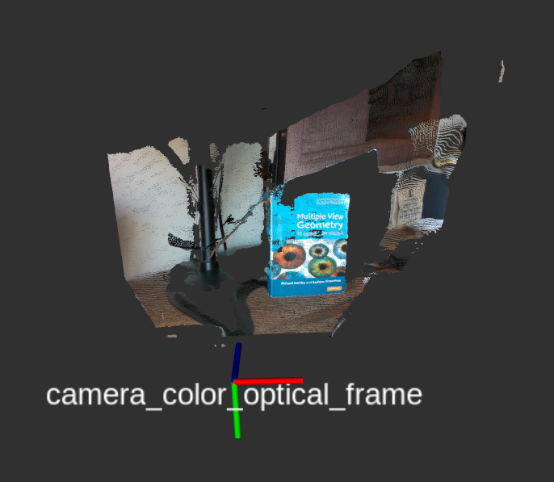
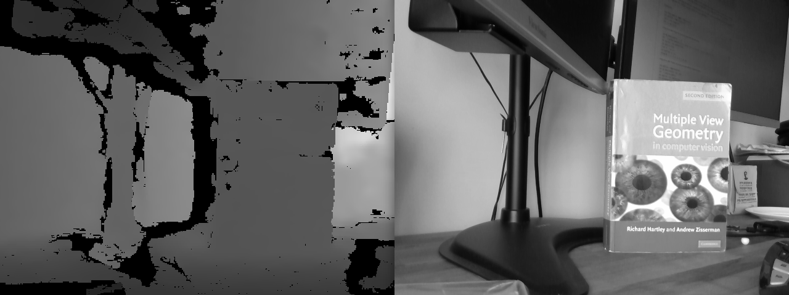

# Assignment 3 (Extra questions for CPSC-559)

The sections below for Assignment 3 are only meant to be completed/answered by students taking CPSC-559. Students in CPSC-459 are welcome to try to solve the problems/tasks below and even come to office hours to discuss them. However, their answers to the questions in Part IV and Part V of the assignment 3 will not be considered during grading.

## Part IV. Solving for the intrinsics

[Full camera calibration](https://www.mathworks.com/help/vision/ug/camera-calibration.html) consists of findings the intrinsic and extrinsic camera parameters
that define the projective operation $`\mathbf{x} = P\mathbf{X}`$, where $`\mathbf{X}=[X\ Y\ Z\ 1]^T`$ is a point in homogeneous coordinates in the world coordinate frame and $`\mathbf{x}`$ is the point's projection on the image. 
However, it sometimes happens that one only cares about observing the world from a camera and an external coordinate frame is irrelevant for the application. In these situations, we only care about the intrinsic camera parameters $`K`$, such that $`\mathbf{x} = K[I|\bold{0}][X\ Y\ Z\ 1]^T`$, where $`I`$ is the $`3 \times 3`$ identity matrix and $`\bold{0}`$ is the 3-dimensional zero vector.

### Questions / Tasks


- **IV-1.** Assume that a camera has no skew and no lens distortion, as the virtual camera that you implemented for Shutter in Part III of this assignment. Then, compute the camera's intrinsic parameters $`K`$ by minimizing the $`error = \sum_i \|\mathbf{x}_i - K[I|\bold{0}]\mathbf{X}_i\|^2`$ using Least Squares, where i indexes a set of sample correspondences $`< \mathbf{x}_i,\mathbf{X}_i >`$. This set of 3D - 2D correspondences is provided for you in the `calibration/correspondences.txt` file of this assignment. Note that the first three columns of the file provide the $` X, Y, Z `$ 3D coordinates of the points, meanwhile the last two columns are the corresponding pixel locations $`x, y`$. Assume that the pixel locations in homogeneous coordinates are simply $`[x, y, 1]`$.

    Implement a script to solve for the instrinsics in Python. Your script should take as input the path to the correspondences.txt file, and print the estimated
    matrix $`K`$ and the $`error`$ for your solution. Name your script `calibrate_K.py` and save it in the `calibration` directory of this assignment within
    your repository. 

    Explain in your report how your calibrate_K.py script should be run, how you formulated a system of equations to solve for $`K`$, and how you solved the system in your implementation. Provide the resulting value for $`K`$ in your report as well as the $`error`$, as defined above.

    > Note: It is allowed to use numeric libraries like numpy in your implementation. But even if you do, explain how you solved the problem in your report.


## Part V. Estimating depth from images

In general, it is impossible to estimate the absolute scale of a scene based only on an image of it. However, if we know the true size of an object in the world,
we can take advantage of this piece of information to estimate how far the object is from the camera (i.e., its depth). This is your goal for this part of the assignment.

To work on the problem of estimating the depth of an object in an image, the instructor followed the steps below to gather data from a RealSense camera -- like the one in Shutter.

1. First, the [RealSense driver](https://github.com/IntelRealSense/librealsense/blob/master/doc/distribution_linux.md) and the [realsense2_camera ROS package](https://github.com/IntelRealSense/realsense-ros.git) were installed to use the camera in Ubuntu. 

2. Second, the driver for the RealSense D435 camera was started to stream images through the ROS network:

    ```bash
    $ roslaunch realsense2_camera rs_camera.launch align_depth:=true
    ```

    The aligned depth option told the driver to generate depth images that are aligned with the RGB images captured by the camera. This means
    that the depth of a pixel (x,y) in the RGB image can be obtained from the same location in the depth image. 

3. Third, a Hartly and Zisserman's book was placed on the table, as shown in the pointcloud below. You will estimate the depth of this book in the tasks of this section of the assignment.

    
    
4. Fourth, the `depth/save_images.py` script was run to save to disk what the camera was currently observing. The resulting depth (left) and gray (right) images are shown below:

    
    
The above process resulted in the [image.npz](https://drive.google.com/file/d/1BFibFGBLJeYvgxtBnxHRJxfHfbAcOjO_/view?usp=sharing) data file, which you should download to complete this part of the assignment. The data includes:

- The image captured by the camera and converted to grayscale format (i.e., the data is a 2D matrix of 8-bit integer pixel values).
- The depth image (aligned with the grayscale image). The data is a 2D matrix of floats (in meters).
- The width of the images.
- The height of the images.
- The intrinsics matrix K for the camera that captured the grayscale image.

To load the data from the image.npz file, you can use the sample script `depth/process_images.py`. This script shows you how extract the different components of the image.npz file in Python, visualize the images, and select a region of interest in the grayscale image.


### Questions / Tasks

- **V-1.** The book has a true height of $`h=24.5`$ cm and is placed in front of the camera, oriented roughly such that its cover is parallel to the $`XY`$ plane of the camera's coordinate frame. How can you compute how far the book is from the camera's center in the grayscale image of the [image.npz](https://drive.google.com/file/d/1BFibFGBLJeYvgxtBnxHRJxfHfbAcOjO_/view?usp=sharing) file? That is, how can you get an estimate of the $`Z`$ coordinate of the book's cover in the camera's coordinate frame? Explain your answer to this question in your report, given the book's true height, the intrinsic 
parameters ($`K`$) of the camera used to get the grayscale image, and the position of the top-left ($`\bold{x_1} = (x_1,y_1)`$) and bottom-right ($`\bold{x_2} = (x_2,y_2)`$) corners of a box surrounding the book's front cover in the image, as illustrated in the image below.

    

    > Tip: We recommend that you draw the geometric relations of the known and unknown variables for this problem. Include this drawing in your report to help explain your answer to this question. 

- **V-2.** Modify the `docs/process_images.py` script to implement your solution to the task V-1. To this end, first add an additional input argument to the script for gathering the height of the object of interest (in this case, the book):

    ```python
    object_height = float(sys.argv[2]) # new argument in the script
    ```

    Second, write code at the end of the script to compute the depth based on the `image_coordinates` provided for the object when the script runs. Finally,
    print the result:

    ```python
    Z = ... # compute Z
    print("Estimated depth: {}m".format(Z))
    ```

    Then, you should be able to run the script, providing the book's height, select the book in the grayscale image, and see the estimated depth printed in the terminal:

    ```bash
    $ ./process_images.py images.npz <book_height>
    Loading images.npz
    (...)
    Estimated depth: ... <- your result
    ```

    Write in your report the resulting depth value that you computed for the book. And don't forget to commit your modified script to your repository!

    > Tip: The book is not perfectly parallel to the horizontal and vertical axes of the camera's frame, thus the book does not appear in the image as a perfect rectangle. This is OK for this part of the assignment, though. The important detail when selecting the book in the image is that the top and bottom part of the green rectangle align as best as possible with the top and bottom edge of the book's cover.

- **V-3.** Add code to the end of your process_images.py script to compare your estimated value from V-2 with the average depth of the book in the depth image. To this end, first gather the depth values corresponding to the book from the depth image, and filter out zero values (these cells of the depth image correspond to
pixels in the grayscale image for which depth could not be estimated). Then compute the average depth of the resulting filtered values, and
the difference between the latter result and your estimated depth from the grayscale image alone.

    Once the above steps are implemented, your process_images.py script should print the estimated depth from the depth image, and the
    difference between the two depth estimates:

    ```python
    # Example
    print("Estimated depth from depth image: {}m".format(average_depth)) # where average_depth is computed from the depth image
    print("Difference between estimates: {}".format(average_depth - Z))
    ```

    Thus, the output of your process_images.py script should now look like:

    ```bash
    $ ./process_images.py images.npz <book_height>
    Loading images.npz
    (...)
    Estimated depth: ... <- your result from V-2
    Estimated depth from depth image: ... <- result from V-3
    Difference between estimates: ... <- result from V-3
    ```

- **V-4.** Now that you have tools to compute the depth of objects captured by a RealSense image, try this approach on a new image captured from a camera in one of the Shutter robots in AKW 411. The necessary RealSense driver is already installed in the laptops connected to the robots, but you will need to follow the steps below to setup the [realsense2_camera ROS package](https://github.com/IntelRealSense/realsense-ros.git) in your catkin workspace and collect a new image:

    **a.** Decide on an object that you want to image in this part of the assigment. Measure it's height. Provide a description of the object and its height in your report.

    **b.** Check that the camera is working when connected to one of the laptops in AKW411:

    ```bash
    $ realsense-viewer # and enable the RGB camera 
    ```

    **c.** Install the realsense2_camera package in your catkin workspace:

    ```bash
    $ roscd; cd ../src # go to the src folder of your workspace
    $ git clone https://github.com/IntelRealSense/realsense-ros.git # clone the realsense2_camera repository into your workspace's src folder
    $ cd realsense-ros; git checkout 2.2.8 # get a stable version of the realsense2_camera code
    $ roscd; cd .. # go back to the root of your catkin workspace
    $ catkin_make -DCMAKE_BUILD_TYPE=Release # compile your catkin workspace
    $ roslaunch realsense2_camera rs_camera.launch align_depth:=true # check that you can run the camera driver from ROS and visualize the images, e.g., using rqt_image_view
    ```

    **d.** While the camera driver is running, place the object in a steady position in front of the camera, and generate a new images.npz file with the pictures of the objects captured by you in the lab. You can capture the images by running the `depth/save_images.py` script from the terminal. Inspect the images.npz file to make sure that the desired image was properly capatured, and submit the images.npz file as part of your assignment to Canvas.

    **e.** Run your process_images.py script on the new images.npz file. Include in your report a screenshot of the depth and grayscale images shown by your
    script when it loads the images.npz file. Also report the estimated depths for the object (with the grayscale image only, and using the depth image).

**Once you get to the end of the assignment, remember to commit your code, push to GitLab, and indicate
in your assignment report the commit SHA for the final version of the code that you wish to be evaluated on.**
