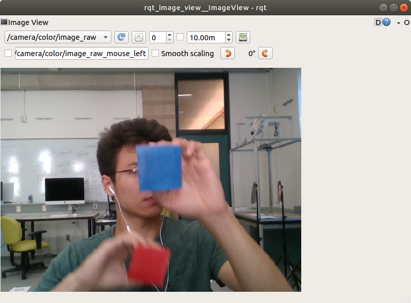
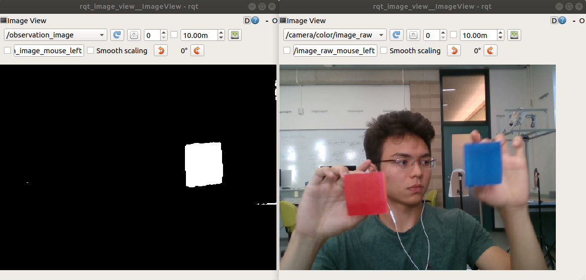
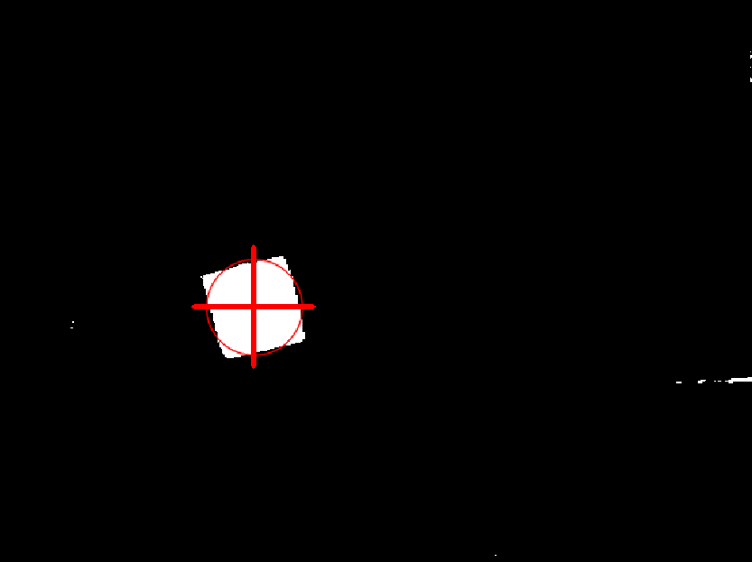

# Assignment 3

This is the third assignment for Yale's CPSC-459/559 Building Interactive Machines course.

## Table of Contents

* [Introduction](#introduction)
    * [System Requirements](#system-requirements)
    * [Background Knowledge](#background-knowledge)
    * [Notation](#notation)
    * [Deliverables](#deliverables)
    * [Evaluation](#evaluation)
    * [Further Reading](#further-reading)
* [Setup](#setup)
* [Part I. Creating a Custom ROS Message Type](#part-i-creating-a-custom-ros-message-type)
    * [Questions / Tasks](#questions--tasks)
* [Part II. Get Data](#part-ii-get-data)
    * [Questions / Tasks](#questions--tasks-1)
* [Part III. Detecting a Visual Target](#part-iii-detecting-a-visual-target)
    * [Questions / Tasks](#questions--tasks-2)
* [Part IV. Filtering the Target's Position](#part-iv-filtering-the-targets-position)
    * [Questions / Tasks](#questions--tasks-3)
* [Part V. Real-Time Filtering](#part-v-real-time-filtering)
   * [Questions / Tasks](#questions--tasks-4)
* [Part VI. Non-Parametric Filtering](ExtraQuestions-CPSC559.md) (only for students taking CPSC-559)

## Introduction 
This assignment will provide you practical experience with custom messages in ROS, low-level image processing,
 and filtering.

#### System Requirements
As for the prior assignments, you should have access to a computer with `Ubuntu 20.04` and `ROS Noetic` to complete this homework. 

You should also have `git` installed in the machine that you are using to work on your assignment.
You will use git to save your work to your [GitHub](http://www.github.com) repository.

#### Background Knowledge

This assignment assumes that you have already completed the prior assignments and, thus, you
have set up your catkin workspace. You are also expected to have experience with Linux shells 
(e.g., [bash](https://www.gnu.org/software/bash/)), [git](https://git-scm.com/), and
the [Robot Operating System (ROS)](http://www.ros.org/). This includes being familiar with
the `roscore`, `rosrun`, `roslaunch`, `rosbag`, `rostopic`, `rosmsg`, `rosnode`, `rqt_image_view`, 
and `rviz` tools. 

You are also expected to be familiar with the [numpy Python library](http://www.numpy.org/) for linear algebra. 
If you are not, please check [this tutorial](https://docs.scipy.org/doc/numpy/user/quickstart.html) before starting the assignment.

#### Notation
We refer to `vectors` or column matrices with bold lower-case letters (e.g., <!--$`\bold{x}`$-->).
Other `matrices`, such as linear transformations, and `scalars` are written with regular
font weight. 

#### Deliverables

- **Report:** You are expected to submit a pdf to Canvas/Gradescope with answers to the questions/tasks at 
the end of each part of the assignment. The report is a fillable PDF which is available [here](https://drive.google.com/file/d/170NTiV_V4EDJdNTiH4iyZRZc7b18fohk/view?usp=sharing) for CPSC 459 students and [here](https://drive.google.com/file/d/1BHmVgG_wONIXlhWADDB0aUDiJ4dqRQKs/view?usp=sharing) for CPSC 559 students

- **ROS Bag:** You are expected to provide a link to a ROS bag in your assignment report (see Part V of this assignment). 
ROS bags can be hosted in [Google drive](https://drive.google.com/) or [Box](https://yale.account.box.com/) -- you 
should ensure that the teaching staff can access your ROS bags by making them accessible to anyone with the link. Do not share this link with other students.

- **Code:** Finally, you are expected to push code for this assignment to your 
[GitHub](http://www.github.com) repository as for other assignments. 


#### Evaluation

The assignment will be evaluated based on the content of your report and your code:

- Report / Other Deliverables (26 pts + 15 pts for CPSC-559 only)
    - Part IV (23 pts): IV-1 (6 pts) + IV-2 (4 pts) + IV-3 (3 pts) + IV-4 (3 pts) + IV-12 (4 pts) + IV-13 (3 pts)
    - Part V (3 pts): V-1 (3 pts)
    - Part VI (15 pts for CPSC-559 only): IV-1 (5 pts) + IV-2 (4 pts) + IV-3 (6 pts)
- Code (74 pts)
    * Part I (6 pts) 
    * Part II (5 pts)
    * Part III (30 pts): III-1 (10 pts) + III-2 (10 pts) + III-3 (5 pts) + III-4 (5 pts)
    * Part IV (31 pts): IV-5 (5 pts) + IV-6 (5 pts) + IV-7 (4 pts) + IV-8 (4 pts) + IV-9 (3 pts) + IV-10 (4 pts) + IV-13 (3 pts) + IV-14 (3 pts) 
    * Part V (2 pts): V-1 (2 pts)

Students taking CPSC-459 are evaluated over 100 pts; those taking CPSC-559 are evaluated over 115 pts. 

#### Further Reading

- [Playing Catch and Juggling with a Humanoid Robot](https://www.disneyresearch.com/publication/playing-catch-and-juggling-with-a-humanoid-robot/):
Application of Kalman Filtering to a fun entertainment application.

- [Discriminative Training of Kalman Filters](http://www.roboticsproceedings.org/rss01/p38.pdf):
Describes systematic ways for tuning Kalman Filters given ground truth data.


## Setup
Before you start implementing or answering questions for this assignment, please update
your repository to pull the latest changes from the assignments repository and update
the shutter-ros repository:

```bash
# update your repository with the latest version of the assignment
$ cd <path-to-your-repository-in-your-workspace>
$ git pull upstream master

# update the shutter-ros repository 
$ roscd shutter_bringup
$ git pull

# finally, re-build your catkin workspace 
$ cd <path-to-your-catkin-workspace-root-directory>
$ catkin_make -DCMAKE_BUILD_TYPE=Release
```

## Tests

A set of public tests has been provided for your code - they are a subset of the tests that will be used to grade your code. Please run the public tests before submitting your assignment.

To run these tests, refer to the [README.md](https://github.com/Yale-BIM/f20-assignments/tree/master/assignment-3/shutter_track_target_public_tests) in the `shutter_track_target_public_tests` package.

## Part I. Creating a Custom ROS Message Type
ROS uses [messages](http://wiki.ros.org/msg) of various types to transmit information between nodes. For example, in the 
past you have worked with [TransformStamped](http://docs.ros.org/kinetic/api/geometry_msgs/html/msg/TransformStamped.html) 
messages and [PoseStamped](http://docs.ros.org/kinetic/api/geometry_msgs/html/msg/PoseStamped.html) messages. Now, you 
will create your own custom message type.

To get started, read [this tutorial on Creating Messages and Services](http://wiki.ros.org/ROS/Tutorials/CreatingMsgAndSrv) 
in ROS. In particular, focus on understanding Sections 1-3 of the tutorial, as they describe how to create a new message type and how to check that this new type was set up properly in your workspace. Then, follow the steps below to make your own message type, similar to the steps in the tutorial. This message type will serve in the next parts of the assignment to send information about a detected visual target through ROS.

1. Create a `msg` directory within the `shutter_track_target` ROS repository of this assignment. This directory
will hold your new message definition.

    ```bash
    $ cd shutter_track_target
    $ mkdir msg
    ```
    
2. Create a file in the shutter_track_target/msg directory named `Observation.msg`. The content of the file
should define the following fields for the message type:

    - **header** (of type [std_msgs/Header](http://docs.ros.org/api/std_msgs/html/msg/Header.html))
    - **x** (of type float64 -- built-in [primitive message type](http://wiki.ros.org/msg) --)
    - **y** (of type float64 -- built-in [primitive message type](http://wiki.ros.org/msg) --)
    <br><br>
    
3. Edit the package.xml and CMakeLists.txt files in the shutter_track_target package to define your
new message type as in the [tutorial on Creating Messages and Services](http://wiki.ros.org/ROS/Tutorials/CreatingMsgAndSrv).

    *Tip:* You need to add package dependencies to package.xml as well as define your new message
    type and dependencies in the CMakeLists.txt file. Don't forget to uncomment the generate_messages() function
    in CMakeLists.txt, as in the tutorial.

4. Build your catkin workspace to generate the new message type

    ```bash
    $ cd <catkin_workspace>
    $ catkin_make -DCMAKE_BUILD_TYPE=Release
    ```
    
    *Tip:* If for some reason catkin_make fails to generate your message, check the CMakeLists.txt and
    package.xml files that you edited in step 3.
    
5. Verify that your message type is built and that it has the 3 fields mentioned in the step 2 above. You
can use the `rosmsg` tool to this end:

    ```bash
    $ rosmsg show shutter_track_target/Observation
    std_msgs/Header header
      uint32 seq
      time stamp
      string frame_id
    float64 x
    float64 y
    ```
    (the output of rosmsg should be as in the code snippet above)
    

### Questions / Tasks

- **I-1.** Add the Observation.msg, package.xml and CMakeLists.txt files to your repository.
Commit the changes that you made to generate your new message type within the `shutter_track_target` package.

## Part II. Get Data 
Download the ROS bag [left-seq1.bag](https://drive.google.com/file/d/1AZl6zNYjEhPcag_MfPq39N-kdJJmEBIS/view?usp=sharing) from Google 
Drive. Then, place it inside a `data` directory within the `shutter_track_target` package:

```bash
$ roscd shutter_track_target
$ mkdir data
$ cd data
$ mv <path-to-bag> . # move the bag to the data directory
```

Inspect the bag to make sure that it was downloaded properly:

```bash
$ rosbag info left-seq1.bag
path:        left-seq1.bag
version:     2.0
duration:    12.4s
start:       Aug 02 2019 11:41:41.56 (1564760501.56)
end:         Aug 02 2019 11:41:53.99 (1564760513.99)
size:        326.2 MB
messages:    371
compression: none [371/371 chunks]
types:       sensor_msgs/Image [060021388200f6f0f447d0fcd9c64743]
topics:      /camera/color/image_raw   371 msgs    : sensor_msgs/Image
```

And play the bag to see its content: 

```bash
# set the use_sim_time parameter so that rosbag play simulates the original time in the bag when it is played
$ rosparam set use_sim_time true 

# play the bag
$ rosbag play --clock left-seq1.bag

# and in another terminal visualize the images
$ rosrun rqt_image_view rqt_image_view # visualize the /camera/color/image_raw topic
```

You should then see an image sequence of Burton moving two colored squares as in the figure below:


<br>

> NOTE: ROS nodes use the /clock topic to gather information about time (see [here](http://wiki.ros.org/Clock) for more information).
When the `use_sim_time` parameter is set to true in the ROS parameter server, ROS will stop publishing your computer's system clock
through /clock. And when a bag is played with the `--clock` option, rosbag play will publish a simulated time instead.
If you are playing ROS bags and don't set the `use_sim_time` parameter to true, then messages may be handled incorrectly by
ROS nodes. You can check the value of the `use_sim_time` parameter in the [ROS parameter server](http://wiki.ros.org/Parameter%20Server)
with the command: `$ rosparam get use_sim_time`

### Questions / Tasks
- **II-1.** Make a video of `rqt_image_view` that shows the content of the `/camera/color/image_raw`
topic as left-seq1.bag plays for at least 3 seconds. Turn this video into an animated
gif, e.g., with [ffmpeg](https://www.ffmpeg.org/) and [imagemagick](https://imagemagick.org/) as indicated in 
[this code snippet](https://gitlab.com/snippets/1743818), and include it in a `docs` directory within the
 `shutter_track_target` package. Name the gif `input.gif` and commit it to your repository.
 

## Part III. Detecting a Visual Target
You will now use simple image processing techniques to detect the blue square in the images within the left-seq1.bag.
These detections will be observations for the location of the target, which you will then filter in the next part
of the assignment.

To get you started, this assignment provides the skeleton structure for a node that detects
blobs of a given color: see the [shutter_track_target/scripts/detect_visual_target.py](https://github.com/Yale-BIM/f21-assignments/blob/master/assignment-3/shutter_track_target/scripts/detect_visual_target.py) script. Read the script
to understand how it works in general. 

For the next parts of this assignment, do NOT edit the `init()` and `image_callback()` functions of the `DetectTarget` class
in the `detect_visual_target.py` node. **Only edit the `filter_image()`, `compute_keypoints_for_blobs()`, and `publish_observation()`
functions** as indicated in the tasks below. 

### Questions / Tasks
Complete the `detect_visual_target.py` node by implementing the `filter_image()`, `compute_keypoints_for_blobs()`, and `publish_observation()`
functions. Afterwards, make an animated video of the visual output of your node, as indicated below.

- **III-1.** Read this [tutorial on Color Spaces in OpenCV](https://www.learnopencv.com/color-spaces-in-opencv-cpp-python/).
Afterwards, implement the `filter_image()` function in the `detect_visual_target.py` node so that the function:

    1. Converts the input `cv_image` to the HSV color space with the OpenCV library.
    2. Filters the image in the HSV color space using the [cv2.inRange](https://docs.opencv.org/4.2.0/da/d97/tutorial_threshold_inRange.html) function from OpenCV and the input `lower_hue_value` and `higher_hue_value`. 
    3. Finally, returns the image (mask) output by the inRange() function.
    <br><br>
    
    *Tip:* This [tutorial](https://pythonprogramming.net/color-filter-python-opencv-tutorial/) provides
    another example on color filtering in OpenCV. 
    
    To check that your `filter_image()` function is working properly, run your node with the default hue range of 100-140:
    
    ```bash
    # play the left-seq1.bag as in Part II of the assignment, and then run the node:
    $ rosrun shutter_track_target detect_visual_target.py
    ```
    
    You should then be able to visualize the output topic `/observation_image` for debugging purposes with 
    `rqt_image_view`. The output image (or mask) should have high values for the pixels corresponding to the blue 
    square in the input image, as shown in the left image below. The right image shows the corresponding image_raw
    photo from the bag as a reference.
    
    
    <br><br>

- **III-2.** Read this other [tutorial on Blob Detection](https://www.learnopencv.com/blob-detection-using-opencv-python-c/)
and implement the `compute_keypoints_for_blobs()` function in the detect_visual_target.py node so that it:

    1. Creates a `cv2.SimpleBlobDetector_Params()` object with all of the parameters
    for an OpenCV blob detector.
    
    2. Creates a `cv2.SimpleBlobDetector()` object with the parameters from the previous step.
    
    3. Uses the SimpleBlobDetector to detect blobs on the mask output by `filter_image()`, which is input to the `compute_keypoints_for_blobs()` function.
    
    4. Returns the detected list of keypoints, as output by the SimpleBlobDetector object.
    
    *Tip:* You can read more about how the SimpleBlobDetector algorithm works on the [official OpenCV documentation](https://docs.opencv.org/4.2.0/d0/d7a/classcv_1_1SimpleBlobDetector.html).

    Once you've implemented the `compute_keypoints_for_blobs()` function, you can run the `detect_visual_target.py` 
    node to debug your code for this part of the assignment, as in the task III-1. Edit the parameters of the 
    blob detector such that the **blue square** is detected well in the left-seq1.bag
    image sequence. The result should look similar to the image below:
    
    
    <br>
    
    The thin red circle corresponds to a detected keypoint. The crossmark corresponds to the biggest keypoint
    found by OpenCV blob's detection algorithm. The position of this keypoint is what your node should output
    through the `/observation` topic, as described in the next task.

- **III-3.** Finally, implement the `publish_observation()` function in the `detect_visual_target.py` node.
This function receives a `tuple (x,y)` corresponding to the location of the biggest keypoint 
found by the blob detection algorithm. The function should publish this coordinate as an Observation message
through the `/observation` topic (`self.obs_pub` variable in the `DetectTarget()` class). 

    Before publishing the Observation message, make sure to set its 
    `header field`. The header field should have the same values as the header variable 
    that is passed to the `publish_observation()` function. This will ensure that the time stamp and frame of the Observation message
    matches the time stamp and frame of the image that it was generated from.
    
    Once your `detect_visual_target.py` node is properly detecting targets of a given color
    and publishing observations, commit the script to your repository.

- **III-4.** As in II-1, make a video of `rqt_image_view` that shows the content of the `/observation_image`
topic as the left-seq1.bag rosbag plays for at least 5 seconds. Turn this video into an animated
gif, name it `keypoints.gif`, and include it in the `docs` directory within the
 `shutter_track_target` package. Commit the gif to your repository.
 

## Part IV. Filtering the Target's Position
You will now implement a linear Kalman filter to track a visual target in image space. Please read Sections 3.2.1 and 3.2.2 from Chapter 3 of the [Probabilistic Robotics book](http://www.probabilistic-robotics.org/) before starting with 
this assigment. The Chapter is available in Canvas (under the Files section). Chapters 3.2.1 and 3.2.2 will remind you of how Kalman filters work.

For this assignment, the `filter state` 
<!--$`\bold{x} \in \mathbb{R}^6`$--> should contain <!--$`\bold{x} = [p_x\ p_y\ v_x\ v_y\ a_x\ a_y]^T`$-->, 
where <!--$`\mathbf{p} = [p_x\ p_y]^T`$--> corresponds to the estimated position of the target in an image, 
 <!--$`\mathbf{v} = [v_x\ v_y]^T`$--> is its estimated velocity, and <!--$`\mathbf{a} = [a_x\ a_y]^T`$--> is its estimated acceleration.

The `transition model` of the filter should include additive gaussian noise and 
follow the [equations of motion](https://en.wikipedia.org/wiki/Equations_of_motion):

- ^2)<!--$`\bold{p}_{t+1} = \bold{p}_t + \bold{v}_t \Delta t + \frac{1}{2} \bold{a} (\Delta t)^2`$-->
- <!--$`\bold{v}_{t+1} = \bold{v}_t + \bold{a}_t \Delta t`$-->
- <!--$`\bold{a}_{t+1} = \bold{a}_t`$-->

where  <!--$`\Delta t`$--> is the elapsed time between updates.

The `measurement model` of the filter should correct for the predicted state based on
the observed position of the visual target. This observation is generated by your `detect_visual_target.py`
node.

You should implement your Kalman filter 
within the `kalman_filter.py` script that is inside of the [shutter_track_target/scripts](https://github.com/Yale-BIM/f21-assignments/tree/master/assignment-3/shutter_track_target/scripts) 
directory, as indicated in the tasks below. The `kalman_filter.py` script already provides you with
the main logic for a filtering node, and will help you debug your filter visually. 
 
### Questions / Tasks

- **IV-1.** Please write down the mathematical equation for the filter's linear transition model, including
Gaussian noise, in your report. Note that because you are not moving the target, but tracking will be
happening only based on the observed target position, your filter's transition model should have no control  <!--$`\bold{u}`$--> component.

- **IV-2.** Please write down the mathematical equation for the filter's measurement model, including Gaussian
noise, in your report.

- **IV-3.** Please write down the mathematical equation that defines the Kalman gain in your report.

- **IV-4.** What happens with the values in the Kalman gain if the covariance <!--$`Q`$--> for the measurement noise 
grows?

- **IV-5.** Complete the `KF_predict_step()` function at the top of the
[kalman_filter.py](https://github.com/Yale-BIM/f21-assignments/blob/master/assignment-3/shutter_track_target/scripts/kalman_filter.py) script such that it predicts a new belief for the state (encoded by its mean and covariance) based
on the prior belief and the transition model of the filter.

- **IV-6.** Complete the `KF_measurement_update_step()` function in the [kalman_filter.py](https://github.com/Yale-BIM/f21-assignments/blob/master/assignment-3/shutter_track_target/scripts/kalman_filter.py) script such that
it corrects the belief of the state of the filter based on the latest observation and the filter's
measurement model.

- **IV-7.** Implement the `assemble_A_matrix()` and `assemble_C_matrix()` methods within the `KalmanFilterNode`
class of the [kalman_filter.py](https://github.com/Yale-BIM/f21-assignments/blob/master/assignment-3/shutter_track_target/scripts/kalman_filter.py) script. The methods should set the A and C
parameters of the transition and measurement model of the filter used by the `KalmanFilterNode`. Use [numpy
arrays](https://docs.scipy.org/doc/numpy-1.15.1/reference/generated/numpy.array.html) to represent the A and C matrices.

    > NOTE: You do not have to implement the logic that passes the A and C parameters to the filter. This is
    already done for you in the main loop of the KalmanFilterNode class.
    
- **IV-8.** Implement the `initialize_process_covariance()` and `initialize_measurement_covariance()` methods
within the `KalmanFilterNode` class of the [kalman_filter.py](https://github.com/Yale-BIM/f21-assignments/blob/master/assignment-3/shutter_track_target/scripts/kalman_filter.py) script. These methods should set some fixed value
for the Q and R covariances
for the noise of the transition model and measurement model, respectively. Don't worry too much about the
exact values that you set for the noise now, as you will have to tune these values later in the assignment.

- **IV-9.** Implement the `assemble_observation_vector()` function within the `KalmanFilterNode` class of the
[kalman_filter.py](https://github.com/Yale-BIM/f21-assignments/blob/master/assignment-3/shutter_track_target/scripts/kalman_filter.py) script. This function should return a vector (numpy array) with the observed position for the
target. 
 
    > To make this part of the assigment easy, note that the `assemble_observation_vector()` function has
    an Observation message argument. This argument provides the latest observed position of the target as received
    through the `/observation` topic in the `KalmanFilterNode`.

- **IV-10.** Implement the `initialize_mu_and_sigma()` method within the `KalmanFilterNode` class of the
[kalman_filter.py](https://github.com/Yale-BIM/f21-assignments/blob/master/assignment-3/shutter_track_target/scripts/kalman_filter.py) script. This method should set the initial values for the filter belief based on the latest
observed target position. Again, note that this observation is passed to the `initialize_mu_and_sigma()` method
as an input argument.

- **IV-11.** Once you have finished the prior tasks, complete the `filter_colored_target.launch` file within the [shutter_track_target/launch](https://github.com/Yale-BIM/f21-assignments/tree/master/assignment-3/shutter_track_target/launch) directory.
The launch file should run your `kalman_filter.py` script after playing a bag, run `rqt_image_view`, and 
run your `detect_visual_target.py` script.

    Note that the begining of the launch file already defines a set of arguments:
    
    - **bagfile:** path to the left-seq1.bag file.
    - **add_observation_noise:** whether to add artificial noise to the observed target position.
    - **lower_hue_value:** Min. hue value for the colored target that is tracked.
    - **higher_hue_value:** Max. hue value for the colored target that is tracked.
    - **playback_speed:** Speed at which to play the bag (1.0 simulates real time play back).
    
    > Do NOT modify the above arguments in the launch file, nor the way how the bag is launched or how
    the `detect_visual_target.py` node is run.
    
    Once you have completed the launch file, you should be able to run it as:
    
    ```bash
    $ roslaunch shutter_track_target filter_colored_target.launch
    ```
    
    An rqt_image_view window will then open that allows you to visualize the 3 images being streamed
    through the ROS network: 
    
    - /camera/color/image_raw topic: the original image sequence
    - /observation_image topic: the detected target position
    - /tracked_image topic: the tracked target
    <br>
    
    The images sent over the /tracked_image topic display two trajectories: the red line connects the observed locations for the target (as received through the /observations topic); and the thinner green line connects the estimated location for the target (from the Kalman Filter belief).
    
    
 

- **IV-12.** Tune the parameters of your filter (initial belief, R, and Q) such that you can effectively 
track the blue square in the image sequence within the left-seq1.bag. Use the filtered_colored_target.launch
file to quickly launch rosbag, rqt_image_view, detect_visual_target.py and kalman_filter.py. As the bag plays, use
rqt_image_view to visualize the images being streamed through your network and debug your code.

    Note you can slow down the speed at which rosbag plays the image sequence with the `playback_speed`
    argument of the filtered_colored_target.launch file. For example,
    
    ```bash
    # play the bag at half real-time speed
    $ roslaunch shutter_track_target filter_colored_target.launch playback_speed:=0.5
    ```

    Once it looks like your filter is tracking the target, include the filter parameters that you are using
     for this part of the assignment in your report. Also, indicate the playback_speed that you ended up using for adjusting your 
     filter parameters.
     
- **IV-13.** Tune the parameters of your filter such that it can track the blue square when the argument
add_observation_noise is set to true in filter_colored_target.launch:

    ```bash
    # play the bag at half real-time speed
    $ roslaunch shutter_track_target filter_colored_target.launch add_observation_noise:=true [playback_speed:=0.5]
    ```
    
    In the above command, the brackets [*] indicate optional arguments.
    
    Once it looks like your filter is tracking the target, include the filter parameters that you are using
     for this part of the assignment in your report.  In addition, make a video of `rqt_image_view` that shows the images sent
    through the `/tracked_image` topic for at least 5 seconds with `add_observation_noise:=true`. 
    Turn this video into an animated
    gif, name it `filtered_blue_square_with_extra_noise.gif`, and include it in the `docs` directory within the
     `shutter_track_target` package. Commit the gif to your repository.
     
- **IV-14.** Write a README.md Markdown file inside the `shutter_track_target` repository that explains
what the `detect_visual_target.py` and `kalman_filter.py` nodes do, and how the `filtered_colored_target.launch` script
works. To provide visual support to the explanation of how the launch file works, include the gifs that you generated
previously in this assignment in the README.md file.
   
     > *Tip:* More information on including images 
     in GitHub's markdown can be found [here](https://guides.github.com/features/mastering-markdown/).
     

## Part V. Real-Time Filtering

You will now run your filter on another video. This video should contain a **uniform color, but non-blue object**. Record this video from your computer, phone, or download a (non-copyrighted) video for this section. Ensure that this video is in `.mp4` format.

You can play the video through ROS using the provided `play_video.py` script within the `shutter_track_target/scripts` folder. For your convenience, we also provide you
a launch file to run the script:

```bash
$ roslaunch shutter_track_target play_video.launch
```

You should update the default path to your video in the launch file, or pass the optional parameter `video_file` to update the value of this argument at run time.


### Questions / Tasks

- **V-1.** Run your completed Kalman Filter node, updating the hue arguments to track the desired object in your video. Make sure to look at rqt_image_view to ensure that your object is being tracked properly.

    Once it looks like your filter is tracking your object well, make a gif of `rqt_image_view` showing the topic `/tracked_image`. Name this gif `new_object.gif` and store it in `shutter_track_target/docs`. Include this gif in the README for `shutter_track_target` that you wrote in Part IV.
    
    Make a rosbag of your system while the video is playing and you are tracking the object's position. The bag should be around 5 seconds long, and **only** include the following topics:

    - /tracked_image
    - /observation_image
    - /rosout

    <br/>
    
    Please name your bag `track_target.bag`. Then, check that it passes the public test for the bag: `$ rostest shutter_track_target_public_tests test_bag_recording.launch`.
    Note that the test expects the bag to be stored within the `shutter_track_target/data` directory, but you should not commit the bag to your repository.
    
    Upload your ROS bag to Google Drive or Box and make it accessible to anybody with the link. Then, **provide a link to your ROS bag in your report for this assignment.** As mentioned before, you don't need to and you shouldn't commit the bag to your repository! Otherwise, you will make your repository unnecessarily heavy. 
    
    A couple of tips for this part of the assignment:

    > *Tip 1:* When you play your video, you should set the `use_sim_time` parameter back to false since you are no longer playing a bag. 
            The `play_video.launch` file does this for you automatically.

    > *Tip 2:* This assignment provides you of an example launch file to record the `track_target.bag`. 
            See the [assignment-3/shutter_track_target/launch/record_bag.launch](https://github.com/Yale-BIM/f21-assignments/blob/master/assignment-3/shutter_track_target/launch/record_bag.launch) file.

    > *Tip 3:* Double check the content of your bag with the `rosbag info` and `rosbag play` commands before 
            submitting your assignment. Make sure that the `/tracked_image` and `/observation_image` topics show 
            your filter tracking your desired object. As a reference, the bag should include at least
            200 images for each of these topics.

## Part VI

Part VI of the assignment is only for students taking CPSC-559 (graduate version of the course). See the tasks/questions in the [ExtraQuestions-CPSC559.md](ExtraQuestions-CPSC559.md) document.

Once you've finished the assignment, **add the commit SHA** that you would like to be evaluate on to your report.


