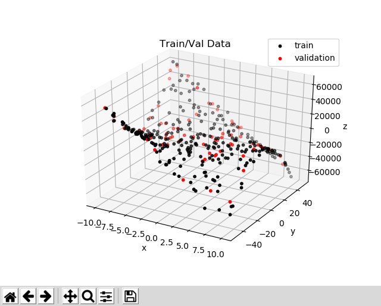

# Assignment 4

This is the fourth assignment for Yale's CPSC-459/559 Building Interactive Machines course.

## Table of Contents

* [Introduction](#introduction)
    * [System Requirements](#system-requirements)
    * [Background Knowledge](#background-knowledge)
    * [Preliminaries](#preliminaries)
       * [Training on Google Colaboratory](#training-on-google-colaboratory)
       * [Training on Google Cloud](#training-on-google-cloud)
    * [Deliverables](#deliverables)
    * [Evaluation](#evaluation)
    * [Further Reading](#further-reading)
* [Setup](#setup)
* [Part I. Approximating a Non-Linear Function](#part-i-approximating-a-non-linear-function)
    * [Questions/Tasks](#questionstasks)
* [Part II. Building a Face Classifier](#part-ii-building-a-face-classifier)
    * [Questions / Tasks](#questions--tasks-1)
* [Part III. Imitation Learning (2 extra points)](#part-iii-imitation-learning-2-extra-points)
     * [Questions / Tasks](#questions--tasks-1)


## Introduction 
This assignment will provide you practical experience with deep learning. In particular, you'll become
familiar with [TensorFlow's Keras API](https://www.tensorflow.org/api_docs/python/tf/keras).


#### System Requirements
This assignment should be completed using Python 3.6–3.9 in Ubuntu 20.04. For training neural networks,
we recommend that you use cloud services if your don't have access to a local GPU. For the last part of the assignment, 
you should have access to a computer with `ROS Noetic`.

You should also have `git` and `pip3` installed in the machine that you are using to work on your assignment.
You will use git to save your work to your [Github](http://www.github.com) repository. The pip3 tool will be used to install
Python dependencies, and can be installed in Unbuntu 20.04 as in [this guide](https://linuxize.com/post/how-to-install-pip-on-ubuntu-20.04/). More details on installing pip3 are provided later in this document.

#### Background Knowledge

This assignment assumes that you have already completed the prior assignments and, thus, you
 have experience with Linux shells 
(e.g., [bash](https://www.gnu.org/software/bash/)), and [git](https://git-scm.com/). You are also expected to be familiar with the [numpy Python library](http://www.numpy.org/) for linear algebra. 
If you are not, please check [this tutorial](https://docs.scipy.org/doc/numpy/user/quickstart.html) before starting the assignment.

#### Preliminaries
You will be training supervised learning models, especially Neural Networks, for this assignment. 
It is possible to complete all of the tasks using your local CPU, but it might be faster at times to train on the cloud and
using hardware acceleration (e.g., a dedicated GPU).

> Whether or not you use the cloud to train your neural networks, the deliverables are the same.
You should submit code in your private Github repository. You should also submit a report to Gradescope
and provide model parameter files through Google Drive.

##### Training on Google Colaboratory
One option to train a network on the cloud is to use [Google Colaboratory](https://colab.research.google.com).
Google Colaboratory (or Colab) is a **free** research tool for machine learning education and research. It's a 
[Jupyter notebook](http://jupyter.org/) environment that requires no setup to use. For more information
on using Google Colab such as usage limits, read the official [F.A.Q](https://research.google.com/colaboratory/faq.html).

A `quick tutorial` on using Google Colab for this assignment is provided in the 
[Train_Google_Colab.md](Train_Google_Colab.md) file.

##### Training on Google Cloud
Another option is to use [Google Cloud](https://cloud.google.com). This option is not free,
but you can customize virtual machines with as many resources as you need. Use your 
credits judiciously. 

A `quick tutorial` on using Google Cloud for this assignment is provided in the
[Train_Google_Cloud_Engine.md](Train_Google_Cloud_Engine.md) file.


#### Deliverables

- **Report:** You are expected to submit a pdf to Gradescope with answers to the questions/tasks at 
the end of each part of the assignment. This report should also have any information needed 
to understand and/or run your code, as well as the specific commit SHA of the version of the code
that you would like to be evaluated on. The report is a fillable PDF which is available [here](https://drive.google.com/file/d/1_m4jR6kk_3N12KpS5tZP9xPHOGTMWMKk/view?usp=sharing).

- **Model weights and input normalization parameters:** You should upload trained models and parameters
to Google Drive and share them with anybody who has access to the links.

- **Code:** Finally, you are expected to push code for this assignment to your 
[Github](http://www.github.com) repository and submit it to Gradescope, as in all prior assignments.

#### Evaluation

You assignment will be evaluated based on the content of your report and your code.

- Report (39 pts)
    * Part I (29 pts): I-1 (7 pts) + I-3 (10 pts) + I-4 (6 pts) + I-5 (6 pts)
    * Part II (10 pts): II-2 (10 pts)
- Code (61 pts)
    * Part I (11 pts): I-1 (2 pts) + I-2 (6 pts) + I-3 (3 pts)
    * Part II (29 pts): II-1 (17 pts) + II-2 (12 pts) 
    * Part III (28 pts): III-1 (14 pts) + III-2 (14 pts)

**Note on Part III of the assignment:** Part III provides extra credit for those at the top of the leaderboard in Gradescope.
The extra credit (2 pts) is valid for all students (CPSC 459 or 559) and will be counted for the final course grade 
(over 100 pts for this assignment). 

#### Further Reading

Below are some example Neural Networks to give you a starting point for implementing your own:
- [SqueezeNet](https://arxiv.org/abs/1602.07360) - A small network for image classification
- [Tiny Darknet](https://pjreddie.com/darknet/tiny-darknet/) - An even smaller network for image classification

## Setup
Before you start implementing or answering questions for this assignment, please
check that [pip3](https://pip.pypa.io/en/stable/) is installed in your machine:

```bash
$ pip3 --version
```

If it's not installed and you are using Ubuntu, then install it with:

```bash
$ sudo apt update
$ sudo apt install python3-pip
```

Then, update your repository to pull the latest changes from the assignments repository,
install Python dependencies, and update the shutter-ros repository:

```bash
# update your repository with the latest version of the assignment
$ cd <path-to-your-repository-in-your-workspace>
$ git pull upstream master

# install Assignment-4 Python dependencies
$ cd assignment-4
$ ./install_python_deps.sh

# update the shutter-ros repository 
$ roscd shutter_bringup
$ git pull

# finally, re-build your catkin workspace 
$ cd <path-to-your-catkin-workspace-root-directory>
$ catkin_make -DCMAKE_BUILD_TYPE=Release
```

The above `install_python_deps.sh` script will install several Python packages
that are required for this assignment, including TensorFlow v. 2.6.0. 

You can verify your TensorFlow installation as follows:

```bash
$ python3 -c "import tensorflow as tf; print(tf.__version__)"
2.6.0
```

**NOTE:** If your machine has a GPU with CUDA Compute Capability 3.5 or higher and 
you have [CUDA 11.2](https://developer.nvidia.com/cuda-11.2-download-archive) plus 
[cuDNN 8.1.0](https://developer.nvidia.com/cudnn) installed in your system, then you should install:

```bash
pip3 install --user tensorflow-gpu==2.6.0
```

to take advantage of hardware acceleration. You can test that your GPU is visible in TensorFlow
by running the following commands on a Python shell:

```python
>> import tensorflow as tf
>> tf.test.is_gpu_available()
```

The function should return True if TensorFlow can access your GPU. If the function
returns False, check the errors that are printed in the shell. Common errors include
not having Cuda 11.2 installed in the system but a different version, not having CuDNN
installed for Cuda 11.2, and not having CUDA system variables setup in your environment. 
See the [TensorFlow GPU support page](https://www.tensorflow.org/install/gpu) 
for more information. 


## Part I. Approximating a Non-Linear Function

Read the [Primer on Universal Function Approximation with Deep Learning](https://cartesianfaith.com/2016/09/23/a-primer-on-universal-function-approximation-with-deep-learning-in-torch-and-r/) 
by Brian Yung Rowe. 

Once you've read the primer, you should complete the tasks below to approximate the 
[monkey saddle surface](https://en.wikipedia.org/wiki/Monkey_saddle) defined by the equation .
<!-- $`z = x^3 - 3xy^2`$ --> 
Your code should leverage [TensorFlow's Keras API](https://www.tensorflow.org/guide/keras).

To get you started, this assignment provides two files within the 
`assignment-4/function_approximation` directory:

- *train_and_test_saddle_function.py:* main file that you will complete in this part of the assignment.
- *saddle_function_utils:* code to generate data and help you visualize results.

If you run the train_and_test_saddle_function.py script (which is incomplete at this point)
with the `visualize_training_data` option, you should be able to visualize the data that the
script generates for you and example predictions with a linear neural network model implemented with 
[TensorFlow's Keras API](https://www.tensorflow.org/versions/r2.0/api_docs/python/tf/keras):

```bash
$ cd assignment-4/function_approximation
$ ./train_and_test_saddle_function.py --visualize_training_data
```

When you run the script, a [matplotlib](https://matplotlib.org/) plot of the data should appear, 
as in the figure below:



And, once the linear model is trained for a number of epochs with the 
[Adam optimizer](https://www.tensorflow.org/api_docs/python/tf/keras/optimizers/Adam), the script would show:


To see all the options that the train script already provides, run it as:

```bash
$ ./train_and_test_saddle_function.py --help
usage: train_and_test_saddle_function.py [-h] [--n N]
                                         [--batch_size BATCH_SIZE]
                                         [--epochs EPOCHS] [--lr LR]
                                         [--visualize_training_data]
                                         [--build_fn BUILD_FN]

optional arguments:
  -h, --help            show this help message and exit
  --n N                 total number of examples (including training, testing,
                        and validation)
  --batch_size BATCH_SIZE
                        batch size used for training
  --epochs EPOCHS       number of epochs for training
  --lr LR               learning rate for training
  --visualize_training_data
                        visualize training data
  --build_fn BUILD_FN   model to train (e.g., 'linear')
```

The optional parameters `lr`, `epochs`, and `batch_size` correspond to the learning rate,
number of epochs, and bath size that are used at training time.

Read the code in the training script to familiarize yourself with its functionality. We highly recommend that you also 
watch [Nathan's video](https://yale.hosted.panopto.com/Panopto/Pages/Viewer.aspx?id=80140234-566a-417d-b4ad-adc201246740), where he walks you through the code in a Google Colab notebook, so that you understand how to work with Keras within the training script.

### Questions/Tasks

- **I-1.** Add callbacks to the [Keras model's fit function](https://www.tensorflow.org/versions/r2.0/api_docs/python/tf/keras/Model#fit) 
in the `train_model()` method of the train_and_test_saddle_function.py script:

    ```python
     # tensorboard callback
     logs_dir = 'logs/log_{}'.format(datetime.datetime.now().strftime("%m-%d-%Y-%H-%M"))
     tbCallBack = tf.keras.callbacks.TensorBoard(log_dir=logs_dir, write_graph=True)

     # save checkpoint callback
     checkpointCallBack = tf.keras.callbacks.ModelCheckpoint(os.path.join(logs_dir,'best_monkey_weights.h5'),
                                                            monitor='mae',
                                                            verbose=0,
                                                            save_best_only=True,
                                                            save_weights_only=False,
                                                            mode='auto',
                                                            save_freq=1)

     # do training for the specified number of epochs and with the given batch size
     model.fit(norm_train_input, train_target, epochs=epochs, batch_size=batch_size,
              validation_data=(norm_val_input, val_target),
              callbacks=[tbCallBack, checkpointCallBack]) # add this extra parameter to the fit function
    ```

    The callbacks perform the following operations during the training loop:
    
    - **tf.keras.callbacks.TensorBoard:** [TensorBoard](https://www.tensorflow.org/guide/summaries_and_tensorboard) 
    write [TensorBoard](https://www.tensorflow.org/tensorboard) logs to a given directory.
    - **tf.keras.callbacks.ModelCheckpoint:** Callback that saves the model after every epoch (see
    more information [here](https://www.tensorflow.org/api_docs/python/tf/keras/callbacks/ModelCheckpoint)).
    Because we set "save_best_only = True", the callback would only save the model if the
    validation loss is smaller than the prior best validation loss.<br/><br/>
    
    Run the `train_and_test_saddle_function.py` script again to check that it is indeed saving model weights to a logs folder.
    Also, check that you can visualize your training losses in TensorBoard by running it from another shell:

    ```bash
    $ tensorboard --logdir <path_to_logs>
    ```

    Then, go to the URL that the script provides (e.g., http://localhost:6006) in your favorite
    browser. The `SCALARS` tab of the TensorBoard interface should then show various training curves
    (e.g., epoch_loss for the loss after every epoch in the training and validation sets). The `GRAPHS` tab of the TensorBoard interface should show a 
    [computation graph](https://www.tensorflow.org/guide/graph_viz) for your simple neural network model.
    
    Make a screenshot of your computation graph and include it in your project report.
    
    > NOTE: In general, we recommend that you use TensorBoard to check your models' computation
    graphs and training/validation performance for all of the other tasks in this assignment. 
    This 30min [TensorBoard tutorial](https://www.youtube.com/watch?v=eBbEDRsCmv4)
    provides good examples on how the interface can help you debug many issues!
    
- **I-2.** Modify the train_and_test_saddle_function.py script so that you can load a `pre-trained model` 
and train its weights further (e.g., to resume training or for fine-tuning on a new task).

    a. Add a "load_model" argument to the argument parser at the end of the script:
        
    ```python
    parser = argparse.ArgumentParser()
    ... # other arguments
    parser.add_argument("--load_model", help="path to the model",
                        type=str, default="")
    ```
        
    b. Add two lines of code after the build_fn variable is set at the end of the script to
    replace the value of build_fn with [TensorFlow's Keras load_model() function](https://www.tensorflow.org/api_docs/python/tf/keras/models/load_model):
    
    ```python
    ... # Set ArgumentParser arguments()
    
    # define the model function that we will use to assemble the Neural Network
    if args.build_fn == "linear":
    ...
        
    # ---- lines to be added ----
    # load model (and thus, ignore prior build function)
    if len(args.load_model) > 0:
        build_fn = lambda x: tf.keras.models.load_model(args.load_model, compile=False)
    # ---- end of lines to be added ----
        
    # run the main function
    main(args.n, args.epochs, args.lr, args.visualize_training_data, build_fn=build_fn)
    sys.exit(0)
    ```
        
    > Note that the load_model() function above is passed the argument `compile=False`.
    This means that the model should not be compiled after loading, because the train_model() function
    does this already.
        
    c. Test your code. Your script should now be able to load a model from a file and continue training
    its weights thereafter:
    
    ```bash
    $ ./train_and_test_saddle_function.py --load_model <path_to_model_h5_file> [--lr 1e-2] [--epochs 500] [--batch_size 16]
    ```
    
    The model that you trained before for task I-1 should be stored as best_monkey_weights.h5
    within the folder corresponding to your training session in assignments-4/function_approximation/logs.
    You can pass this model as argument to your train_and_test_saddle_function.py to test the new
    functionality that you just implemented.
    
- **I-3.** Complete the function called `build_nonlinear_model()` in the train_and_test_saddle_function.py 
script. This function should have as argument the number of input features for the data and should
return a [Keras model](https://www.tensorflow.org/api_docs/python/tf/keras/models/Model), similar
to the `build_linear_model()` function that you implemented before. The difference between these functions, though, 
is that build_nonlinear_model() should implement a more complex neural network capable of approximating the monkey saddle surface
with an **average L2 error of 150 or less on the test set**. Note that this error is printed by the `train_and_test_saddle_function.py`
script when it finishes running.

   The `build_nonlinear_model()` function looks as follows in the `train_and_test_saddle_function.py` script:

    ```python
    def build_nonlinear_model(num_inputs):
    """
    Build nonlinear NN model with Keras
    :param num_inputs: number of input features for the model
    :return: Keras model
    """
    ... # complete
    ```
    
    Once you've implemented the function, edit the last lines of the train_and_test_saddle_function.py 
    script to be able to change the model that is trained through the command line:
    
    ```python
    # define the model function that we will use to assemble the Neural Network
    if args.build_fn == "linear":
        build_fn = build_linear_model # function that builds linear model
    elif args.build_fn == "nonlinear":
        build_fn = build_nonlinear_model # function that builds non-linear model
    else:
        print "Invalid build function name {}".format(args.build_fn)
        sys.exit(1)
    ```
    
    You should then be able to train and test your model as:
    ```bash
    $ ./train_and_test_saddle_function.py --build_fn nonlinear [--lr 1e-1] [--epochs 10] [--batch_size 16]
    ```
    
    Change your nonlinear model, the learning rate, and number of epochs that you are training for
    until you achieve an average test error of 150 or less. Afterwards, take a new screenshot of the plot
    that you get after training. This plot should be similar to [docs/fit-linear.png](docs/fit-linear.png)
    but show the result for your new nonlinear model. In summary, include in your report:
     
    - The screenshot of the plot with test results after training;
    - what average L2 error did you get on the test set this time;
    - a description of the neural network model that you used to approximate the monkey saddle surface; and
    - whatever parameters you used for training it (e.g., batch size, learning rate, and number of epochs).<br/><br/>
    
- **I-4.** Train your nonlinear neural network such that it `overfits` on the training data. 

    After training, include a picture
    in your report of the plots from TensorBoard corresponding to the `mean absolute error` (mae) on the training and validation
    sets. Explain how you concluded that your model overfit in the report.
    
- **I-5.** What happens with the loss per epoch on the training set if you train with a batch size of 1?
Explain why does the loss per epoch graph look different than with a bigger batch size (e.g., than with a batch size of 100).

## Part II. Building a Face Classifier

Now that you are familiar with training deep learning models, you will create your own face 
classifier. 

1. Download a subset of the [Face Detection Dataset and Benchmark](http://vis-www.cs.umass.edu/fddb/) 
from [this link](https://drive.google.com/open?id=1JIIalRu5WZQ01p-S6mBxzHV8ZMqAJcdH) and place it in 
the `assignment-4/face_detection` directory (note that you should not commit the data to your repository).

   > The data is provided as a [numpy npz file](https://docs.scipy.org/doc/numpy-1.15.1/reference/generated/numpy.savez.html) for this assignment. 
   The .npz file format is a zipped archive of files named after the variables they contain. 
   For a description of the .npy format, see [numpy.lib.format](https://numpy.org/doc/stable/reference/generated/numpy.lib.format.html#module-numpy.lib.format).

   Check that you can open the data in python and that it has inputs and target values:
   
   ```bash
   $ cd assignment-4/face_detection/ # go to the assignment-4/face_detection directory within your private repository
   $ python3 
   >>> import numpy as np
   >>> data = np.load("64x64_data.npz")
   >>> data.files
   ['input', 'target']
   >>> image_0 = data['input'][0,:,:,:]
   >>> 
   >>> # visualize the first image in the dataset with opencv 
   >>> import cv2 
   >>> cv2.imshow("image", image_0)
   >>> cv2.waitKey(0)
   ```
   
   You should then be able to see the image:
   
   
   
2. Read the `train_face_detection.py` skeleton code in the `assignment-4/face_detection` directory. 
This code is provided to get you started on building your custom face classifier. You should be able to run the code
and load the training data with the following command:

   ```bash
   $ ./train_face_detection.py --input 64x64_data.npz
   Loaded 11038 training examples.
   ```
   
   Note that the `input` is organized as a 4-D tensor of dimension NxHxWxC, where N
   corresponds to the number of examples, H is the height of input images, W is their width, and C
   is the number of channels per image. In general, the dataset has color images of 64x64 pixels 
   (i.e., W=H=64 and C=3). The channels are organized in Blue-Green-Red (bgr) order.
   
   The `target` is a single number: 1 if the corresponding input image shows a face, or 0 otherwise.
   Thus, the target tensor is 2D. It has shape Nx1.
   
3. Your main task in this assignment is to complete the `main` function of the 
train_face_detection.py script so that it:

   a. Splits the input data into a training and validation set.
   
   b. Normalizes the training data such that the pixel values are floats in [0,1] rather than integers in [0,255]. The normalization logic
   should be implemented within the `normalize_data_per_row()` function of the `train_face_detection.py` script.
   
   c. Builds a convolutional neural network model with TensorFlow's Keras API to predict 
   whether the input image corresponds to the face of a person or not. The output of the
   network should be a probability (i.e., a float between 0 and 1) corresponding to the 
   likelihood that the input image shows a human face.
   
   d. Trains the model based on the input arguments: batch_size, epochs, lr, val, logs_dir.
   These arguments are all defined in the bottom section of the script, when they are
   added to the [ArgumentParser](https://docs.python.org/2/library/argparse.html).
   
   The script should have saved one file to disk after finishing training:
   
   - **weights.h5:** model parameters. 
   
       > We highly recommend that you use the [tf.keras.callbacks.ModelCheckpoint]() function to generate the best weights.h5 
       file based on validation data, as in Part I of this assignment.
       
   Many different convolutional neural networks have been proposed in the past for image classification. 
   If you are unsure of what model to implement, we suggest that you look at the
   [Tiny DarkNet Network](https://pjreddie.com/darknet/tiny-darknet/) as a reference. You can implement a
   small network like that one for this assignment. However, keep in mind that you will have to adjust 
   the structure of your network according to the input data that is provided.
   
   For the loss and metric that you use while training your model, we 
   suggest that you use `binary_crossentropy` and `binary_accuracy`, respectively. You can set
   this loss and metric when you compile your model. For example:
   
   ```python
   model.compile(optimizer=tf.keras.optimizers.Adam(lr=learning_rate),
                 loss='binary_crossentropy',
                 metrics=['binary_accuracy'])
   ```
       
### Questions / Tasks

- **II-1.** Implement your image classification model in the train_face_detection.py script, and
train your model using the 64x64_data.npz dataset:

    ```bash
    $ ./train_face_detection.py --input 64x64_data.npz [--lr 1e-4] [--epochs 100] [--batch_size 200]
    ```

    Make sure to search for good hyper-parameter values:
    
    - **lr:** learning rate
    - **epochs:** number of epochs to train for
    - **batch_size:** batch size used for training<br/><br/>

    Commit your modified `train_face_detection.py`
    script to your repository once you are happy with your model. 
    **Upload your best weights.h5 file to Google Drive, share the file publicly with "Anyone with a link",
    and add its URL to the `WEIGHT_FILE_URL` variable at top of the `face_detection/download_weights.py` script.**
    For example, if your link is `https://drive.google.com/file/d/<file_id>/view?usp=sharing`, then add the 
    following url download_weights.py: `WEIGHT_FILE_URL=https://drive.google.com/uc?id=<file_id>`
    
    To test that your model weights URL is setup properly in the evaluate_face_detection.py script, run it as:
    ```bash
    $ ./download_weights.py
    ```
    The script should then download your weights file to your local drive.
    
    **NOTE:** The `performance` of your model will be evaluated using the `evaluate_face_detection.py` script
    within the `assignment-4/face_detection` directory. The script will be run on a test set (that is not provided
    as part of this assignment) but that you can assume comes from the same image distribution as
    the data that is provided in the 64x64_data.npz file. The expectation is that your model should
    reach at least **0.9 (or 90%) binary accuracy** on the (unseen) test set. You can read more about
    binary accuracy in the [official TensorFlow documentation](https://www.tensorflow.org/versions/r2.6/api_docs/python/tf/keras/metrics/BinaryAccuracy).
    
    In general, we recommend that you use [TensorBoard](https://www.tensorflow.org/guide/summaries_and_tensorboard) 
    to monitor the performance of your model in a validation set as it trains.
    
- **II-2.** The binary accuracy metric that you used before, assumed that a face was found when the output
probability of your network was greater than 0.5 for a given input. But, is this the best threshold 
to decide that your network found a face? You will now inspect how performance changes as a 
function of the threshold to better understand if 0.5 is a good value for your classifier.

    To start, make a copy of the evaluate_face_detection.py script and name it `plot_roc_curve.py`:

    ```bash
    $ cd assignment-4/face_detection
    $ cp evaluate_face_detection.py plot_roc_curve.py
    ```
    
    Then, edit the new `plot_roc_curve.py` script so that instead of evaluating the model on a given input data,
    it computes predictions for all of the examples on that input set. Then, based on these predictions and the target values, it plots a 
    [Receiver Operating Characteristic (ROC)](https://en.wikipedia.org/wiki/Receiver_operating_characteristic) 
    curve. An example ROC curve is shown below:
   
    
        
    The curve shows the performance of the model based on the True Positive Rate (TPR) and False Positive Rate (FPR), 
    which are defined as:
    
    - **TPR:** The number of correct face predictions over the total number of positive (face) examples
    in the input data.
    - **FPR:** The number of false (or incorrect) face predictions over the total number of negative examples in the
    input data.<br/><br/>

    You should organize the main file of your plot_roc_curve.py script as follows:
    
    1. Change the `evaluate()` function so that it returns: a list of TPR values, a list of FPR values, 
    a list of thresholds, and the index of the best threshold found from the list.
    2. Add code to the `main()` function to print the best threshold and plot your ROC curve.
    
    An example is shown below:
    
    ```python
    # Example code
    import matplotlib.pyplot as plt

    def evaluate(input_features, target, model):
        """
        Helper function to evaluate model
        :param input_features: input tensor
        :param target: target tensor
        :param model: Keras model
        :return: list of TPR, list of FPR, list of thresholds, index of best threshold as an int
        """
        ... # normalize the inputs
        
        ... # output model predictions on "prob" variable
  
        # generate roc thresholds
        thresholds = [x/100.0 for x in range(0,100,2)]
        
        tpr = [] # list of true positive rate per threshold
        fpr = [] # list of false positive rate per threshold
        N = ... # number of examples
      
        # compute the true positive rate and the false positive rate for each of the thresholds
        for t in thresholds:
      
            # turn predicted probabilities to 0-1 values based on the threshold
            prediction = np.zeros(prob.shape)
            prediction[prob > t] = 1
          
            # compute tpr and fpr based on the predictions and the target values from the dataset     
            # TO-DO. complete
            current_tpr = ...
            current_fpr = ...
  
            tpr.append(current_tpr)
            fpr.append(current_fpr)
          
        # pick threshold that minimizes l2 distance to top-left corner of the graph (fpr = 0, tpr = 1)
        # TODO. Complete.
        index = ... # index of the threshold for which (fpr, tpr) get closest to (0,1) in the Euclidean sense
        
        return tpr, fpr, thresholds, index
  
    def main(input_file, weights_file):
        """
        Evaluate the model on the given input data
        :param input_file: npz data
        :param weights_file: path to h5 file with model definition and weights
        """
        ... # load data
  
        ... # load keras model from file
        
        tpr, fpr, thresholds, index = evaluate(input_features, target, model)
  
        print("Best threshold was: {} (TPR = {}, FPR = {})".format(thresholds[index], tpr[index], fpr[index]))
  
        # plot the ROC curve with matplotlib
        plt.plot(fpr, tpr)
        plt.scatter(fpr[index], tpr[index], s=20, c='r')
        plt.xlabel('False positive rate')
        plt.ylabel('True positive rate')
        plt.xlim([0,1])
        plt.ylim([0,1])
        plt.title('ROC Curve')
        plt.show()
        
    ```
    
    As indicated above, the script should print to the screen the "Best threshold" for predicting faces from the 
    set ```[x/100.0 for x in range(0,100,2)]```, given the ROC values. You can try your script by running it with the 
    64x64_data.npz file and your trained model from III-1. 
    
    Once your script is working as desired, commit it to your repository. In addition, add to your report the ROC curve that your script 
    displayed when running on the 64x64_data.npz file and what was the best threshold found given the TRP and FPR values computed for your model. 

## Part III. Imitation Learning (2 extra points)

In this last part of the assignment, you will gain practical experience with Behavioral Cloning. That is, you will use
supervised learning to estimate a motion policy for Shutter.

Your expert -- which you aim to learn to imitate -- will be the `expert_opt.py` node within the 
`shutter_behavior_cloning/src` directory. This expert uses optimization to align the face of the robot towards a target
by moving two of its joints: joint_1, and joint_3. In practice, this type of behavior could be 
useful for the robot to convey attention towards a moving person or object in a real scenario.

To make it easy for you to run the expert and see it in action, this assignment provides you the `collect_data.launch` 
 file. For example, if you run it as:

```bash
$ roslaunch shutter_behavior_cloning collect_data.launch
```

Then, you should see the robot in RViz following the blue targets as below:


The above launch file can also be used to generate data for behavioral cloning:

```bash
$ roslaunch shutter_behavior_cloning collect_data.launch save_state_actions:=True
```

As the launch script is running, you can check that example `state`-`action` pairs are being written
  to `shutter_behavior_cloning/data/state_action.txt`. For example, you can check this with:

```
$ tail -f state_action.txt
# data from 17/10/2021 23:00:05
base_footprint  1.1781  -0.1099 1.3627  0.0000  0.0000  -0.1202 -0.6751
base_footprint  1.9321  -2.6038 0.6671  -0.1202 -0.6751 -0.8220 0.5598
base_footprint  2.8652  -0.8011 2.2853  -0.9423 -0.1153 0.6589  -0.4528
base_footprint  2.3123  1.8743  2.6313  -0.2833 -0.5681 0.9538  -0.0859
(...)
```

The `state_action.txt` file contains comment lines that start with "#". Non-comment lines have 8 fields:
1. frame_id for the target's position
2. the target's x coordinate
3. the target's y coordinate
4. the target's z coordinate
5. the robot's current joint_1 
6. the robot's current joint_3
7. the next joint_1 that the robot should have to point towards the target
8. the next joint_3 that the robot should have to point towards the target

Thus, the state representation for this imitation learning problem is 5-dimensional. 
It corresponds to the target's position (X,Y,Z) and the current position for the robot's joint_1 and joint_3. 
The output action is 2-dimensional. It corresponds to the new position for the robot's joints.

### Questions / Tasks

- **III-1.** Generate data for behavioral cloning as explained in the prior section, and implement a script to learn
an imitation policy from this data using the TensorFlow Keras API. The script should be called `learn_policy.py` and 
be placed within the `assignment-4/shutter_behavior_cloining/scripts` directory. 

    The script should:
     
    1. Take as input the path to your training data:  
       ```bash
       $ python learn_policy.py <path_to_training_data>
       ```
       
    2. Load up the data and use it to train a neural network model that predicts the new joint positions for the robot 
    (joint_1, and joint_3). For your convenience, this assignment provides you the `load_data()` function 
    within the `assignment-4/shutter_behavior_cloning/scripts/train_utils.py` script to load up the `state_action.txt`
    data.
    
    3. Save the model's weights to disk (as well as any feature normalization parameters if need be). The Keras model
    should be saved to disk in HDF5 format using the [Keras model.save() function](https://www.tensorflow.org/versions/r2.6/api_docs/python/tf/keras/Model#save).
    The feature normalization parameters can be saved to disk in whatever format you like, so long as they are all saved
    into a single file.
    
    Once you have trained your model, upload your saved files to Google Drive and make them accessible to "Anyone with 
    the link". Then, add this link to the top of the `assignment-4/shutter_behavior_cloning/scripts/train_utils.py` file
    and test that they can be automatically downloaded using the `download_model_files()` function inside that same 
    Python file. Remember that if Google gives you a link like 
    `https://drive.google.com/file/d/<file_id>/view?usp=sharing`, then you should add 
    `https://drive.google.com/uc?id=<file_id>` to the script for the evaluation with Gradescope to run successfully.
    
- **III-2.** Complete the `assignment-4/shutter_behavior_cloining/scripts/run_policy.py` script so that it loads up 
your model and computes new poses for Shutter to follow the target. More specifically, update lines 26-28 in the script
to load up your model from disk using the model file path and normalization params provided to the node via:
    ```python
    self.model_file = rospy.get_param("~model")              # required path to model file
    self.normp_file = rospy.get_param("~norm_params", "")    # optional path to normalization parameters (empty str means no norm params)
    ```
    Also, update the `compute_joints_position()` function in line 63 to make a prediction for 
    the robot's joint position such that the `target_callback()` function can command the robot to move appropriately relative to the observed target.

    **NOTE 1:** You can test your model with the `test_policy.launch` file within 
    `assignment-4/shutter_behavior_cloning/test`. For example:
    ```bash
    rostest shutter_behavior_cloning test_policy.launch model:=<full_path_to_model_hdf5> [normp:=<full_path_to_normalization_file>] run_rviz:=True
    ```
    The test will output the `~/.ros/test_policy_output.txt` file with: trial number, the target's x,y,z coordinates,
    the difference (in radians) between the predicted joint_1 and joint_3 positions and the expert's output, and
    and acceptable boolean value indicating if both differences are less than 0.00872665 radians (0.5 degrees).
  
    **NOTE 2:** When you submit your code to Gradescope, your model files will be downloaded from Google Drive automatically
    and tested on the virtual robot on 100 trials. The number of trials for which you get an acceptable output (as 
    defined above) will set 50% of your grade for this part of the assignment. The other 50% will be based on
    whether your training script runs as indicated in Part III-1 and 
    your model can be downloaded successfully from Google Drive for testing.
    
    **NOTE 3:** The student(s) with the minimum average error: `avg(diff_j1 + diff_j3)` up to 5 point precision
    will receive 2 extra points in their final course grade. Multiple submissions to this assignment are allowed
    in Gradescope.
    

Once you've finished the assignment, **add the commit SHA** that you would like to be evaluate on to your report.

