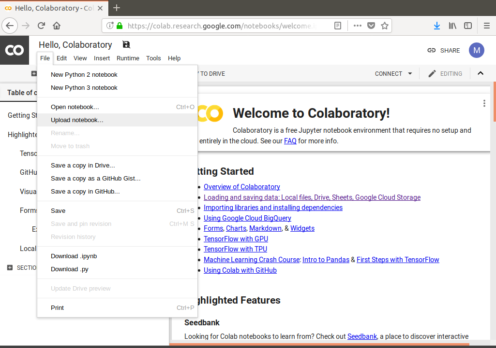
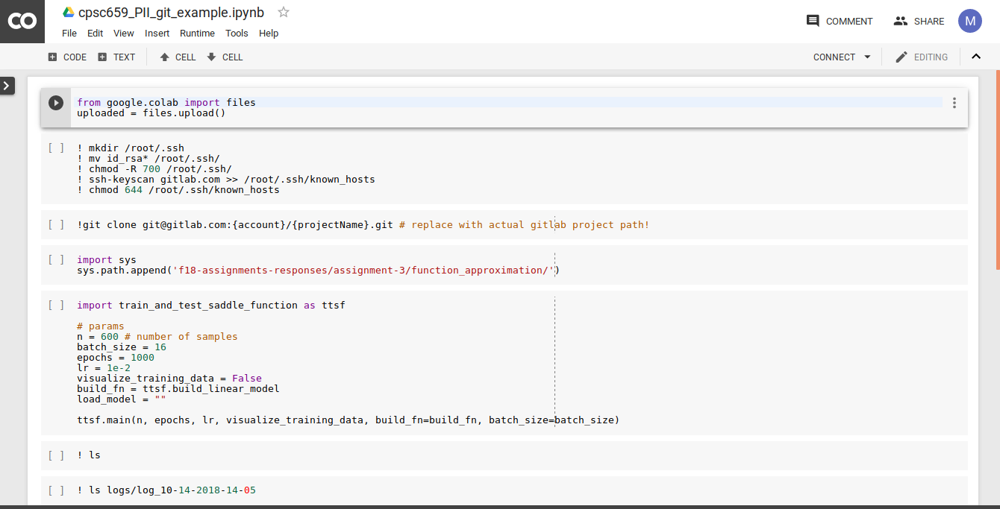
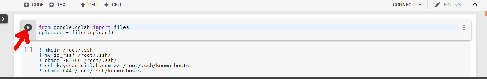

# Training a Neural Network with Google Colab

We recommend that you use Google Colab for short training exercises (e.g., task II-6 and II-9 of this assignment).
Once you have implemented all of the code to train a model and you have tested that your code
runs locally, then you can commit your code to your repository, load it in Colab (as explained below), 
and train your model on a CPU or a machine with a hardware accelerator (GPU or [TPU](https://cloud.google.com/tpu/)):

## Example: Training a Model in Google Colab
This assignment provides an example Python Notebook script to show you how you can train
the model from task II-6 in Google Colab using your Gitlab repository (as suggested [here](https://stackoverflow.com/questions/48350226/methods-for-using-git-with-google-colab)). 
You should have completed the train_and_test_saddle_function.py
script and pushed it to your private Gitlab repository before training the model as explained below.

1. If you haven't done this already in your local machine, create a SSH key pair for
Gitlab as in [this tutorial](https://docs.gitlab.com/ee/ssh/#generating-a-new-ssh-key-pair). Leave the passphrase empty.

2. Open Google Colab: [https://research.google.com/colaboratory/](https://research.google.com/colaboratory/)

3. Upload the assignment-4/pynb/bim_git_example.ipynb notebook to Google Colab by selecting
File -> Upload Notebook.

    
    
4. You should then be able to work with the notebook online.

    
    
5. Run the first cell of the notebook by clicking on the play symbol next to it. 
You should then be prompted to upload files to Google Colab.

    

    Upload your id_rsa and id_rsa.pub keys from your .ssh folder in your local machine. This is
    necessary for Google Colab to download the code from your Gitlab repository without asking
    for a password to authenticate. 
    
6. Run the second cell to move your keys to the /root/.ssh directory, set permissions for
your keys so that only you can read them (```chmod -R 777 ...``), and add gitlab
as a known host for ssh.

7. Edit the third cell to point to your private Gitlab repository and run it. Your code should
be downloaded to Google Colab.

8. Run cells 4 and 5 to train your network. Note that you can edit the parameters passed to
the main function.

9. The logs from your training process will then be saved to the logs folder in your Google Colab
project. Run cells 6 and 7 to see what data what logged (edit the path in cell 7 as appropriate).

10. You can download files from Google Colab by adding a new cell with the code:

    ```python
    from google.colab import files
    files.download("<path_to_file>") 
    ```

## Other Tips

1. **You can train on a GPU or TPU in Google Colab.** Enable hardware acceleration
by changing the Notebook settings for a project in Edit -> Notebook settings. Select GPU or
TPU as hardware accelerator.

    > If your model is small, it might just train faster in the cloud without hardware acceleration.

2. **Google Colab works with Google Drive.**
You can load files from your Google Drive account into Google Colab, as explained 
[here (see the Mounting Google Drive locally section)](https://colab.research.google.com/notebooks/io.ipynb).

3. **You can run TensorBoard on Google Colab.** You can use
[tensorboardcolab](https://github.com/taomanwai/tensorboardcolab) to run TensorBoard on your
Google Colab Project. First, install the module in Colab:

    ```python
    # install tensorboardcolab in Colab
    !pip install tensorboardcolab
    ```
    
    Then, edit your training script so that it uses the `TensorBoardColabCallback`:
    
    ```python
    # import necessary modules
    from tensorboardcolab import TensorBoardColab, TensorBoardColabCallback

    # define callback
    tbc=TensorBoardColab()

    ...
 
    model.fit(......,callbacks=[TensorBoardColabCallback(tbc), ...])
    ```
    
    When you run the training script next in Google Colab, you should get a message in Colab
    showing the link to TensorBoard for your model:
    
    ```text
    TensorBoard link:
    http://<some numbers and letters>.ngrok.io
    ```