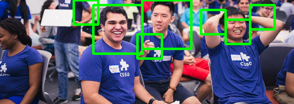
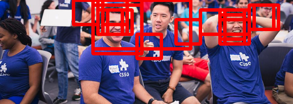

# Assignment 5

This is the fifth assignment for Yale's CPSC-459/559 Building Interactive Machines course.

## Table of Contents

* [Introduction](#introduction)
    * [System Requirements](#system-requirements)
    * [Background Knowledge](#background-knowledge)
    * [Notation](#notation)
    * [Preliminaries](#preliminaries)
       * [Training on Google Colaboratory](#training-on-google-colaboratory)
       * [Training on Google Cloud](#training-on-google-cloud)
    * [Deliverables](#deliverables)
    * [Evaluation](#evaluation)
    * [Further Reading](#further-reading)
* [Setup](#setup)
* [Part I. Set Up TensorFlow Locally](#part-i-set-up-tensorflow-locally)
    * [Questions / Tasks](#questions--tasks)
* [Part II. Approximating a Non-Linear Function](#part-ii-approximating-a-non-linear-function)
    * [Questions/Tasks](#questionstasks)
* [Part III. Building a Face Classifier](#part-iii-building-a-face-classifier)
    * [Questions / Tasks](#questions--tasks-1)


## Introduction 
This assignment will provide you practical experience with deep learning. In particular, you'll become
familiar with [TensorFlow's Keras API](https://www.tensorflow.org/api_docs/python/tf/keras).


#### System Requirements
This assignment should be completed using Python 2.7 in Ubuntu 18.04. For training neural networks,
we recommend that you use cloud services if your don't have access to a local GPU. For the last part of the assignment, 
you should have access to a computer with `ROS Melodic`.

You should also have `git` installed in the machine that you are using to work on your assignment.
You will use git to save your work to your [GitLab](http://www.gitlab.com) repository. 

#### Background Knowledge

This assignment assumes that you have already completed the prior assignments and, thus, you
 have experience with Linux shells 
(e.g., [bash](https://www.gnu.org/software/bash/)), and [git](https://git-scm.com/). You are also expected to be familiar with the [numpy Python library](http://www.numpy.org/) for linear algebra. 
If you are not, please check [this tutorial](https://docs.scipy.org/doc/numpy/user/quickstart.html) before starting the assignment.

#### Preliminaries
You will be training Neural Networks for this assignment. It is possible to complete all
of the tasks using your local CPU, but it might be faster at times to train on the cloud and
using hardware acceleration (e.g., GPU).

> Whether or not you use the cloud to train your neural networks, the deliverables are the same.
You should submit code in your private Gitlab repository. You should also submit a report 
and model parameter files to Canvas.

##### Training on Google Colaboratory
One option to train a network on the cloud is to use [Google Colaboratory](https://colab.research.google.com).
Google Colaboratory (or Colab) is a **free** research tool for machine learning education and research. It's a 
[Jupyter notebook](http://jupyter.org/) environment that requires no setup to use. For more information
on using Google Colab such as usage limits, read the official [F.A.Q](https://research.google.com/colaboratory/faq.html).

A `quick tutorial` on using Google Colab for this assignment is provided in the 
[Train_Google_Colab.md](Train_Google_Colab.md) file.

##### Training on Google Cloud
Another option is to use [Google Cloud](https://cloud.google.com). This option is not free,
but you can customize virtual machines with as many resources as you need. Use your 
credits judiciously. 

A `quick tutorial` on using Google Cloud for this assignment is provided in the
[Train_Google_Cloud_Engine.md](Train_Google_Cloud_Engine.md) file.

#### Deliverables

- **Report:** You are expected to submit a pdf to Canvas with answers to the questions/tasks at 
the end of each part of the assignment. This report should also have any information needed 
to understand and/or run your code, as well as the specific commit SHA of the version of the code
that you would like to be evaluated on. Though not mandatory, it is recommended that you generate this pdf 
with [Overleaf](https://www.overleaf.com/edu/yale#!overview) and this 
[simple assignment template](https://www.overleaf.com/latex/templates/simple-assignment-template/mzkqqqjypzvd) 
in [LaTeX](https://www.latex-project.org/).

- **Model weights and input normalization parameters:** You should upload trained models and parameters
to canvas.

- **Code:** Finally, you are expected to push code for this assignment to your 
[GitLab](http://www.gitlab.com) repository as indicated in the [general instructions](../README.md) 
document for CPSC-659 assignments. 

> NOTE: If you are using late days to submit this assignment after the official deadline,
you should let Marynel and Tim know about this before the deadline is due! Otherwise, you
won't be able to submit your report through Canvas.

#### Evaluation

You assignment will be evaluated based on the content of your report and your code.

- Report (48 pts + 3 extra pts)
    * Part II (33 pts): II-6 (10 pts) + II-7 (4 pts) + II-9 (10 pts) + II-10 (5 pts) + II-11 (4 pts)
    * Part III (15 pts + 3 extra pts): III-2 (3 pts) + III-3 (5 pts) + III-4 (7 pts) + III-6 (3 pts extra credit)
- Code (52 pts + 5 extra pts)
    * Part I (2 pts)
    * Part II (24 pts): II-1 (4 pts) + II-2 (2 pts) + II-3 (2 pts) + II-4 (4 pts) + II-5 (4 pts) + II-8 (2 pts) + II-8 (6 pts)
    * Part III (26 pts + 5 extra pts): III-1 (12 pts) + III-2 (4 pts) + III-3 (10 pts) + III-5 (5 pts extra credit)

#### Further Reading

- [SqueezeNet](https://arxiv.org/abs/1602.07360) - A small network for image classification
- [Tiny Darknet](https://pjreddie.com/darknet/tiny-darknet/) - An even smaller network for image classification


## Setup
Before you start implementing or answering questions for this assignment, please update
your repository to pull the latest changes from the assignments repository and update
the shutter-ros repository:

```bash
# update your repository with the latest version of the assignment
$ cd <path-to-your-repository-in-your-workspace>
$ git pull upstream master

# update the shutter-ros repository 
$ roscd shutter_bringup
$ git pull

# finally, re-build your catkin workspace 
$ cd <path-to-your-catkin-workspace-root-directory>
$ catkin_make -DCMAKE_BUILD_TYPE=Release
```

## Part I. Set Up TensorFlow Locally

The first thing that you will need to start working on deep learning is installing TensorFlow in the
machine that you are using to develop code. Follow the instructions below, which are based on the [official 
TensorFlow installation page](https://www.tensorflow.org/install/pip?lang=python2), 
to set up TensorFlow v. 2.0.0 with Python 2.7.

1. Check that [pip]() in installed in your machine:

    ```bash
    $ pip --version
    ```
    
    If it's not installed and you are using Ubuntu, then install it with:
    
    ```bash
    sudo apt install python-dev python-pip
    ```

2. Check that [virtualenv](https://virtualenv.pypa.io/en/stable/) is already installed:

    ```bash
    $ virtualenv --version
    ```
    
    If virtualenv is NOT installed in your machine, install it:
    
    ```bash
    sudo apt install virtualenv
    ```
  
3. Create a [virtual environment](https://realpython.com/python-virtual-environments-a-primer/) 
named `venv` with virtualenv:

    ```bash
    $ cd assignment-5 # enter this assignments directory within your assignments private repository
    $ virtualenv --system-site-packages -p python2.7 venv
    ```
    
4. Activate your virtual environment:

   ```bash
   $ source ./venv/bin/activate
   ```
   
   Now your terminal prompt should start with `(venv)` indicating that you are within the environment.
    
5. Upgrade pip within your virtual environment:
   
   ```bash
   (venv) $ pip install --upgrade pip
   ```
   
6. Install TensorFlow (TF):

    - If your machine has no GPU:
    
        ```bash
        (venv) $ pip install --upgrade tensorflow
        ```
        
    - If your machine has a GPU with CUDA Compute Capability 3.5 or higher and 
    you have CUDA 10.0 installed in your system (see [here](https://www.tensorflow.org/install/gpu) for 
    more details on setting up CUDA for TF):
    
        ```bash
        (venv) $ pip install --upgrade tensorflow-gpu
        ```
        
7. Verify the install:

    ```bash
    (venv) $ python -c "import tensorflow as tf; print(tf.__version__)"
    ```
    
    The command should print "2.0.0".

    > If you've installed tensorflow-gpu, you can check that the GPU is being recognized properly by calling the `tf.test.is_gpu_available()` function after importing tensorflow as tf. If you are having trouble installing Tensorflow with GPU support, see the official installation guide [here](https://www.tensorflow.org/install/gpu#ubuntu_1804_cuda_10).

8. Install opencv and matplotlib:

    ```bash
    (venv) $ pip install matplotlib opencv-python
    ```

> NOTE: Because you have installed the packages that you need to complete this assignment within 
a virtual environment, you will always have to activate the environment before starting to run your code 
(as in step 3 above). To exit your virtual environment at any time, you can run the command: 
``` (venv) $ deactivate ```.

### Questions / Tasks 

- **I-1.** In general, committing virtual environments to your repository is bad practice (e.g., paths might differ
in different computers and this may render your environment unusable). Instead, what people generally
do is create a `requirements.txt` file with all of the dependencies for a project. This file can then be 
used to install all required Python models with pip.

    For this part of the assignment, **create a requirements.txt** file so that you remember what needs
    to be installed to run your assignment. The file should be placed within the assignment-5 directory
    of your private assignments repository. Below is an example of how the requirements.txt file would 
    look like:
    
    ```text
    tensorflow==2.0.0
    opencv-python==4.1.1.26
    matplotlib==2.1.1
    ```
    
    or if you installed `tensorflow-gpu` before,
    
    ```text
    tensorflow-gpu==2.0.0
    opencv-python==4.1.1.26
    matplotlib==2.1.1
    ```
    
    Commit the requirements.txt file to your private assignments repository. 
    
    > NOTE: If you ever need to install the packages in a new 
    virtual environment, then you can just run the command `(env) $ pip install -r requirements.txt`
    within your virtual environment.


## Part II. Approximating a Non-Linear Function

Read the [Primer on Universal Function Approximation with Deep Learning](https://cartesianfaith.com/2016/09/23/a-primer-on-universal-function-approximation-with-deep-learning-in-torch-and-r/) 
by Brian Yung Rowe. 

Once you've read the primer, you should complete the tasks below to approximate the 
[monkey saddle surface](https://en.wikipedia.org/wiki/Monkey_saddle)  defined by the equation 
$`z = x^3 - 3xy^2`$. Your code should leverage [TensorFlow's
Keras API](https://www.tensorflow.org/guide/keras).

To get you started, this assignment provides two files within the 
`assignment-5/function_approximation` directory:

- *train_and_test_saddle_function.py:* main file that you will complete in this part of the assignment.
- *saddle_function_utils:* code to generate data and help you visualize results.

If you run the train_and_test_saddle_function.py script (which is incomplete at this point)
with the `visualize_training_data` option, you should be able to visualize the data that the
script generates for you:

```bash
$ cd assignment-5/function_approximation
$ ./train_and_test_saddle_function.py --visualize_training_data
```

When you run the script, a [matplotlib](https://matplotlib.org/) plot of the data should appear, 
as in the figure below:


### Questions/Tasks

- **II-1.** Complete the `compute_normalization_parameters()` and `normalize_data_per_row()` functions in
the train_and_test_saddle_function.py script.

    a. For the compute_normalization_parameters() function, you want to compute the mean
    and standard deviation for the data that is input to the function:
    
    ```python
    def compute_normalization_parameters(data):
        """
        Compute normalization parameters (mean, st. dev.)
        :param data: matrix with data organized by rows [N x num_variables]
        :return: mean and standard deviation per variable as row matrices of dimension [1 x num_variables]
        """
        mean = ...  # numpy array with num_variables elements 
        stdev = ... # numpy array with num_variables elements
        return mean, stdev
    ```
    
    Note that the input `data`
    is organized in a matrix where each row corresponds to an example. The columns of the data
    matrix correspond to features of each of the input examples. The mean and standard deviation 
    should be computed for each example feature independently.
    
    b. For the normalize_data_per_row() function, you want to use the mean and stdev from
    (a) above to apply a whitening transformation to the data:
    
    ```python
    def normalize_data_per_row(data, mean, stdev):
        """
        Normalize a give matrix of data (samples must be organized per row)
        :param data: input data
        :param mean: mean for normalization
        :param stdev: standard deviation for normalization
        :return: whitened data, (data - mean) / stdev
        """
    
        # sanity checks!
        assert len(data.shape) == 2, "Expected the input data to be a 2D matrix"
        assert data.shape[1] == mean.shape[1], "Data - Mean size mismatch ({} vs {})".format(data.shape[1], mean.shape[1])
        assert data.shape[1] == stdev.shape[1], "Data - StDev size mismatch ({} vs {})".format(data.shape[1], stdev.shape[1])
    
        normalized_data = ... # Complete.
        
        return normalized_data
    ``` 
     
    For example, if an example
    feature is $`x`$, then you want to transform it into $`(x - \mu)/\sigma`$,
    where $`\mu`$ is the expected value for that feature and $`\sigma`$ corresponds to the feature's standard deviation based on
    the input data.
    
- **II-2.** Complete the `build_linear_model()` function in
the train_and_test_saddle_function.py script. This function should implement
a simple Neural Network model (with one hidden layer) using the [Keras API](https://www.tensorflow.org/guide/keras):

    ```python
    input = tf.keras.layers.Input(shape=(num_inputs,), name="inputs")
    hidden1 = tf.keras.layers.Dense(64, use_bias=True)(input)
    output = tf.keras.layers.Dense(1, use_bias=True)(hidden1)
    model = tf.keras.models.Model(inputs=input, outputs=output, name="monkey_model")
    ```

    The function should return the [Keras model](https://www.tensorflow.org/api_docs/python/tf/keras/models/Model)
    specified above.

    > In general, we suggest that you use [TF's Keras Functional API](https://www.tensorflow.org/guide/keras/functional)
    to build your model as in the script above.

- **II-3.** Complete the `train_model()` function in
the train_and_test_saddle_function.py script. This function should first normalize the input
features in the training and validation set using the normalize_data_per_row() function from step 1 above. 
Then, train_model() should [compile](https://www.tensorflow.org/api_docs/python/tf/keras/models/Model#compile) 
the neural network model that is passed as input to the function, i.e., 
define the optimizer to be used during training, loss, and relevant metrics. Finally, the train_model() 
function should train the network's weights using the [model's fit function](https://www.tensorflow.org/api_docs/python/tf/keras/models/Model#fit).

    ```python
    def train_model(model, train_input, train_target, val_input, val_target, input_mean, input_stdev,
                epochs=20, learning_rate=0.01, batch_size=16):
        """
        Train the model on the given data
        :param model: Keras model
        :param train_input: train inputs
        :param train_target: train targets
        :param val_input: validation inputs
        :param val_target: validation targets
        :param input_mean: mean for the variables in the inputs (for normalization)
        :param input_stdev: st. dev. for the variables in the inputs (for normalization)
        :param epochs: epochs for gradient descent
        :param learning_rate: learning rate for gradient descent
        :param batch_size: batch size for training with gradient descent
        """
        # normalize
        norm_train_input = normalize_data_per_row(train_input, input_mean, input_stdev)
        norm_val_input = normalize_data_per_row(val_input, input_mean, input_stdev)
   
        # compile the model: define optimizer, loss, and metrics
        model.compile(optimizer=tf.keras.optimizers.Adam(lr=learning_rate),
                     loss='mse',
                     metrics=['mae'])
    
        # tensorboard callback
        logs_dir = 'logs/log_{}'.format(datetime.datetime.now().strftime("%m-%d-%Y-%H-%M"))
        tbCallBack = tf.keras.callbacks.TensorBoard(log_dir=logs_dir, write_graph=True)
    
        checkpointCallBack = tf.keras.callbacks.ModelCheckpoint(os.path.join(logs_dir,'best_monkey_weights.h5'),
                                                                monitor='val_loss',
                                                                verbose=0,
                                                                save_best_only=True,
                                                                save_weights_only=False,
                                                                mode='auto',
                                                                period=1)
    
        # do trianing for the specified number of epochs and with the given batch size
        model.fit(norm_train_input, train_target, epochs=epochs, batch_size=batch_size,
                 validation_data=(norm_val_input, val_target),
                 callbacks=[tbCallBack, checkpointCallBack])
    ```

    Note that the example above also adds two callbacks to the fit() function:
    
    - **tf.keras.callbacks.TensorBoard:** [TensorBoard](https://www.tensorflow.org/guide/summaries_and_tensorboard) 
    callback to write TensorBoard logs to a given directory.
    - **tf.keras.callbacks.ModelCheckpoint:** Callback that saves the model after every epoch (see
    more information [here](https://www.tensorflow.org/api_docs/python/tf/keras/callbacks/ModelCheckpoint)).
    Because we set "save_best_only = True", the callback would only save the model if the
    validation loss is smaller than the prior best validation loss.<br/><br/>
    
    We suggest that, as a first try, you use the [Adam optimizer](https://www.tensorflow.org/api_docs/python/tf/keras/optimizers/Adam)
    when you train neural works with gradient descent. The optimizer tends to work well for many problems. You can read the
    original paper with full details of how it works here: [Diederik P. Kingma, Jimmy Ba. Adam: A Method for Stochastic Optimization](https://arxiv.org/abs/1412.6980).
    A bit more information about the TensorFlow implementation can be found here: [tf.train.AdamOptimizer](https://www.tensorflow.org/api_docs/python/tf/train/AdamOptimizer).
    
- **II-4.** Complete the `test_model()` function in the train_and_test_saddle_function.py script. The function
should output predictions for the given input matrix (test_input) using the `model.predict()` function.
The official documentation for the predict() function can be found [here](https://www.tensorflow.org/api_docs/python/tf/keras/models/Model#predict).

    > Remember that whatever transformation that you apply to your data at training time, should be applied at test time as well for your model to work in practice.

- **II-5.** Complete the `compute_average_L2_error()` function in the train_and_test_saddle_function.py script.
The function should compute the average [L2 difference](http://mathworld.wolfram.com/L2-Norm.html) between the ground truth 
(test_target) and the predicted values (predicted_targets) that are input to the function. The average
should be over all of the examples in each of the input matrices.

    ```python
    def compute_average_L2_error(test_target, predicted_targets):
        """
        Compute the average L2 error for the predictions
        :param test_target: matrix with ground truth targets [N x 1]
        :param predicted_targets: matrix with predicted targets [N x 1]
        :return: average L2 error
        """
        
        average_l2_err = ... # Complete.
    
        return average_l2_err
    ```

- **II-6.** Uncomment the last line in the main() function of the train_and_test_saddle_function.py
script so that you can easily visualize the predictions made by your model:

    ```python
    # visualize the result (uncomment the line below to plot the predictions)
    sfu.plot_test_predictions(test_input, test_target, predicted_targets, title="Predictions")
    ```

    You should now be able to train your network and visualize the results for the test set:

    ```bash
    (venv) $ ./train_and_test_saddle_function.py [--lr 1e-1] [--epochs 10] [--batch_size 16]
    ```    
    
    The optional parameters `lr`, `epochs`, and `batch_size` correspond to the learning rate,
    number of epochs, and bath size that are used at training time.
    
    Make a screenshot of the plot that you get after training your simple neural network for the
    first time with a learning rate of 1e-2 and for 500 epochs. Then, add to your report:
    - the screenshot of the plot that you took;
    - the average L2 error that you got on the testing set after training as indicated; and 
    - an explanation of why the neural network is performing poorly.<br/><br/>
    
- **II-7.** Visualize the learning curves and your model using [TensorBoard](https://www.tensorflow.org/guide/summaries_and_tensorboard).
Open a new terminal window, activate your virtual environment, and run:

    ```bash
    (venv) $ cd assignment-5 # go to the assignment-5 directory within your private repository
    (venv) $ tensorboard --logdir function_approximation/logs
    ```
    
    Then, go to the URL that the script provides (e.g., http://localhost:6006) in your favorite
    browser. The `SCALARS` tab of the TensorBoard interface should then show various training curves
    (e.g., epoch_loss for the loss after every epoch in the training and validation sets). The `GRAPHS` tab of the TensorBoard interface should show a 
    [computation graph](https://www.tensorflow.org/guide/graph_viz) for your simple neural network model.
    
    Make a screenshot of your computation graph and include it in your project report.
    
    > NOTE: In general, we recommend that you use TensorBoard to check your models' computation
    graphs and training/validation performance for all of the other tasks in this assignment. 
    This 30min [TensorBoard tutorial](https://www.youtube.com/watch?v=eBbEDRsCmv4)
    provides good examples on how the interface can help you debug many issues!
    
- **II-8.** Modify the train_and_test_saddle_function.py script so that you can load a `pre-trained
model` and train its weights further (e.g., to resume training or for fine-tuning on a new task).

    a. Add a "load_model" argument to the argument parser at the end of the script:
        
    ```python
    parser = argparse.ArgumentParser()
    ... # other arguments
    parser.add_argument("--load_model", help="path to the model",
                        type=str, default="")
    ```
        
    b. Add two lines of code after the build_fn variable is set at the end of the script to
    replace the value of build_fn with [TensorFlow's Keras load_model() function](https://www.tensorflow.org/api_docs/python/tf/keras/models/load_model):
    
    ```python
    ... # Set ArgumentParser arguments()
    
    # define the model function that we will use to assemble the Neural Network
    if args.build_fn == "linear":
    ...
        
    # ---- lines to be added ----
    # load model (and thus, ignore prior build function)
    if len(args.load_model) > 0:
        build_fn = lambda x: tf.keras.models.load_model(args.load_model, compile=False)
    # ---- end of lines to be added ----
        
    # run the main function
    main(args.n, args.epochs, args.lr, args.visualize_training_data, build_fn=build_fn)
    sys.exit(0)
    ```
        
    > Note that the load_model() function above is passed the argument `compile=False`.
    This means that the model should not be compiled after loading, because the train_model() function
    that you implemented before did this already.
        
    c. Test your code. Your script should now be able to load a model from a file and continue training
    its weights thereafter:
    
    ```bash
    (venv) $ ./train_and_test_saddle_function.py --load_model <path_to_model_h5_file> [--lr 1e-2] [--epochs 500] [--batch_size 16]
    ```
    
    The model that you trained before for task II-6 should be stored as best_monkey_weights.h5
    within the folder corresponding to your training session in assignments-5/function_approximation/logs.
    You can pass this model as argument to your train_and_test_saddle_function.py to test the new
    functionality that you just implemented.
    
- **II-9.** Create a new function called `build_nonlinear_model()` in the train_and_test_saddle_function.py 
script. This function should have as argument the number of input features for the data and should
return a [Keras model](https://www.tensorflow.org/api_docs/python/tf/keras/models/Model), similar
to the build_linear_model() function that you implemented before. The difference between these functions, though, 
is that build_nonlinear_model()
 should implement a more complex neural network capable of approximating the monkey saddle surface
with an **average L2 error of 150 or less on the test set**.

    ```python
    def build_nonlinear_model(num_inputs):
    """
    Build nonlinear NN model with Keras
    :param num_inputs: number of input features for the model
    :return: Keras model
    """
    ... # complete
    ```
    
    Once you've implemented the function, edit the last lines of the train_and_test_saddle_function.py 
    script to be able to change the model that is trained through the command line:
    
    ```python
    # define the model function that we will use to assemble the Neural Network
    if args.build_fn == "linear":
        build_fn = build_linear_model # function that builds linear model
    elif args.build_fn == "nonlinear":
        build_fn = build_nonlinear_model # function that builds non-linear model
    else:
        print "Invalid build function name {}".format(args.build_fn)
        sys.exit(1)
    ```
    
    You should then be able to train and test your model as:
    ```bash
    (venv) $ ./train_and_test_saddle_function.py --build_fn nonlinear [--lr 1e-1] [--epochs 10] [--batch_size 16]
    ```
    
    Change your nonlinear model, the learning rate, and number of epochs that you are training for
    until you achieve an average test error of 150 or less. Afterwards, take a new screenshot of the plot
    that you get after training (as in task 6 above). Include in your report:
     
    - The screenshot of the plot after training;
    - what average L2 error did you get on the test set this time;
    - a description of the neural network model that you used to approximate the monkey saddle surface; and
    - whatever parameters you used for training it (e.g., batch size, learning rate, and number of epochs).<br/><br/>
    
- **II-10.** Train your nonlinear neural network such that it `overfits` on the training data. 

    After training, include a picture
    in your report of the plots from TensorBoard corresponding to the `mean absolute error` (mae) on the training and validation
    sets. Explain how you concluded that your model overfit in the report.
    
- **II-11.** What happens with the loss per epoch on the training set if you train with a batch size of 1?
Explain why does the loss per epoch graph look different than with a bigger batch size (e.g., than with a batch size of 100).

## Part III. Building a Face Classifier

Now that you are familiar with training deep learning models, you will create your own face 
classifier. 

1. Download a subset of the [Face Detection Dataset and Benchmark](http://vis-www.cs.umass.edu/fddb/) 
from [this link](https://drive.google.com/open?id=1JIIalRu5WZQ01p-S6mBxzHV8ZMqAJcdH) and place it in 
the assignment-5/face_detection directory (note that you should not commit the data to your repository).

   > The data is provided as a [numpy npz file](https://docs.scipy.org/doc/numpy-1.15.1/reference/generated/numpy.savez.html) for this assignment. 
   The .npz file format is a zipped archive of files named after the variables they contain. 
   The archive is not compressed and each file in the archive contains one variable in .npy format. 
   For a description of the .npy format, see [numpy.lib.format](https://docs.scipy.org/doc/numpy-1.15.1/reference/generated/numpy.lib.format.html#module-numpy.lib.format).

   Check that you can open the data in python and that it has inputs and target values:
   
   ```bash
   (venv) $ cd assignment-5/face_detection/ # go to the assignment-5/face_detection directory within your private repository
   (venv) $ python 
   Python 2.7.15rc1 (default, Apr 15 2018, 21:51:34) 
   [GCC 7.3.0] on linux2
   Type "help", "copyright", "credits" or "license" for more information.
   >>> import numpy as np
   >>> data = np.load("64x64_data.npz")
   >>> data.files
   ['input', 'target']
   >>> image_0 = data['input'][0,:,:,:]
   >>> 
   >>> # visualize the first image in the dataset with opencv 
   >>> import cv2 
   >>> cv2.imshow("image", image_0)
   >>> cv2.waitKey(0)
   ```
   
   You should then be able to see the image:
   
   
   
2. Read the `train_face_detection.py` skeleton code in the assignment-5/face_detection directory. 
This code is provided to get you started on building your custom face classifier. You should be able to run the code
and load the training data with the following command:

   ```bash
   (venv) $ ./train_face_detection.py --input 64x64_data.npz
   Loaded 11038 training examples.
   ```
   
   Note that the `input` is organized as a 4-D tensor of dimension NxHxWxC, where N
   corresponds to the number of examples, H is the height of input images, W is their width, and C
   is the number of channels per image. In general, the dataset has color images of 64x64 pixels 
   (i.e., W=H=64 and C=3). The channels are organized in Blue-Green-Red (bgr) order.
   
   The `target` is a single number: 1 if the corresponding input image shows a face, or 0 otherwise.
   Thus, the target tensor is 2D. It has shape Nx1.
   
3. Your main task in this assignment is to complete the `main` function of the 
train_face_detection.py script so that it:

   a. Splits the input data into a training and validation set.
   
   b. Normalizes the training data such that the pixel values are floats in [0,1] rather than integers in [0,255].
   
   c. Builds a convolutional neural network model with the TensorFlow Keras API to predict 
   whether the input image corresponds to the face of a person or not. The output of the
   network should be a probability (i.e., a float between 0 and 1) corresponding to the 
   likelihood that the input image shows a human face.
   
   d. Trains the model based on the input arguments: batch_size, epochs, lr, val, logs_dir.
   These arguments are all defined in the bottom section of the script, when they are
   added to the [ArgumentParser](https://docs.python.org/2/library/argparse.html).
   
   The script should have saved one file to disk after finishing training:
   
   - **weights.h5:** model parameters. 
   
       > We highly recommend that you use the 
       [tf.keras.callbacks.ModelCheckpoint]() function to generate the best weights.h5 
       file based on validation data, as in Part II of this assignment.
       
   Many different convolutional neural networks have been proposed in the past for image classification. 
   If you are unsure of what model to implement, we suggest that you look at the
   [Tiny DarkNet Network](https://pjreddie.com/darknet/tiny-darknet/) as a reference. You can implement a
   small network like that one for this assignment. However, keep in mind that you will have to adjust 
   the structure of your network according to the input data that is provided.
   
   For the loss and metric that you use while training your model, we 
   suggest that you use `binary_crossentropy` and `binary_accuracy` respectively. You can set
   this loss and metric when you compile your model. For example:
   
   ```python
   model.compile(optimizer=tf.keras.optimizers.Adam(lr=learning_rate),
                 loss='binary_crossentropy',
                 metrics=['binary_accuracy'])
   ```
       
### Questions / Tasks

- **III-1.** Implement your image classification model in the train_face_detection.py script, and
train your model using the 64x64_data.npz dataset:

    ```bash
    (venv) $ ./train_face_detection.py --input 64x64_data.npz [--lr 1e-4] [--epochs 100] [--batch_size 200]
    ```

    Make sure to search for good hyper-parameter values:
    
    - **lr:** learning rate
    - **epochs:** number of epochs to train for
    - **batch_size:** batch size used for training<br/><br/>

    Commit your modified train_face_detection.py
    script to your repository once you are happy with your model. **Submit your best weights.h5 file to Canvas as part of your assignment.**
    
    **NOTE:** The `performance` of your model will be evaluated using the `evaluate_face_detection.py` script
    within the assignment-5/face_detection directory. The script will be run on a test set (that is not provided
    as part of this assignment) but that you can assume comes from the same image distribution as
    the data that is provided in the 64x64_data.npz file. The expectation is that your model should
    reach at least **0.9 (or 90%) binary accuracy** on the (unseen) test set. You can read more about
    binary accuracy in the [official TensorFlow documentation](https://www.tensorflow.org/api_docs/python/tf/keras/metrics/binary_accuracy).
    
    In general, we recommend that you use [TensorBoard](https://www.tensorflow.org/guide/summaries_and_tensorboard) 
    to monitor the performance of your model in a validation set as it trains.
    
- **III-2.** The binary accuracy metric that you used before, assumed that a face was found when the output
probability of your network was greater than 0.5 for a given input. But, is this the best threshold 
to decide that your network found a face? You will now inspect how accuracy changes as a 
function of the threshold to better understand if 0.5 is a good value for your classifier.

    To start, make a copy of the evaluate_face_detection.py script and name it `plot_roc_curve.py`:

    ```bash
    (venv) $ cd assignment-5/face_detection
    (venv) $ cp evaluate_face_detection.py plot_roc_curve.py
    ```
    
    Then, edit the new plot_roc_curve.py script so that instead of evaluating the model on a given
    test set, it computes predictions for all of the examples on the input data. Based on these
    predictions and the target values, the script should then plot a [Receiver Operating Characteristic (ROC)](https://en.wikipedia.org/wiki/Receiver_operating_characteristic) 
    curve like the one below:
   
    
        
    The curve shows the performance of the model based on the True Positive Rate (TPR) and False Positive Rate (FPR), which are defined as:
    
    - **TPR:** The number of correct face predictions over the total number of positive (face) examples
    in the input data.
    - **FPR:** The number of false (or incorrect) face predictions over the total number of negative examples in the
    input data.<br/><br/>

    You should organize the main file of your plot_roc_curve.py script as follows:
    
    ```python
    # Example code
  
    def main(input_file, weights_file, norm_file):
        """
        Evaluate the model on the given input data
        :param input_file: npz data
        :param weights_file: h5 file with model definition and weights
        :param norm_file: normalization params
        """
        # load data
        input, target = load_data_from_npz_file(input_file)
        N = input.shape[0]
        ... # normalize the inputs
        
        ... # output model predictions on "prob" variable
  
        # generate roc thresholds
        thresholds = [x/100.0 for x in range(0,100,2)]
        
        tpr = [] # list of true positive rate per threshold
        fpr = [] # list of false positive rate per threshold
      
        # compute the true positive rate and the false positive rate for each of the thresholds
        for t in thresholds:
      
            # turn predicted probabilities to 0-1 values based on the threshold
            prediction = np.zeros(prob.shape)
            prediction[prob > t] = 1
          
            # compute tpr and fpr based on the predictions and the target values from the dataset     
            # TO-DO. complete
            current_tpr = ...
            current_fpr = ...
  
            tpr.append(current_tpr)
            fpr.append(current_fpr)
          
        # pick threshold that minimizes l2 distance to top-left corner of the graph (fpr = 0, tpr = 1)
        # TODO. Complete.
        index = ... # index of the threshold for which (fpr, tpr) get closest to (0,1) in the Euclidean sense
        print "Best threshold was: {} (TPR = {}, FPR = {})".format(thresholds[index], tpr[index], fpr[index])
  
        # plot the ROC curve with matplotlib (remember to import it as "import matplotlib.pyplot as plt")
        plt.plot(fpr, tpr)
        plt.scatter(fpr[index], tpr[index], s=20, c='r')
        plt.xlabel('False positive rate')
        plt.ylabel('True positive rate')
        plt.xlim([0,1])
        plt.ylim([0,1])
        plt.title('ROC Curve')
        plt.show()
    ```
    
    As indicated above, the script should print to the screen the "Best threshold" for predicting faces from the set ```[x/100.0 for x in range(0,100,2)]```, given the ROC values. You can try your script by running it with the 64x64_data.npz file and your trained model
    from III-1. 
    
    Once your script is working as desired, commit it to your repository. In addition, add to your report the ROC curve that your script 
    displayed when running on the 64x64_data.npz file and what was the best threshold found given the TRP and FPR values computer for your model. 
   
- **III-3.** Complete the make_predictions() function in the 
`window_detection.py` script within your assignment-5/face_detection directory
to run your face classifier on a sliding window over an input image. The script should enable you to
detect multiple faces on the input by sliding a window of various scales. 
For example, given the following input image from the Yale Computer Science website:

    
    
    The script should output face predictions to the screen:
    
    ```bash
    (venv) $ ./window_detection.py --input cs50_2.jpg --logs_dir <path-to-logs-folder>
    ...
    DETECTIONS:
    [[ 280.           70.          330.          120.            0.97373563]
     [ 190.           10.          290.          110.            0.95309627]
     [ 290.            0.          390.          100.            0.96896017]
     [ 460.           40.          510.           90.            0.95603698]
     [ 410.           20.          460.           70.            0.99236625]
     [ 510.           10.          560.           60.            0.99526775]
     [ 150.            0.          200.           50.            0.96062028]]
    ```
    where each row of the printed matrix contains [min_x, min_y, max_x, max_y, prob] for a given
    face detection. The first
    four columns are the top-left (min_x, min_y) and bottom-right (max_x, max_y) coordinates of 
    the bounding box corresponding to a face detection. The last column is the detection probability
    output by your model.

    When the script finishes, it should also show an image with the boxes:

    
    
    **Tip:** When you slide a window over the image to make predictions, it is possible that 
    many windows will fire over the same region in the image:
    
    
    
    To help you group overlapping boxes together through `non maximum suppression`, the 
    window_detection.py script provides the non_max_suppression() function. More information
    about this procedure can be found 
    in [this blog](https://www.pyimagesearch.com/2015/02/16/faster-non-maximum-suppression-python/)
    by A. Rosebrock.
    
    Test your window_detection.py script using the best threshold for the predicted probabilities
    from part III-2 and the images "cs50_2.jpg" and "shaocrew_0.jpg" 
    within the assignment-5/docs directory. It is OK if your model makes mistakes, as 
    long as your code uses the best classification threshold from the ROC curve. Include in your report:
     
    - images of your bounding boxes predictions (after non maximum suppression) on "cs50_2.jpg" 
    and "shaocrew_0.jpg". 
    
    - if your model missed out faces or had too many false positives, explain in your report
    what could you do to address these issues in the future.
    
- **III-4.** Explain in your report how could you change the structure of your neural network
to detect faces in a more efficient way than with a windowed approach.

## Part IV. Testing Your Face Classifier in Real-Time

Create a ROS package named "deep_face_detector" within the assignment 5 directory. Within this package, create a ROS node (Python script) named `detect_faces.py` that runs your face classification model over images received through the the topic "/camera/color/image_raw". 

    The node should:
    
    - detect faces using the sliding window approach of part III-3 of this assignment.
    - display the result visually by rendering the detection boxes (after non maximum suppression) on 
the input image.
    - get the path to your model's weights/parameters using the [rospy.get_param()](http://wiki.ros.org/rospy/Overview/Parameter%20Server) function,
    so that the path to the files is not hardcoded and can be changed upon node execution.
    - publish through the /detected_face topic
    
    It is OK if your node runs slow. Once your node is working, take a screen shot of an image that was processed with it and
    add it to a `README.md` file in the assignment-5/shutter_face_detection directory. The README.md should serve
    to document your ROS package. It should briefly explain how your node works and how it should be run.

    Commit to your repository all of the package files (package.xml, CMakeLists.txt, your detect_faces.py
    node and any other code needed to run your model). You do not need to add your model's 
    weights.h5 to the repository, as you are submitting that already through Canvas (part III-1).

### Questions / Tasks

- **IV-2.** Run your detect_faces.py node (from part IV-1) on images
received through Shutter's RealSense camera. For this part of the assignment, you will have to run your
code in one of the machines in AKW 411. 

    Add to your report a picture of one of the images that you processed on the Jetson TX2 Development Kit.
    Also, indicate in your report how long it took for your node to process one image from the ZED camera.

    > You will need to set up an appointment on a weekday (during regular working hours)
    with Sherry or Marynel before the assignment is due to complete this last extra credit. 
    They will explain to you how to stream images from the ZED camera to the Jetson computer.
    

Once you've finished the assignment, **add the commit SHA** that you would like to be evaluate on to your report.

